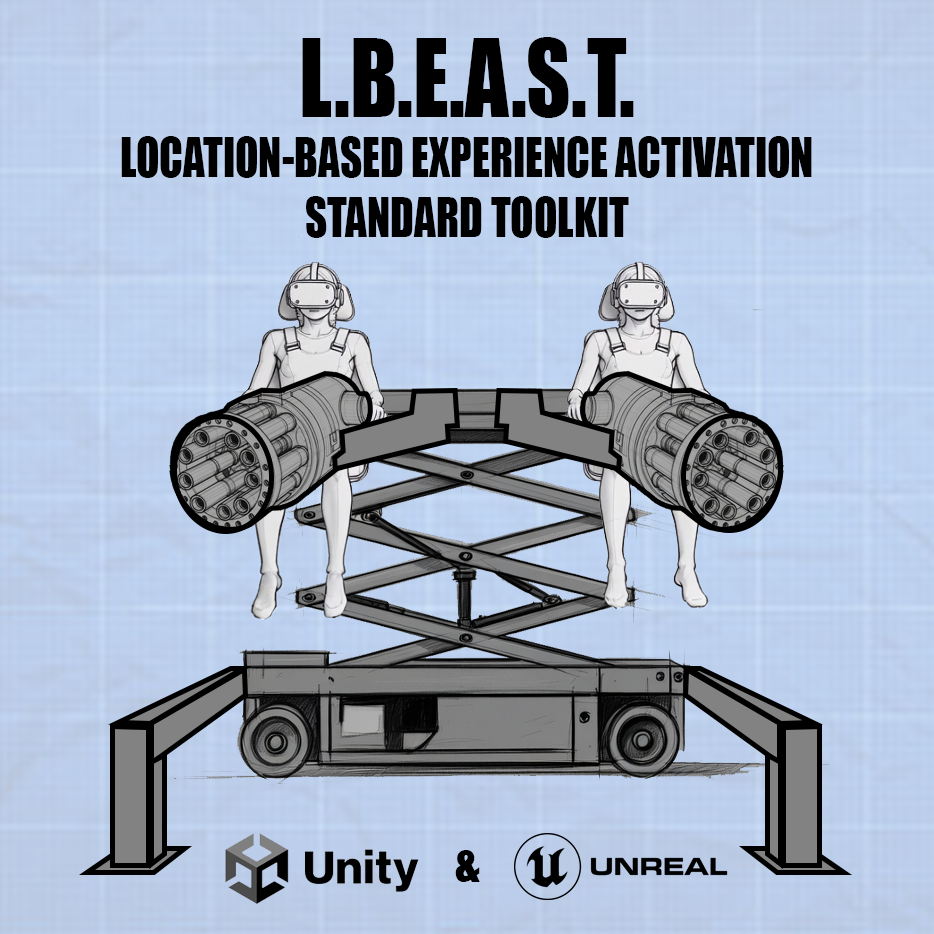

# HoloCade SDK for Unity



**HoloCade SDK** - A comprehensive SDK for developing VR/AR Location-Based Entertainment experiences in Unity with support for AI facial animation, large hydraulic haptics, and embedded systems integration.

<details>
<summary><strong>⚠️Author Disclaimer:</strong></summary>

<div style="margin-left: 20px;">
This is a brand new plugin as of November 2025. Parts of it are not fully fleshed out. The author built LBE activations for Fortune 10 brands over the past decade. This is the dream toolchain he wishes we had back then, but it probably still contains unforeseen bugs in its current form. V1.0 is considered Alpha. If you're seeing this message, it's because HoloCade has yet to deploy on a single professional project. Please use this code at your own risk. Also, this plugin provides code that may or may not run on systems your local and state officials may classify as  "amusement rides" or "theme park rides" which may fall under ASTM standards or other local regulations. HoloCade's author disclaims any and all liability for any use of this code, including for safety of guests or patrons, regulatory readiness, etc. Please review the local regulations in your area prior to executing this code in any public venue. You are responsible for compliance in your state.
</div>

</details><br>

[](https://github.com/scifiuiguy/holocade_unity/releases)
[](https://opensource.org/licenses/MIT)
[](https://unity.com)

> **🔗 Unreal version:** [github.com/scifiuiguy/holocade_unreal](https://github.com/scifiuiguy/holocade_unreal)

---

## 📖 Overview

HoloCade is a comprehensive SDK for developing VR and AR Location-Based Entertainment (LBE) experiences. This **Unity package** (`com.ajcampbell.holocade`) is the Unity implementation; for install steps and project-level docs, see the [holocade_unity](https://github.com/scifiuiguy/holocade_unity) repository README.

The HoloCade SDK democratizes LBE development by providing:
- **Experience Genre Templates** - Drag-and-drop complete LBE solutions
- **Low-Level APIs** - Technical modules for custom integration between game engine and various physical systems
- **AI-Driven Facial Animation** for immersive theater live actors (automated w/ NVIDIA ACE)
- **Wireless Trigger Controls** - Embedded buttons in costume/clothing for narrative state machine control through WiFi/Bluetooth
- **Large-Scale Hydraulic Haptics** for lift/motion platforms
- **Embedded Systems Integration** for costume-/prop-/wall-/furniture-mounted interfaces
- **Embedded Sensors** temperature, motion, face, and body tracking sensors to trigger escape room actions
- **Co-located XR Multiplayer LAN Experiences** with Unity NetCode for GameObjects
- **HMD and Hand Tracking** via OpenXR (Unity's native XR system)
- **6DOF Tracking** with SteamVR trackers and future extensibility

<details>
<summary><strong>⚠️OpenXR Note:</strong></summary>

<div style="margin-left: 20px;">
HoloCade uses **OpenXR** for HMD and hand tracking in Unity. If OpenXR is not desired for your LBE deployment, you may need to customize gesture and tracking-related code to use another XR stack.

</div> 

</details>   
<br>

> **📎 Long-form sections below** still contain paths and API names from the Unreal plugin (`Plugins/HoloCade/...`) in places; in this repo, equivalent code lives under `Packages/com.ajcampbell.holocade/`.

## 📚 Table of Contents

<details>
<summary><strong>THIS README</strong></summary>

<div style="margin-left: 20px;">

- [Overview](#overview)
- [Philosophy](#philosophy)
- [Three-Tier Architecture](#three-tier-architecture)
- [Standard Pop-up Layout](#standard-pop-up-layout)
- [Features](#features)
- [Installation](#-installation)
- [Quick Start](#quick-start)
- [Architecture](#architecture)
- [Module Structure](#module-structure)
- [Networking](#networking)
- [Hardware Integration](#hardware-integration)
- [Use Cases](#use-cases)
- [Dedicated Server & Server Manager](#dedicated-server--server-manager)
- [Network Configuration](#network-configuration)
- [Embedded System Philosophy](#embedded-system-philosophy)
- [Embedded System Nuts & Bolts](#-embedded-system-nuts--bolts)
- [Roadmap](#-roadmap)
- [Support](#support)
- [License](#license)
- [Contributing](#contributing)
- [Credits](#credits)

</div>

</details>

<details>
<summary><strong>OTHER READMEs IN THIS PROJECT</strong></summary>

<div style="margin-left: 20px;">

**Low-Level APIs:**
- [HoloCadeAI API README](https://github.com/scifiuiguy/holocade_unreal/blob/main/Plugins/HoloCade/Source/HoloCadeAI/README.md) - `Plugins/HoloCade/Source/HoloCadeAI/README.md`
- [VRPlayerTransport README](https://github.com/scifiuiguy/holocade_unreal/blob/main/Plugins/HoloCade/Source/HoloCadeCore/Public/VRPlayerTransport/README.md) - `Plugins/HoloCade/Source/HoloCadeCore/Public/VRPlayerTransport/README.md`
- [Input README](https://github.com/scifiuiguy/holocade_unreal/blob/main/Plugins/HoloCade/Source/HoloCadeCore/Public/Input/README.md) - `Plugins/HoloCade/Source/HoloCadeCore/Public/Input/README.md`
- [VOIP README](https://github.com/scifiuiguy/holocade_unreal/blob/main/Plugins/HoloCade/Source/VOIP/README.md) - `Plugins/HoloCade/Source/VOIP/README.md`
- [EmbeddedSystems README](https://github.com/scifiuiguy/holocade_unreal/blob/main/Plugins/HoloCade/Source/EmbeddedSystems/README.md) - `Plugins/HoloCade/Source/EmbeddedSystems/README.md`
- [ProLighting README](https://github.com/scifiuiguy/holocade_unreal/blob/main/Plugins/HoloCade/Source/ProLighting/README.md) - `Plugins/HoloCade/Source/ProLighting/README.md`

**Experience Genre Templates:**
- [AIFacemask Experience README](https://github.com/scifiuiguy/holocade_unreal/blob/main/Plugins/HoloCade/Source/HoloCadeExperiences/Private/AIFacemask/README.md) - `Plugins/HoloCade/Source/HoloCadeExperiences/Private/AIFacemask/README.md`

**Firmware Examples:**
- [FirmwareExamples README](https://github.com/scifiuiguy/holocade_unreal/blob/main/Plugins/HoloCade/FirmwareExamples/README.md) - `Plugins/HoloCade/FirmwareExamples/README.md`
- [GunshipExperience README](https://github.com/scifiuiguy/holocade_unreal/blob/main/Plugins/HoloCade/FirmwareExamples/GunshipExperience/README.md) - `Plugins/HoloCade/FirmwareExamples/GunshipExperience/README.md`
- [FlightSimExperience README](https://github.com/scifiuiguy/holocade_unreal/blob/main/Plugins/HoloCade/FirmwareExamples/FlightSimExperience/README.md) - `Plugins/HoloCade/FirmwareExamples/FlightSimExperience/README.md`
- [SuperheroFlightExperience README](https://github.com/scifiuiguy/holocade_unreal/blob/main/Plugins/HoloCade/FirmwareExamples/SuperheroFlightExperience/README.md) - `Plugins/HoloCade/FirmwareExamples/SuperheroFlightExperience/README.md`
- [EscapeRoom README](https://github.com/scifiuiguy/holocade_unreal/blob/main/Plugins/HoloCade/FirmwareExamples/EscapeRoom/README.md) - `Plugins/HoloCade/FirmwareExamples/EscapeRoom/README.md`
- [Base Examples README](https://github.com/scifiuiguy/holocade_unreal/blob/main/Plugins/HoloCade/FirmwareExamples/Base/Examples/README.md) - `Plugins/HoloCade/FirmwareExamples/Base/Examples/README.md`
- [Base Templates README](https://github.com/scifiuiguy/holocade_unreal/blob/main/Plugins/HoloCade/FirmwareExamples/Base/Templates/README.md) - `Plugins/HoloCade/FirmwareExamples/Base/Templates/README.md`

**Examples & Utilities:**
- [ServerManager README](https://github.com/scifiuiguy/holocade_unreal/blob/main/Plugins/HoloCade/Source/Examples/ServerManager/README.md) - `Plugins/HoloCade/Source/Examples/ServerManager/README.md`

</div>

</details>

---

## 💭 Philosophy

<details>
<summary><strong>Why HoloCade?</strong></summary>

<div style="margin-left: 20px;">

Home console VR usage is nascent and difficult despite being steadily on the rise:
* 80 million monthly active users in the U.S. in 2025
* up 60% from 2020
* 10% of Americans started using VR regularly so far this decade

If that growth holds, we might reach 100 million regular VR users by end-of-decade, more than 1/4 of the population. It's not smartphone-era growth, but it's steady.

BUT...

Content budgets are skin-and-bone. 

Building for VR requires specialty talent compared to film/TV/gaming, and every dollar spent goes half as far due to...
* deeper fidelity challenges
* bigger QA hurdles
* evil perf op constraints

VR devs need a leg up. The industry has been in a funding desert since the Pandemic. "VR is all hype" rumors put the dev community on a respirator, and we never got off the ropes.

I get where investors are coming from. We're 10 years into modern VR. They need proof of ROI. We need to deliver in the black. We need better tools. We were building cars without factories.


**A good analogy for 21st century VR Distro - Movie Theaters:**
If a Hollywood studio invested millions on a new film in the 80s, they'd be sunk if there were no 35mm projector and no movie theaters hungry to roll the next hit.

**An even better analogy - the JAMMA Arcade Spec:**
In 1985, the arcade industry was in a slump. All the arcade boxes were proprietary. Venues had to buy a new arcade box for every game. Devs had to design a whole arcade box for just THEIR game. Enter the JAMMA Spec. Suddenly venues could leave the same box in place and swap a card, and it's a new game! Same hardware, fresh regular content. Devs could focus on the game knowing reliable hardware was already on-site.

We need that for the VR industry:
* Devs need to be able to focus on dev, not hardware
* Venues need standard hardware so devs can bring them regular new content.

We have an chicken-egg situation. A standard spec for VR LBE is what we need.

Enter HoloCade. Free, open-source, plug-n-play across multiple genres.

</div>

</details>

<details>
<summary><strong>Who is HoloCade for?</strong></summary>

<div style="margin-left: 20px;">

HoloCade is for VR venues, trade show designers, and professional dev teams designing  permanent, semi-permanent, or pop-up Location-Based Entertainment installations. HoloCade is a professional-grade toolchain designed for teams of programmers and technical artists.

**Target audiences:**
- **Theme park attraction designers/engineers/production staff** - Building immersive attractions with motion platforms, embedded systems, and live actor integration
- **VR Arcade venue designers/engineers/production staff** - Deploying multiplayer VR experiences with synchronized motion and professional audio/lighting
- **Brands at trade shows** interested in wowing audiences with VR
- **3rd-party VR developers** who want to deploy new content rapidly to theme parks and VR Arcades
- **VR educators** who want to expose students to professional toolchains used in commercial LBE production

The SDK provides:
- ✅ **C++ programmers** with robust APIs and extensible architecture
- ✅ **Blueprint artists** with drag-and-drop components and visual scripting
- ✅ **Content teams** with rapid deployment capabilities
- ✅ **Commercial projects** with free-to-use, MIT-licensed code

</div>

</details>

<details>
<summary><strong>Who is HoloCade not for?</strong></summary>

<div style="margin-left: 20px;">

Developers with little or no experience with C++ may struggle to put HoloCade to its fullest use. It is meant for a scale of production that would be challenging for lone developers. However, it can be a great learning tool for educators to prepare students to work on professional team projects.

**Important notes:**
- HoloCade is **not** a no-code solution. It requires programming knowledge (C++ or Blueprint scripting) to customize experiences beyond the provided templates.
- HoloCade is designed for **team-based production** with multiple developers, technical artists, and production staff.
- HoloCade provides blueprints, but it assumes tech art team members have access to C++ programmers on the team to back them up for customization.

</div>

</details>

---

## 🏗️ Three-Tier Architecture

HoloCade uses a modular three-tier architecture for code organization and server/client deployment.

### Code and Class Structure

<details>
<summary><strong>Tier 1: Low-Level APIs (Technical Modules)</strong></summary>

<div style="margin-left: 20px;">

Foundation modules providing core functionality:
- `HoloCadeCore` - HMD/tracking abstraction, networking
- `HoloCadeAI` - Low-level AI API (LLM, ASR, TTS, container management)
- `LargeHaptics` - Platform/gyroscope control
- `EmbeddedSystems` - Microcontroller integration
- `ProAudio` - Professional audio console control via OSC
- `ProLighting` - DMX lighting control (Art-Net, USB DMX)
- `Retail` - Cashless tap card payment interface for VR tap-to-play
- `VOIP` - Low-latency voice communication with 3D HRTF spatialization
- `RF433MHz` - 433MHz RF trigger/receiver API for wireless button/remote control (rolling code support, USB receiver abstraction)

**Use these when:** Building custom experiences from scratch with full control.

</div>

</details>

<details>
<summary><strong>Tier 2: Experience Genre Templates (Pre-Configured Actors)</strong></summary>

<div style="margin-left: 20px;">

Ready-to-use complete experiences combining multiple APIs:
- `AAIFacemaskExperience` - Live actor-driven multiplayer VR with wireless trigger buttons controlling automated AI facemask performances
- `AMovingPlatformExperience` - A 4-gang hydraulic platform on which a single VR player stands while hooked to a suspended cable harness to prevent falling
- `AGunshipExperience` - 4-player seated platform with 4DOF hydraulic motion driven by a 4-gang actuator platform with a player strapped in at each corner, all fixed to a hydraulic lift that can dangle players a few feet in the air
- `ACarSimExperience` - A racing/driving simulator where 1-4 player seats are bolted on top of a 4-gang hydraulic platform
- `AFlightSimExperience` - A single player flight sim with HOTAS controls in a 2-axis gyroscopic cockpit built with servo motors for pitch and roll.
  - **⚠️ Requires outside-in tracking with cockpit-mounted trackers for Space Reset feature (see FlightSimExperience/README.md)** 
- `AEscapeRoomExperience` - Puzzle-based escape room with embedded door lock/prop latch solenoids, sensors, and pro AV integration for light/sound and live improv actors
- `AGoKartExperience` - Electric go-karts, bumper cars, race boats, or bumper boats augmented by passthrough VR or AR headsets enabling overlaid virtual weapons and pickups that affect the performance of the vehicles
- `ASuperheroFlightExperience` - A dual-hoist-harness-and-truss system that lifts a player into the air and turns them prone to create the feeling of superhero flight as they punch fists out forward, up, or down

**Use these when:** Rapid deployment of standard LBE genres.

</div>

</details>

<details>
<summary><strong>Tier 3: Your Custom Game Logic</strong></summary>

<div style="margin-left: 20px;">

Build your specific experience (Tier 3) on top of templates (Tier 2) or APIs (Tier 1).

</div>

</details>

<details>
<summary><strong>When to Use What?</strong></summary>

<div style="margin-left: 20px;">

| Scenario | Use This | Why |
|----------|----------|-----|
| Building a gunship VR arcade game | `AGunshipExperience` | Pre-configured for 4 players, all hardware setup included |
| Building a racing game | `ACarSimExperience` | Simplified driving API, optimized motion profiles |
| Building a space combat game | `AFlightSimExperience` | HOTAS integration ready, continuous rotation supported |
| Custom 3-player standing platform | Low-Level APIs | Need custom configuration not covered by templates |
| Live actor-driven escape room | `AAIFacemaskExperience` | Wireless trigger buttons in costume control narrative state machine, automated AI facemask performances |
| Puzzle-based escape room | `AEscapeRoomExperience` | Narrative state machine, door locks, prop sensors, embedded systems |
| Go-kart racing with VR/AR overlay | `AGoKartExperience` | Passthrough VR/AR support, virtual weapons, item pickups, projectile combat |
| Superhero flight simulation | `ASuperheroFlightExperience` | Dual-winch suspended harness, gesture-based control, free-body flight |
| Unique hardware configuration | Low-Level APIs | Full control over all actuators and systems |

**Rule of thumb:** Start with templates, drop to APIs only when you need customization beyond what templates offer.

</div>

</details>

### LAN Server/Client Configuration

<details>
<summary><strong>Local Command Console</strong></summary>

<div style="margin-left: 20px;">

```
┌─────────────────────────────────────────────────┐
│  Single PC (Command Console + Server Manager)   │
│  ─────────────────────────────────────────────  │
│  • Command Console UI (UMG Panel)               │
│  • Server Manager (Dedicated Server Backend)    │
│  • All processing on one machine                │
└──────────────────────┬──────────────────────────┘
                       │
                       │ UDP WiFi (LAN)
                       │
        ┌──────────────┴──────────────┐
        │                             │
        ▼                             ▼
   ┌─────────┐                  ┌─────────┐
   │ VR HMD  │                  │ VR HMD  │
   │(Player) │                  │(Live    │
   │   1     │                  │ Actor 1)│
   └─────────┘                  └─────────┘
        │                             │
        │                             │
   ┌────┴────┐                  ┌────┴────┐
   │  ...    │                  │  ...    │
   │(Players)│                  │(Live    │
   │  N      │                  │ Actors) │
   └─────────┘                  └─────────┘
```

**Use Case:** Simple setup for single-player or lightweight multiplayer experiences. Command Console and Server Manager share the same PC.

</div>

</details>

<details>
<summary><strong>Dedicated Server + Separate Local Command Console</strong></summary>

<div style="margin-left: 20px;">

```
┌─────────────────────────────────────────────────┐
│  Server Manager PC (Dedicated Server)           │
│  ─────────────────────────────────────────────  │
│  • Handles all network traffic                  │
│  • Decision-making & game state logic           │
│  • Graphics processing offloaded from VR        │
│  • AI workflow (Speech → NLU → Emotion →        │
│    Audio2Face)                                  │
└──────────────────────┬──────────────────────────┘
                        │
                        │ UDP WiFi (LAN)
                        │
        ┌───────────────┴───────────────┐
        │                               │
        ▼                               ▼
   ┌─────────┐                    ┌─────────┐
   │ VR HMD  │                    │ VR HMD  │
   │(Player) │                    │(Live    │
   │   1     │                    │ Actor 1)│
   └─────────┘                    └─────────┘
        │                               │
        │                               │
   ┌────┴────┐                  ┌───────┴─┐
   │  ...    │                  │  ...    │
   │(Players)│                  │(Live    │
   │  N      │                  │ Actors) │
   └─────────┘                  └─────────┘
        │                               │
        │                               │
        └───────────────┬───────────────┘
                        │
                        │ UDP WiFi (LAN)
                        │
                        ▼
        ┌─────────────────────────────────────┐
        │  Command Console PC (Local Network) │
        │  ────────────────────────────────── │
        │  • Server Manager GUI (UMG Panel)   │
        │  • Admin Panel for Ops Tech         │
        │  • Experience control interface     │
        └─────────────────────────────────────┘
```

**Use Case:** Heavy processing workloads. Server Manager runs on dedicated PC, Command Console runs on separate PC on same LAN. Better performance isolation and HMD battery life.

</div>

</details>

<details>
<summary><strong>Dedicated Server + Remote Command Console</strong></summary>

<div style="margin-left: 20px;">

```
┌─────────────────────────────────────────────────┐
│  Server Manager PC (Dedicated Server)           │
│  ─────────────────────────────────────────────  │
│  • Handles all network traffic                  │
│  • Decision-making & game state logic           │
│  • Graphics processing offloaded from VR        │
│  • AI workflow (Speech → NLU → Emotion →        │
│    Audio2Face)                                  │
└──────────────────────┬──────────────────────────┘
                       │
                       │ UDP WiFi (LAN)
                       │
        ┌──────────────┴──────────────┐
        │                             │
        ▼                             ▼
   ┌─────────┐                  ┌─────────┐
   │ VR HMD  │                  │ VR HMD  │
   │(Player) │                  │(Live    │
   │   1     │                  │ Actor 1)│
   └─────────┘                  └─────────┘
        │                             │
        │                             │
   ┌────┴────┐                  ┌─────┴───┐
   │  ...    │                  │  ...    │
   │(Players)│                  │(Live    │
   │  N      │                  │ Actors) │
   └─────────┘                  └─────────┘
        │                              │
        │                              │
        └───────────────┬──────────────┘
                        │
                        │ UDP WiFi (LAN)
                        │
                        ▼
        ┌─────────────────────────────────────┐
        │  Internet Node (Router/Firewall)    │
        │  ────────────────────────────────── │
        │  • Network boundary                 │
        │  • Port forwarding required         │
        │  • VPN recommended for security     │
        └──────────────────────┬──────────────┘
                               │
                               │ UDP (Port 7779)
                               │ Internet/WAN
                               │
                               ▼
        ┌─────────────────────────────────────┐
        │  Command Console PC (Remote)        │
        │  ────────────────────────────────── │
        │  • Server Manager GUI (UMG Panel)   │
        │  • Admin Panel for Ops Tech         │
        │  • Experience control interface     │
        │  • Off-site monitoring/control      │
        └─────────────────────────────────────┘
```

**Use Case:** Off-site monitoring and control. Command Console connects to Server Manager over internet. **⚠️ Recommended for debugging/testing only. For general public operation, full internet isolation is recommended for security.** Requires authentication enabled in Command Protocol settings.

</div>

</details>

<details>
<summary><strong>When to Use What Configuration?</strong></summary>

<div style="margin-left: 20px;">

| Scenario | Recommended Configuration | Why |
|----------|---------------------------|-----|
| Basic single-player experience | **Local Command Console** (same PC as server) | Simple setup, no need for separate machines. Command Console launches and manages server locally. |
| Basic multiplayer with RPCs but no heavy data transferring wirelessly | **Local Command Console** (same PC as server) | Network traffic is lightweight (player positions, events). Local Command Console can manage server on same machine efficiently. |
| Lots of heavy graphics processing you want to offload from VR HMD(s) | **Dedicated Server + Separate Local Command Console** (separate PCs, same LAN) | Offload GPU-intensive rendering and AI processing to dedicated server PC. Command Console monitors and controls from separate machine on same LAN. Better performance isolation and HMD battery life. |
| Need to monitor the experience in real-time from off-site? | **Dedicated Server + Remote Command Console** (separate PCs, internet connection) ⚠️ | Remote Command Console can connect over internet to monitor server status, player count, experience state, and logs from a separate location. **⚠️ Recommended for debugging/testing only. For general public operation, full internet isolation is recommended for security.** Requires authentication enabled in Command Protocol settings. |

**Configuration Options:**
- **Local Command Console:** Command Console (UI Panel) and Server Manager (dedicated server) run on the same PC. Simple setup, one machine.
- **Dedicated Server + Separate Local Command Console:** Server Manager runs on dedicated PC, Command Console runs on separate PC on same LAN. Networked via UDP (port 7779). Better for heavy processing workloads.
- **Dedicated Server + Remote Command Console:** Server Manager runs on dedicated PC, Command Console runs on separate PC connected via internet. Networked via UDP (port 7779) over WAN. For off-site monitoring only (debugging/testing).

</div>

</details>

---

<details>
<summary><strong>⚠️ Unreal Terminology: Unreal Actors vs. Live Actors</strong></summary>

<div style="margin-left: 20px;">

**Important distinction for clarity:**

### Unreal Actor (AActor)
An **Unreal Actor** refers to Unreal Engine's base class `AActor` - the fundamental object that can be placed in a level. All Experience Genre Templates (like `AAIFacemaskExperience`, `AMovingPlatformExperience`) inherit from `AActor`.

```cpp
// This is an Unreal Actor (engine class)
AAIFacemaskExperience* Experience = GetWorld()->SpawnActor<AAIFacemaskExperience>();
```

### Live Actor (Physical Performer)
A **Live Actor** refers to a **physical human performer** wearing VR equipment and/or costumes in the LBE installation. They drive in-game avatars with real-time facial animation and interact with players.

```cpp
// This configures support for 2 physical performers
Experience->NumberOfLiveActors = 2;  // Human performers wearing facemasks
Experience->NumberOfPlayers = 4;     // VR players
```

### Quick Reference
- **"Unreal Actor"** = C++ class that exists in the game world (`AActor`)
- **"Live Actor"** = Physical person performing in the experience
- **"Avatar"** = The in-game character controlled by a live actor
- **"Player"** = VR participant (not performing, just experiencing)

**In this documentation:**
- When we say "Actor" in code context (`AActor`, `SpawnActor`), we mean the Unreal Engine class
- When we say "Live Actor" or "live actors", we mean physical human performers
- Context should make it clear, but this distinction is important for the AI Facemask system

</div>

</details>

---

## 🏗️ Standard Pop-up Layout

> **Note:** The Standard Pop-up Layout is **recommended but not required**. HoloCade can be deployed in any configuration that meets your needs. This standard format is optimized for rapid pop-up deployments in public venues.

HoloCade is applicable to a large variety of venues, but it is designed in particular to enable rapid deployment of pop-up VR LBE. The SDK pairs well with a standard physical layout which, when used, gives everyone in the ecosystem confidence of rapid deployment and content refresh.


<details>
<summary><strong>Overview</strong></summary>

<div style="margin-left: 20px;">

HoloCade is designed for **1-to-4 player co-located VR multiplayer experiences** in publicly accessible venues such as:
- Trade shows
- Civic centers
- Shopping malls
- Theme parks
- Corporate events
- Brand activations

#### Open Layout

- Standard minimum roomscale dimensions suitable for AIFacemask narratives and escape rooms
- Minimum 10' × 10' cordoned-off play space
- Virtual guardian setup recommended with 2-foot padding buffer to the cord to prevent player from striking outside viewer
- Consider outer margin buffer with secondary cord for extra safety (12' × 12')
- 20' × 20' recommended for any open layout using large haptics

#### Closed Layout

- 20' × 40' minimum play space to accommodate swinging ingress/egress walls
- Establish guardian with 2-foot padding buffer to walls for safety
- Consider safety cord to prevent players from reaching the Ops console

</div>

</details>

<details>
<summary><strong>Space Recommendation</strong></summary>
<div style="margin-left: 20px;">

- **Play Area:** 100+ square feet of open play space
- **Ceiling Height:** Sufficient clearance for players swinging long padded props (minimum 10+ feet recommended)
- **Total Space:** 50% of total space may be allocated for retail, ingress, and egress infrastructure
- **Flexible Boundaries:** Play space can be cordoned off with temporary trade-show walls or dividers around the 50% play area

</div>

</details>

<details>
<summary><strong>Minimum Square Footage</strong></summary>

<div style="margin-left: 20px;">

**Standard pop-up installation minimum square footage recommendation: ~40' × ~40'**

This includes:
- **Dual ingress/egress stations** (~12' × ~12' each) equipped with up to 4 VR HMDs apiece
- **Dual battery charging stations** ready for hot-swap after each playthrough
- **Charger stalls in staging area** near Ops Tech monitor console/server (~12' × ~12')
- **Play space** with enough room for ingress/egress door swing (~18' × ~40')
- **Lobby/Greeting area** with dual ingress/egress entry/exit (~10' × ~40')

</div>

</details>

<details>
<summary><strong>Modular Wall System</strong></summary>

<div style="margin-left: 20px;">

The standard installation uses a **modular wall facade system** for rapid setup and teardown:

#### Wall Components
- **Panel Size:** 4' × 8' lightweight composite panels (e.g. ACM)
- **Frame Height:** 10' total (8' panel + 2' footer)
- **Frame Material:** Steel framing on pairs of swivel caster legs
- **Exterior Surface:** Light-weight composite material with vinyl graphics capability
- **Connections:** QuickConnect interfaces on all sides for rapid assembly
- **Bracket Support:** Rivnuts offset from parallel QuickConnect for 90-degree bracket attachments
- **Optional detachable 2-caster side-mounts:** Consider letting footer sit on ground with rivnuts on inner footer ready to mate with a caster pair for each end to facilitate rapid redeploy of reusable parts to other stations at the same location

#### Footer System
- **Height:** 2' tall swivel caster footers
- **Exterior:** Composite surface flush with walls above and floor on exterior side
- **Interior:** Standard grid pattern enabling 80/20 aluminum furniture attachments and snap-on facia tiling

#### Facade Configuration
- **Standard Height:** 10' tall facade behind lobby desk
- **Quick Assembly:** Modular panels connect rapidly via QuickConnect system
- **Graphics Ready:** Vinyl exterior graphics can be applied to panels

</div>

</details>

<details>
<summary><strong>Ingress/Egress Rooms</strong></summary>

<div style="margin-left: 20px;">

The standard layout includes **two mirror-image ingress/egress stations**:

#### Dimensions & Layout
- **Room Size:** 12' × 12' each (3 panels wide)
- **Separation:** Two rooms separated by 4' with two parallel panels forming a closet space between them
- **Open-Air Console:** The rear of the two parallel panels may be left out to provide visibility into the play space for the Ops Tech to run the console from the closet space during playthrough.
- **AR Experience Monitoring:** If the experience is AR, the second panel may be one-way glass or a solid wall with camera monitors supporting the Ops Tech at the console.
- **Command Console:** The Ops Tech may drive the experience from a networked console usually running an Admin Panel built with either UI Toolkit in Unity or UMG in Unreal.
  > **Note:** The **"Command Console"** is the UI Panel (admin interface) used by Operations Technicians. It provides the graphical interface for monitoring and controlling the experience. The **"Server Manager"** is the dedicated server backend that handles all network traffic, decision-making, graphics processing offloaded from VR harnesses, and other heavy computational tasks. The Command Console (UI) may run on the same CPU/PC as the Server Manager (dedicated server), or they may be separate but networked in close proximity.
- **Flow:** Front-of-House (FOH) Retail clerk directs up to four players in alternating fashion to the next available ingress station (left or right)

#### Features per Room
- **Swing Wall:** One panel-footer pair may include a built-in hinge to enable the entire rear wall to swing open, revealing the play area after players don VR headsets
- **Harness Storage:** Wall with four hooks to stow VR harnesses between uses
- **Charging Cabinet:** 80/20 aluminum framing cabinet for rapid battery recharge cycling
- **Capacity:** Up to four VR harnesses per room (eight total across both rooms)
- **Chargers:** Four chargers per room (eight total)

</div>

</details>

<details>
<summary><strong>Staffing Requirements</strong></summary>

<div style="margin-left: 20px;">

**Minimum Staff:** Two employees during operation hours

1. **Front-of-House (FOH) Retail Clerk**
   - Operates lobby desk
   - Point-of-sale station (tablet or computer)
   - Directs players to ingress stations
   - Handles transactions and customer service

2. **Operations Technician (Ops Tech)**
   - Assists with player ingress/egress
   - Manages VR harness distribution and collection
   - Performs battery swaps
   - Monitors experience operations

**Optional Staff:**
- **Immersive Actors:** Join players in the experience to enhance immersion
- Additional support staff as needed for high-traffic venues

</div>

</details>

<details>
<summary><strong>VR Harness & Power Specifications</strong></summary>

<div style="margin-left: 20px;">

#### Battery System
- **Type:** Hot-swap LiFePO4 6S5P 21700 battery packs
- **Drain Rate:** ~5% per playthrough
- **Swap Protocol:** Ops Tech swaps batteries after each playthrough to ensure harnesses are always near 100% State of Charge (SOC)
- **Total Harnesses:** 8 harnesses (4 per ingress/egress room)

#### Power Requirements
- **Continuous Draw:** 250W-500W per harness
- **Drain-to-Charge Ratio:** 1:4 (always reaching near 100% SOC before reuse)
- **Charging Specifications:**
  - **250W Harnesses:** 5A chargers
  - **500W Harnesses:** 10A chargers

#### Power Management
- All batteries reach near 100% SOC before reuse
- Continuous operation enabled by hot-swap system
- No reserve battery mode needed due to swap protocol

</div>

</details>

<details>
<summary><strong>Lobby & Retail Area</strong></summary>

<div style="margin-left: 20px;">

- **Lobby Desk:** Point-of-sale station with tablet or computer
- **Facade:** 10' tall modular wall facade behind lobby desk
- **Graphics:** Vinyl exterior graphics on facade panels
- **Flow:** Customers enter lobby → FOH directs to ingress → Ops Tech assists with setup → Play → Egress → Return to lobby

</div>

</details>

<details>
<summary><strong>Rapid Deployment Benefits</strong></summary>

<div style="margin-left: 20px;">

This standard format enables:
- **Fast Setup:** Modular components assemble quickly via QuickConnect system
- **Easy Teardown:** Disassembles rapidly for venue transitions
- **Consistent Operations:** Standardized layout and procedures across venues
- **Professional Appearance:** Clean, branded facade with custom graphics
- **Operational Efficiency:** Streamlined player flow and battery management

</div>

</details>

<details>
<summary><strong>HoloCade-Ready Venue Configuration</strong></summary>

<div style="margin-left: 20px;">

To be considered **HoloCade-ready**, a venue would aim to have at least a handful of 40' × 40' stations:

- **100' × 100' play space** subdivided into 4 play stations is perfect for variety
- **One play space each** dedicated to each unique hardware genre:
  - One gunship space
  - One AI narrative space
  - One escape room space
  - One car and flight sim arcade

**The Theater Analogy:**
Just like movie theaters where multiple screens offer variety, VR play spaces function similarly. Variety creates demand:
- **Customer** arrives knowing a variety of new content choice is always on-site
- **Developer** knows their experience is supported by on-site hardware
- **Venue** knows many developers are in-progress on new content
- **Result:** A healthy, thriving market

</div>

</details>

<details>
<summary><strong>Safety Considerations</strong></summary>

<div style="margin-left: 20px;">

- **QTY2 Up-to-code Fire Emergency Fire Extinguishers:** One at the Ops Tech Console and another near any hydraulic equipment.
- **Movable stairs:** Any system that causes players to be lifted into the air must have a physical means of egress in an e-stop emergency.
- **Hydraulically-actuated equipment should have multiple manual and auto e-stops** located at console and on device.
- **Theme park safety regulations vary by state** - take steps to abide by the same rules that apply to carnival equipment in your state.
- **The author of HoloCade disclaims any liability resulting in the use of this free software.**

</div>

</details>

<details>
<summary><strong>Recommended HMD Hardware Example</strong></summary>

<div style="margin-left: 20px;">

For standard HoloCade installations, the following hardware configuration provides optimal performance and reliability:

#### VR Headset
- **Model:** Meta Quest 3 (512GB, standalone VR/MR)
- **Price Range:** $450–$500 per unit (2025 pricing)
- **Features:** Standalone VR/MR capability, OpenXR-compatible, includes controllers
- **Note:** Supports both standalone and PC-connected modes for maximum flexibility

#### Backpack PC (VR Harness Compute Unit)
- **Model:** ASUS ROG Zephyrus G16 GU605 (2025 edition)
- **CPU:** Intel Core Ultra 9
- **GPU:** NVIDIA RTX 5080 (or RTX 5070 Ti for cost optimization)
- **RAM:** 32GB
- **Storage:** 2TB SSD
- **Price Range:** $2,800–$3,200 per unit
- **Form Factor:** Gaming laptop (backpack-compatible)
- **Use Case:** Powers VR headset for high-end rendering, offloads graphics processing from HMD battery

#### Safety Harness
- **Model:** Petzl EasyFit harness (full-body fall arrest, size 1–2)
- **Price Range:** $300–$350 per unit
- **Features:** Newton EasyFit model; padded, quick-donning for adventure/ride use
- **Use Case:** Full-body fall arrest protection for players on motion platforms and elevated play spaces
- **Availability:** REI/Amazon pricing

#### Integration & Assembly
- **System Integration:** The backpack PC, HMD, and EasyFit harness are all connected together as an integrated VR harness system
- **Connection Method:** Custom straps and 3D-printed interfaces secure all components together
- **Assembly:** Backpack PC mounts to harness via 3D-printed brackets; HMD connects to backpack via cable; harness provides structural support and safety attachment points
- **Result:** Single unified system that players don and doff as one unit, streamlining ingress/egress operations
- **Ingress/Egress Support:** Each ingress/egress station contains four carabiner hooks mounted to the wall, allowing the entire integrated rig to be suspended during donning/doffing. This enables players to unstrap and egress rapidly without dropping or damaging equipment, while keeping the rig ready for the next player

**Why This Configuration?**
- **High Performance:** RTX 5080/5070 Ti provides sufficient power for complex VR experiences
- **Battery Efficiency:** Offloading graphics processing extends HMD battery life
- **Flexibility:** Laptop form factor enables backpack mounting or stationary use
- **Future-Proof:** High-end specs support demanding experiences and future content updates

**Alternative Configurations:**
- For lighter experiences: RTX 5070 Ti configuration (~$2,800) provides cost savings
- For maximum performance: RTX 5080 configuration (~$3,200) enables highest-quality rendering
- Bulk purchasing (10+ units) typically provides ~5% discount

</div>

</details>

---

## ✨ Features

### Experience Genre Templates (Drag-and-Drop Solutions)

Experience Genre Templates are complete, pre-configured Actors that you can drag into your level and use immediately. Each combines multiple low-level APIs into a cohesive, tested solution.

<details>
<summary><strong>🎭 AI Facemask Experience</strong></summary>

<div style="margin-left: 20px;">

<br>

<details>
<summary><strong>How the Live Actor Controls their AI Face</strong></summary>

<div style="margin-left: 20px;">

<details>
<summary><strong>Head and Body Tracking</strong></summary>

<div style="margin-left: 20px;">

A live actor wears an HMD e.g. Meta Quest or Steam Frame. Any HMD will work as long as it supports 10-finger hand tracking for full-body control. Body tracking may include Ultimate trackers on feet or automated foot IK. Foot tracking is not built-in yet for HoloCade v1.0.

</div>

</details>

<details>
<summary><strong>Live Actor Narrative Controls</strong></summary>

<div style="margin-left: 20px;">

The live actor can wear custom PCBs (sample code and design provided) that allow production to sew hidden wireless buttons into the lining of costumes. In the provided default example, a forward button is sewn into a right wrist band and a reverse button is sewn into a left wrist band. Hidden buttons are necessary because the live actor needs to portray to the player that they ARE the AI character. They are driving the hands, feet, and head direction of the AI in real-time while the AI animates only the face. They are essentially wearing an AI like a Halloween mask. They have zoomed-out control over the AI face. They don't control emotions or face shapes or specific words. That's all automated. They control the overarching story via at least two buttons, forward/reverse. It's sort of like skip buttons on an MP3 player.

</div>

</details>

<details>
<summary><strong>The AI Can Improvise Conversation?</strong></summary>

<div style="margin-left: 20px;">

Yes, in the default implementation of the Facemask template, the AI facemask is a fully-functional AI NPC. It has a narrative script that the live actor can see in HUD and control one-sentence-at-a-time via forward/reverse buttons, but the player can also interrupt the AI face with conversation. The default AI face is designed to receive conversation input by processing the player's audio into text, generating a text reply, converting that text reply into an audio voice you've pre-trained, and rendering animation of a neurally-generated face you've also pre-trained. 

</div>

</details>

<details>
<summary><strong>Bring historical figures or fictional characters to life</strong></summary>

<div style="margin-left: 20px;">
With AIFacemask, you can bring historical figures or beloved fictional characters to life, and they can give players haptic feedback with real, physical handshakes, high-fives, etc. You can imagine a beloved fictional character grabbing your hand and taking you on a journey through your favorite fictional setting. The haptic feedback of a fictional character's hand touching yours is next-level immersion that wasn't possible even a few years ago.
</div>
</details>

</div>

</details>

<br>

**📚 Documentation:**
- [HoloCadeAI API README](Plugins/HoloCade/Source/HoloCadeAI/README.md) - Low-level AI API documentation (LLM, ASR, TTS, container management)
- [AIFacemask Experience README](Plugins/HoloCade/Source/HoloCadeExperiences/Private/AIFacemask/README.md) - Complete AIFacemask experience documentation

**Class:** `AAIFacemaskExperience`

Deploy LAN multiplayer VR experiences where immersive theater live actors drive avatars with **fully automated AI-generated facial expressions**. The AI face is controlled entirely by NVIDIA ACE pipeline - no manual animation, rigging, or blend shape tools required.

**⚠️ DEDICATED SERVER REQUIRED ⚠️**

This template **enforces** dedicated server mode. You **must** run a separate local PC as a headless dedicated server. This is **not optional** - the experience will fail to initialize if ServerMode is changed to Listen Server.

**Network Architecture:**
```
┌─────────────────────────────────────┐
│   Dedicated Server PC (Headless)    │
│                                     │
│  ┌───────────────────────────────┐  │
│  │  Unreal Dedicated Server      │  │ ← Multiplayer networking
│  │  (No HMD, no rendering)       │  │
│  └───────────────────────────────┘  │
│                                     │
│  ┌───────────────────────────────┐  │
│  │  NVIDIA ACE Pipeline           │  │ ← AI Workflow:
│  │  - Speech Recognition         │  │   Audio → NLU → Emotion
│  │  - NLU (Natural Language)     │  │              ↓
│  │  - Emotion Detection          │  │   Facial Animation
│  │  - Facial Animation Gen       │  │   (Textures + Blend Shapes)
│  └───────────────────────────────┘  │              ↓
└─────────────────────────────────────┘   Stream to HMDs
               │
        LAN Network (UDP/TCP)
               │
        ┌──────┴────────┐
        │               │
   VR HMD #1      VR HMD #2      (Live Actors)
   VR HMD #3      VR HMD #4      (Players)
```

**AI Facial Animation (Fully Automated):**
- **NVIDIA ACE Pipeline**: Generates facial textures and blend shapes automatically
- **No Manual Control**: Live actors never manually animate facial expressions
- **No Rigging Required**: NVIDIA ACE handles all facial animation generation
- **Real-Time Application**: AIFacemaskFaceController receives NVIDIA ACE output and applies to mesh
- **Mask-Like Tracking**: AIFace mesh is tracked on top of live actor's face in HMD
- **Context-Aware**: Facial expressions determined by audio, NLU, emotion, and narrative state machine
- **Automated Performances**: Each narrative state triggers fully automated AI facemask performances

**Live Actor Control (High-Level Flow Only):**
- **Wireless Trigger Buttons**: Embedded in live actor's costume/clothes (ESP32, WiFi-connected)
- **Narrative State Control**: Buttons advance/retreat the narrative state machine (Intro → Act1 → Act2 → Finale)
- **Automated Performance Triggers**: State changes trigger automated AI facemask performances - live actor controls when, not how
- **Experience Direction**: Live actor guides players through story beats by controlling narrative flow

**Why Dedicated Server?**
- **Performance**: Offloads heavy AI processing from VR HMDs
- **Parallelization**: Supports multiple live actors simultaneously
- **Reliability**: Isolated AI workflow prevents HMD performance degradation
- **Scalability**: Easy to add more live actors or players

**Automatic Server Discovery:**

HoloCade includes a **zero-configuration UDP broadcast system** for automatic server discovery:
- **Server**: Broadcasts presence every 2 seconds on port `7778`
- **Clients**: Automatically discover and connect to available servers
- **No Manual IP Entry**: Perfect for LBE installations where tech setup should be invisible
- **Multi-Experience Support**: Discover multiple concurrent experiences on the same LAN
- **Server Metadata**: Includes experience type, player count, version, current state

When a client HMD boots up, it automatically finds the dedicated server and connects - zero configuration required!

**Complete System Flow:**

The AI Facemask system supports two workflows: **pre-baked scripts** (narrative-driven) and **real-time improv** (player interaction-driven).

**Pre-Baked Script Flow (Narrative-Driven):**
```
Live Actor presses wireless trigger button (embedded in costume)
    ↓
Narrative State Machine advances/retreats (Intro → Act1 → Act2 → Finale)
    ↓
ACE Script Manager triggers pre-baked script for new state
    ↓
NVIDIA ACE Server streams pre-baked facial animation (from cached TTS + Audio2Face)
    ↓
AIFacemaskFaceController receives facial animation data (blend shapes + textures)
    ↓
Facial animation displayed on live actor's HMD-mounted mesh
```

**Real-Time Improv Flow (Player Interaction-Driven):**
```
Player speaks into HMD microphone
    ↓
VOIPManager captures audio → Sends to Mumble server
    ↓
Dedicated Server receives audio via Mumble
    ↓
ACE ASR Manager (visitor pattern) receives audio → Converts speech to text (NVIDIA Riva ASR)
    ↓
ACE Improv Manager receives text → Local LLM (with LoRA) generates improvised response
    ↓
Local TTS (NVIDIA Riva) converts text → audio
    ↓
Local Audio2Face (NVIDIA NIM) converts audio → facial animation
    ↓
Facial animation streamed to AIFacemaskFaceController
    ↓
Facial animation displayed on live actor's HMD-mounted mesh
```

**Component Architecture:**
```
┌─────────────────────────────────────────────────────────────────┐
│  PLAYER HMD (Client)                                            │
│  ────────────────────────────────────────────────────────────   │
│  1. Player speaks into HMD microphone                           │
│  2. VOIPManager captures audio                                  │
│  3. Audio sent to Mumble server (Opus encoded)                  │
└───────────────────────┬─────────────────────────────────────────┘
                        │
                        ▼
┌─────────────────────────────────────────────────────────────────┐
│  MUMBLE SERVER (LAN)                                            │
│  ────────────────────────────────────────────────────────────   │
│  Routes audio to dedicated server                               │
└───────────────────────┬─────────────────────────────────────────┘
                        │
                        ▼
┌─────────────────────────────────────────────────────────────────┐
│  DEDICATED SERVER PC (Unreal Engine Server)                     │
│  ────────────────────────────────────────────────────────────   │
│                                                                 │
│  ┌──────────────────────────────────────────────────────────┐   │
│  │  AIFacemaskASRManager (uses HoloCadeAI)                   │   │
│  │  - Receives audio from Mumble (via VOIP visitor pattern)│   │
│  │  - Buffers audio (voice activity detection)              │   │
│  │  - Converts speech → text (NVIDIA Riva/Parakeet/Canary) │   │
│  │  - Triggers Improv Manager with text                     │   │
│  └───────────────────────┬──────────────────────────────────┘   │
│                          │                                      │
│                          ▼                                      │
│  ┌──────────────────────────────────────────────────────────┐   │
│  │  AIFacemaskImprovManager (uses HoloCadeAI)                 │   │
│  │  - Receives text from ASR Manager                        │   │
│  │  - Local LLM (Ollama/NIM via HoloCadeAI) → Improvised text │   │
│  │  - Local TTS (NVIDIA Riva) → Audio file                  │   │
│  │  - Local Audio2Face (NVIDIA NIM) → Facial animation      │   │
│  └───────────────────────┬──────────────────────────────────┘   │
│                          │                                      │
│                          ▼                                      │
│  ┌──────────────────────────────────────────────────────────┐   │
│  │  AIFacemaskScriptManager (uses HoloCadeAI)                 │   │
│  │  - Manages pre-baked scripts                             │   │
│  │  - Triggers scripts on narrative state changes           │   │
│  │  - Pre-bakes scripts (TTS + Audio2Face) on ACE server    │   │
│  └──────────────────────────────────────────────────────────┘   │
│                                                                 │
│  Note: All managers inherit from HoloCadeAI base classes          │
│  (UAIScriptManager, UAIImprovManager, UAIASRManager)           │
│  but add AIFacemask-specific narrative state integration        │
└───────────────────────┬─────────────────────────────────────────┘
                        │
                        │ Facial Animation Data (Blend Shapes + Textures)
                        │
                        ▼
┌─────────────────────────────────────────────────────────────────┐
│  LIVE ACTOR HMD (Client)                                        │
│  ────────────────────────────────────────────────────────────   │
│  ┌──────────────────────────────────────────────────────────┐   │
│  │  AIFacemaskFaceController                                │   │
│  │  - Receives facial animation data from server            │   │
│  │  - Applies blend shapes/textures to mesh                 │   │
│  │  - Real-time facial animation display                    │   │
│  └──────────────────────────────────────────────────────────┘   │
└─────────────────────────────────────────────────────────────────┘
```

**Integration with HoloCadeAI Module:**
The AIFacemask Experience uses the **HoloCadeAI** module for all low-level AI capabilities, but the two are **decoupled**:
- **HoloCadeAI Module**: Provides generic, reusable AI APIs (LLM, ASR, TTS, container management)
- **AIFacemask Experience**: Uses HoloCadeAI but adds experience-specific features:
  - Narrative state machine integration
  - Face controller integration
  - Experience-specific script structures
  - Experience-specific delegates and events

**AIFacemask Components (inherit from HoloCadeAI base classes):**
- `UAIFacemaskScriptManager` inherits from `UAIScriptManager` (HoloCadeAI)
- `UAIFacemaskImprovManager` inherits from `UAIImprovManager` (HoloCadeAI)
- `UAIFacemaskASRManager` inherits from `UAIASRManager` (HoloCadeAI)

This architecture allows:
- **Reusability**: HoloCadeAI can be used by other experiences without AIFacemask dependencies
- **Extensibility**: Future experiences can use HoloCadeAI for custom AI workflows
- **Maintainability**: AI capabilities are centralized in HoloCadeAI, experience-specific logic in AIFacemask

**Architecture:**
- **AI Face**: Fully autonomous, driven by NVIDIA ACE pipeline (Audio → NLU → Emotion → Facial Animation)
- **Live Actor Role**: High-level experience director via wireless trigger buttons, NOT facial puppeteer
- **Wireless Controls**: Embedded trigger buttons in live actor's costume/clothes (4 buttons total)
- **Narrative State Machine**: Live actor advances/retreats through story beats (Intro → Tutorial → Act1 → Act2 → Finale → Credits)
- **Automated Performances**: AI facemask performances are fully automated - live actor controls flow, not expressions
- **Server Mode**: **ENFORCED** to Dedicated Server (attempting to change will fail initialization)

**Live Actor Control System:**
- **Wireless Trigger Buttons**: Embedded in live actor's costume/clothes (ESP32-based, WiFi-connected)
- **High-Level Flow Control**: Buttons advance/retreat the narrative state machine, which triggers automated AI facemask performances
- **No Facial Control**: Live actor never manually controls facial expressions - NVIDIA ACE handles all facial animation
- **Experience Direction**: Live actor guides players through story beats by advancing/retreating narrative states

**Includes:**
- Pre-configured `UAIFacemaskFaceController` (receives NVIDIA ACE output, applies to mesh)
- Pre-configured `UEmbeddedDeviceController` (wireless trigger buttons embedded in costume)
- Pre-configured `UExperienceStateMachine` (narrative story progression)
- Pre-configured `UAIFacemaskScriptManager` (pre-baked script collections, uses HoloCadeAI)
- Pre-configured `UAIFacemaskImprovManager` (real-time improvised responses, uses HoloCadeAI)
- Pre-configured `UAIFacemaskASRManager` (speech-to-text for player voice, uses HoloCadeAI)
- Pre-configured `UAIFacemaskLiveActorHUDComponent` (VR HUD overlay for live actors)
- LAN multiplayer support (configurable live actor/player counts)
- Passthrough mode for live actors to help players

**Note:** All AI capabilities are provided by the **HoloCadeAI** module. AIFacemask components extend HoloCadeAI base classes to add narrative state machine integration and experience-specific features.

**Button Layout (Embedded in Costume):**
- **Left Wrist/Clothing**: Button 0 (Advance narrative), Button 1 (Retreat narrative)
- **Right Wrist/Clothing**: Button 2 (Advance narrative), Button 3 (Retreat narrative)

**Quick Start:**
```cpp
// In your level
AAIFacemaskExperience* Experience = GetWorld()->SpawnActor<AAIFacemaskExperience>();
Experience->NumberOfLiveActors = 1;
Experience->NumberOfPlayers = 4;
Experience->LiveActorMesh = MyCharacterMesh;

// ServerMode is already set to DedicatedServer by default
// DO NOT CHANGE IT - initialization will fail if you dogf

Experience->InitializeExperience();  // Will validate server mode

// Live actor controls high-level flow via wireless trigger buttons embedded in costume
// Buttons advance/retreat narrative state machine, which triggers automated AI facemask performances
// Facial expressions are fully automated by NVIDIA ACE - no manual control needed

// React to experience state changes (triggered by live actor's buttons)
FName CurrentState = Experience->GetCurrentExperienceState();

// Programmatically trigger state changes (usually handled by wireless buttons automatically)
Experience->RequestAdvanceExperience();  // Advance narrative state
Experience->RequestRetreatExperience();  // Retreat narrative state
```

**❌ What Happens If You Try to Use Listen Server:**
```
========================================
⚠️  SERVER MODE CONFIGURATION ERROR ⚠️
========================================
This experience REQUIRES ServerMode to be set to 'DedicatedServer'
Current ServerMode is set to 'ListenServer'

Please change ServerMode in the Details panel to 'DedicatedServer'
========================================
```

**Blueprint Events:**
Override `OnExperienceStateChanged` to trigger game events when live actor advances/retreats narrative state via wireless trigger buttons:
```cpp
void OnExperienceStateChanged(FName OldState, FName NewState, int32 NewStateIndex)
{
    // State changes are triggered by live actor's wireless trigger buttons
    // Each state change triggers automated AI facemask performances
    if (NewState == "Act1")
    {
        // Spawn enemies, trigger cutscene, etc.
        // NVIDIA ACE will automatically generate facial expressions for this state
    }
}
```

</div>

</details>

<details>
<summary><strong>🎢 Moving Platform Experience</strong></summary>

<div style="margin-left: 20px;">

**Class:** `AMovingPlatformExperience`

Single-player standing VR experience on an unstable hydraulic platform with safety harness. Provides pitch, roll, and Y/Z translation for immersive motion.

**Includes:**
- Pre-configured 4DOF hydraulic platform (4 actuators + scissor lift)
- 10° pitch and roll capability
- Vertical translation for rumble/earthquake effects
- Emergency stop and return-to-neutral functions
- Blueprint-friendly motion commands

**Quick Start:**
```cpp
AMovingPlatformExperience* Platform = GetWorld()->SpawnActor<AMovingPlatformExperience>();
Platform->MaxPitch = 10.0f;
Platform->MaxRoll = 10.0f;
Platform->InitializeExperience();

// Send normalized tilt (RECOMMENDED - hardware-agnostic)
// -1.0 to +1.0 automatically scales to hardware capabilities
Platform->SendPlatformTilt(0.3f, -0.5f, 0.0f, 2.0f);  // TiltX (right), TiltY (backward), Vertical, Duration

// Advanced: Use absolute angles if you need precise control
Platform->SendPlatformMotion(5.0f, -3.0f, 20.0f, 2.0f);  // pitch, roll, vertical, duration
```

</div>

</details>

<details>
<summary><strong>🚁 Gunship Experience</strong></summary>

<div style="margin-left: 20px;">

**Class:** `AGunshipExperience`

Four-player VR experience where each player is strapped to the corner of a hydraulic platform capable of 4DOF motion (pitch/roll/forward/reverse/lift-up/liftdown). Perfect for multiplayer gunship, helicopter, spaceship, or multi-crew vehicle simulations.

**Includes:**
- Pre-configured 4DOF hydraulic platform (6 actuators + scissor lift)
- 4 pre-defined seat positions
- LAN multiplayer support (4 players)
- Synchronized motion for all passengers
- Emergency stop and safety functions

**Quick Start:**
```cpp
AGunshipExperience* Gunship = GetWorld()->SpawnActor<AGunshipExperience>();
Gunship->InitializeExperience();

// Send normalized motion (RECOMMENDED - hardware-agnostic)
// Values from -1.0 to +1.0 automatically scale to hardware capabilities
Gunship->SendGunshipTilt(0.5f, 0.8f, 0.2f, 0.1f, 1.5f);  // TiltX (roll), TiltY (pitch), ForwardOffset, VerticalOffset, Duration

// Advanced: Use absolute angles if you need precise control
Gunship->SendGunshipMotion(8.0f, 5.0f, 10.0f, 15.0f, 1.5f);  // pitch, roll, forwardOffset (cm), verticalOffset (cm), duration
```

**Related Documentation:**
- **[FirmwareExamples/GunshipExperience/README.md](FirmwareExamples/GunshipExperience/README.md)** - ECU firmware examples and setup
- **[FirmwareExamples/GunshipExperience/Gunship_Hardware_Specs.md](FirmwareExamples/GunshipExperience/Gunship_Hardware_Specs.md)** - Complete hardware specifications for gun solenoid kickers (solenoids, drivers, thermal management, communication architecture)

</div>

</details>

<details>
<summary><strong>🏎️ Car Sim Experience</strong></summary>

<div style="margin-left: 20px;">

**Class:** `ACarSimExperience`

Single-player seated racing/driving simulator on a hydraulic platform. Perfect for arcade racing games and driving experiences.

**Includes:**
- Pre-configured 4DOF hydraulic platform optimized for driving
- Motion profiles for cornering, acceleration, and bumps
- Compatible with racing wheels and pedals (via Unreal Input)
- Simplified API for driving simulation

**Quick Start:**
```cpp
ACarSimExperience* CarSim = GetWorld()->SpawnActor<ACarSimExperience>();
CarSim->InitializeExperience();

// Use normalized driving API (RECOMMENDED - hardware-agnostic)
CarSim->SimulateCornerNormalized(-0.8f, 0.5f);      // Left turn (normalized -1 to +1)
CarSim->SimulateAccelerationNormalized(0.5f, 0.5f); // Accelerate (normalized -1 to +1)
CarSim->SimulateBump(0.8f, 0.2f);                   // Road bump (intensity 0-1)

// Advanced: Use absolute angles if you need precise control
CarSim->SimulateCorner(-8.0f, 0.5f);         // Left turn (degrees)
CarSim->SimulateAcceleration(5.0f, 0.5f);    // Accelerate (degrees)
```

</div>

</details>

<details>
<summary><strong>✈️ Flight Sim Experience</strong></summary>

<div style="margin-left: 20px;">

**Class:** `AFlightSimExperience`

Single-player flight simulator using a two-axis gyroscope for continuous rotation beyond 360 degrees. Perfect for realistic flight arcade games and space combat.

**Includes:**
- Pre-configured 2DOF gyroscope system (continuous pitch/roll)
- **HOTAS controller integration:**
  - Logitech G X56 support
  - Thrustmaster T.Flight support
  - Joystick, throttle, and pedal controls
  - Configurable sensitivity and axis inversion
- Continuous rotation (720°, 1080°, unlimited)
- Blueprint-accessible input reading

**Quick Start:**
```cpp
AFlightSimExperience* FlightSim = GetWorld()->SpawnActor<AFlightSimExperience>();
FlightSim->HOTASType = EHoloCadeHOTASType::LogitechX56;
FlightSim->bEnableJoystick = true;
FlightSim->bEnableThrottle = true;
FlightSim->InitializeExperience();

// Read HOTAS input in Tick
FVector2D Joystick = FlightSim->GetJoystickInput();  // X=roll, Y=pitch
float Throttle = FlightSim->GetThrottleInput();

// Send continuous rotation command (can exceed 360°)
FlightSim->SendContinuousRotation(720.0f, 360.0f, 4.0f);  // Two barrel rolls!
```

</div>

</details>

<details>
<summary><strong>🚪 Escape Room Experience</strong></summary>

<div style="margin-left: 20px;">

**Class:** `AEscapeRoomExperience`

Puzzle-based escape room experience with narrative state machine, embedded door locks, and prop sensors. Perfect for interactive puzzle experiences with physical hardware integration.

**Includes:**
- Pre-configured narrative state machine (puzzle progression)
- Embedded door lock control (unlock/lock doors via microcontroller)
- Prop sensor integration (read sensor values from embedded devices)
- Automatic door unlocking based on puzzle state
- Door state callbacks (confirm when doors actually unlock)

**Quick Start:**
```cpp
AEscapeRoomExperience* EscapeRoom = GetWorld()->SpawnActor<AEscapeRoomExperience>();
EscapeRoom->InitializeExperience();

// Unlock a specific door (by index)
EscapeRoom->UnlockDoor(0);  // Unlock door 0

// Lock a door
EscapeRoom->LockDoor(0);

// Check if door is unlocked
bool bIsUnlocked = EscapeRoom->IsDoorUnlocked(0);

// Trigger a prop action (e.g., activate a sensor)
EscapeRoom->TriggerPropAction(0, 1.0f);  // Prop 0, value 1.0

// Read prop sensor value
float SensorValue = EscapeRoom->ReadPropSensor(0);

// Get current puzzle state
FName CurrentState = EscapeRoom->GetCurrentPuzzleState();
```

**Blueprint Events:**
Override `OnNarrativeStateChanged` to trigger game events:
```cpp
void OnNarrativeStateChanged(FName OldState, FName NewState, int32 NewStateIndex)
{
    if (NewState == "Puzzle1_Complete")
    {
        // Unlock next door, play sound, etc.
    }
}
```

</div>

</details>

<details>
<summary><strong>🏎️ Go-Kart Experience</strong></summary>

<div style="margin-left: 20px;">

**Class:** `AGoKartExperience`

Electric go-karts, bumper cars, race boats, or bumper boats augmented by passthrough VR or AR headsets enabling overlaid virtual weapons and pickups that affect the performance of the vehicles.

**Includes:**
- Pre-configured passthrough VR/AR support for real-world vehicle driving
- Virtual weapon/item pickup system with projectile combat
- Barrier collision system for projectile interactions
- Throttle control (boost/reduction based on game events)
- Shield system (hold item behind kart to block projectiles)
- Procedural spline-based track generation
- Multiple track support (switchable during debugging)
- ECU integration for physical vehicle control

**Quick Start:**
```cpp
AGoKartExperience* GoKart = GetWorld()->SpawnActor<AGoKartExperience>();
GoKart->ECUIPAddress = TEXT("192.168.1.100");
GoKart->ECUPort = 8888;
GoKart->InitializeExperience();

// Apply throttle boost/reduction based on game event
GoKart->ApplyThrottleEffect(1.5f, 5.0f);  // 50% boost for 5 seconds

// Switch to a different track (for debugging)
GoKart->SwitchTrack(1);  // Switch to track index 1
```

**Use Cases:**
- Electric go-kart racing with VR weapon overlay
- Bumper car arenas with virtual power-ups
- Race boat experiences with AR overlays
- Bumper boat attractions with virtual combat

</div>

</details>

<details>
<summary><strong>🦸 Superhero Flight Experience</strong></summary>

<div style="margin-left: 20px;">

**Class:** `ASuperheroFlightExperience`

A dual-hoist-harness-and-truss system that lifts a player into the air and turns them prone to create the feeling of superhero flight as they punch fists out forward, up, or down. Uses gesture-based control (10-finger/arm gestures) - no HOTAS, no button events, no 6DOF body tracking required.

**Includes:**
- Pre-configured dual-winch system (front shoulder-hook, rear pelvis-hook)
- Five flight modes: Standing, Hovering, Flight-Up, Flight-Forward, Flight-Down
- Gesture-based control (fist detection, HMD-to-hands vector analysis)
- Virtual altitude system (raycast for landable surfaces)
- 433MHz wireless height calibration clicker
- Server-side parameter exposure (airHeight, proneHeight, speeds, angles)
- Safety interlocks (calibration mode only, movement limits, timeout)

**Quick Start:**
```cpp
ASuperheroFlightExperience* SuperheroFlight = GetWorld()->SpawnActor<ASuperheroFlightExperience>();
SuperheroFlight->ECUIPAddress = TEXT("192.168.1.100");
SuperheroFlight->ECUPort = 8888;
SuperheroFlight->AirHeight = 24.0f;  // 24 inches for hovering/flight
SuperheroFlight->ProneHeight = 36.0f;  // 36 inches for flight-forward
SuperheroFlight->InitializeExperience();

// Player gestures control flight:
// - Double fists up → Flight-Up
// - Double fists forward → Flight-Forward
// - Double fists down → Flight-Down
// - Open palms → Hovering
```

**Note:** Distinct from `AFlightSimExperience` (2DOF gyroscope HOTAS cockpit for jet/spaceship simulation). SuperheroFlight is for free-body flight simulation using suspended harnesses.

**Related Documentation:**
- **[FirmwareExamples/SuperheroFlightExperience/README.md](FirmwareExamples/SuperheroFlightExperience/README.md)** - ECU firmware examples and setup
- **[FirmwareExamples/SuperheroFlightExperience/Hardware_Specification.md](FirmwareExamples/SuperheroFlightExperience/Hardware_Specification.md)** - Complete hardware specifications for dual-winch system

</div>

</details>

---

### Low-Level APIs (Advanced/Custom Usage)

For developers who need full control or want to build custom experiences from scratch, HoloCade provides low-level APIs. These are the same APIs used internally by the Experience Genre Templates.

<details>
<summary><strong>🔧 Core Module (`HoloCadeCore`)</strong></summary>

<div style="margin-left: 20px;">

**Module:** `HoloCadeCore`

Foundation module providing core systems for all HoloCade experiences, including HMD/tracking abstraction, networking, and world position calibration.

**Key Components:**
- `HoloCadeExperienceBase` - Base class for all experience templates
- `HoloCadeTrackingInterface` - Unified API for 6DOF tracking systems (SteamVR, custom optical, UWB, ultrasonic)
- `HoloCadeHMDTypes` - HMD configuration types (passthrough settings, etc.) - **Note:** HMD and hand tracking uses Unreal's native OpenXR APIs directly (`IXRTrackingSystem`, `IHandTracker`)
- `HoloCadeHandGestureRecognizer` - Hand gesture recognition component using OpenXR hand tracking
- `HoloCadeWorldPositionCalibrator` - Manual and automatic position calibration for drift prevention
- `HoloCadeUDPTransport` - Binary UDP communication for embedded systems
- `HoloCadeInputAdapter` - Hardware-agnostic input abstraction

> **⚠️ OpenXR Requirement:** HoloCade uses OpenXR exclusively for HMD and hand tracking. If you need to use a different XR SDK (SteamVR, Meta SDK, etc.), you will need to customize `HoloCadeHandGestureRecognizer` and experience classes that use HMD/hand tracking. See the main Overview section for details.

**World Position Calibration:**

HoloCade provides two calibration modes to prevent tracking drift throughout the day:

**1. Manual Calibration (Drag/Drop):**
- Ops Tech toggles calibration mode ON from server (Command Console or Blueprint)
- First HMD client that connects can act as calibrating agent
- Trigger-hold any part of the virtual world and drag to recalibrate
- Automatically detects horizontal/vertical drag axis and constrains movement
- Server saves calibration offset to JSON file immediately when trigger is released
- Offset replicates to all clients automatically

**2. Automatic Tracker-Based Calibration:**
- Uses a fixed Ultimate tracker in a known physical location
- Each client finds that tracker at launch
- Calculates offset based on expected vs actual tracker position
- Applies offset once at launch (not continuous - tracker may move during gameplay)
- Ops Tech can add a fixed tracker to any lighthouse-ready experience for zero-maintenance calibration

**Example:**
```cpp
// Manual calibration mode (default)
UHoloCadeWorldPositionCalibrator* Calibrator = CreateDefaultSubobject<UHoloCadeWorldPositionCalibrator>(TEXT("Calibrator"));
Calibrator->CalibrationMode = ECalibrationMode::Manual;

// Enable calibration mode from server
Calibrator->EnableCalibrationMode();

// Client: Start calibration when trigger is pressed
Calibrator->StartCalibration(GrabLocation);

// Client: Update calibration while trigger is held
Calibrator->UpdateCalibration(CurrentGrabLocation);

// Client: End calibration when trigger is released (saves to JSON immediately)
Calibrator->EndCalibration();

// Automatic tracker-based calibration
Calibrator->CalibrationMode = ECalibrationMode::CalibrateToTracker;
Calibrator->CalibrationTrackerIndex = 0;  // Fixed tracker device index
Calibrator->ExpectedTrackerPosition = FVector(0.0f, 0.0f, 100.0f);  // Known physical location
// Calibration happens automatically at BeginPlay
```

**Benefits:**
- ✅ **Drift Prevention** - Corrects tracking drift throughout the day
- ✅ **Networked** - Server-authoritative calibration with automatic replication
- ✅ **Persistent** - Saves to JSON file for recall on next session
- ✅ **Zero-Maintenance Option** - Tracker-based mode requires no Ops Tech interaction
- ✅ **Blueprint-Friendly** - All calibration functions are BlueprintCallable

</div>

</details>

<details>
<summary><strong>🤖 HoloCadeAI API</strong></summary>

<div style="margin-left: 20px;">

**Module:** `HoloCadeAI`

Low-level AI API for all generative AI capabilities in HoloCade. This module provides LLM providers, ASR providers, TTS providers, Audio2Face integration, container management, and HTTP/gRPC clients for AI service communication.

**Important:** The HoloCadeAI module is **decoupled** from the AIFacemask Experience. While AIFacemask uses HoloCadeAI, the API is designed to be reusable for any future experience that needs AI capabilities.

**Key Features:**
- **LLM Providers**: Ollama, OpenAI-compatible (NVIDIA NIM, vLLM, etc.) with hot-swapping support
- **ASR Providers**: NVIDIA Riva, Parakeet, Canary, Whisper (via NIM) with streaming gRPC support
- **TTS Providers**: NVIDIA Riva
- **Container Management**: Docker CLI wrapper for managing AI service containers
- **HTTP/gRPC Clients**: Communication with AI services (TurboLink integration for low-latency gRPC)

**LLM Provider Example:**
```cpp
// Initialize LLM provider (NVIDIA NIM container)
ULLMProviderManager* LLMProvider = NewObject<ULLMProviderManager>();
LLMProvider->InitializeProvider(
    TEXT("http://localhost:8000"),  // Endpoint URL
    ELLMProviderType::OpenAICompatible,  // Provider type
    TEXT("llama-3.2-3b")  // Model name
);

// Request response
FLLMRequest Request;
Request.PlayerInput = "Hello!";
Request.SystemPrompt = "You are a helpful assistant.";
Request.ModelName = "llama-3.2-3b";
Request.Temperature = 0.7f;
Request.MaxTokens = 150;

LLMProvider->RequestResponse(Request, [](const FLLMResponse& Response) {
    UE_LOG(LogTemp, Log, TEXT("Response: %s"), *Response.ResponseText);
});
```

**ASR Provider Example:**
```cpp
// Initialize ASR provider (NVIDIA Riva or NIM container)
UASRProviderManager* ASRProvider = NewObject<UASRProviderManager>();
ASRProvider->Initialize(
    GRPCClient,  // gRPC client instance
    TEXT("localhost:50051"),  // Endpoint URL
    EASRProviderType::Riva  // Provider type
);

// Process audio
ASRProvider->ProcessAudio(AudioData, SampleRate, [](const FString& Transcript) {
    UE_LOG(LogTemp, Log, TEXT("Transcript: %s"), *Transcript);
});
```

**Container Management Example:**
```cpp
// Create container manager
UContainerManagerDockerCLI* ContainerManager = NewObject<UContainerManagerDockerCLI>(this);

// Check if container is running
bool bIsRunning = false;
bool bExists = false;
ContainerManager->GetContainerStatus(TEXT("holocade-llm-llama"), bIsRunning, bExists);

if (!bIsRunning)
{
    // Start container
    FContainerConfig Config;
    Config.ImageName = TEXT("nvcr.io/nim/llama-3.2-3b-instruct:latest");
    Config.ContainerName = TEXT("holocade-llm-llama");
    Config.HostPort = 8000;
    Config.ContainerPort = 8000;
    Config.bRequireGPU = true;
    
    ContainerManager->StartContainer(Config);
}
```

**Extensibility:**
- **Provider Interface System**: All providers implement interfaces (`ILLMProvider`, `IASRProvider`) enabling hot-swapping at runtime
- **Custom Providers**: Create custom providers by implementing the interface
- **Hot-Swapping**: Change models by updating endpoint URL (no code changes)
- **Multiple Models**: Run multiple models simultaneously on different ports

**Use Cases:**
- **AIFacemask Experience**: Uses HoloCadeAI for LLM, ASR, TTS, and Audio2Face integration
- **Future Experiences**: Any experience needing AI capabilities can use HoloCadeAI without depending on AIFacemask
- **Custom AI Workflows**: Build custom AI pipelines using the provider system

**Documentation:**
See `Plugins/HoloCade/Source/HoloCadeAI/README.md` for complete documentation including:
- LLM provider setup and configuration
- ASR provider setup and model selection
- Container management usage
- TurboLink gRPC integration (16ms latency gains over standard HTTP REST)
- NVIDIA NIM container management
- Best practices and troubleshooting

</div>

</details>

<details>
<summary><strong>🎛️ LargeHaptics API</strong></summary>

<div style="margin-left: 20px;">

**Module:** `LargeHaptics`

Manual control of individual hydraulic actuators, gyroscopes, and scissor lift translation.

<details>
<summary><strong>🎮 Hardware-Agnostic Input System - Normalized Tilt Control (-1 to +1)</strong></summary>

<div style="margin-left: 20px;">

HoloCade uses a **joystick-style normalized input system** for all 4DOF hydraulic platforms. This means you write your game code once, and it works on any hardware configuration:

**Why Normalized Inputs?**
- ✅ **Hardware Independence:** Same game code works on platforms with 5° tilt or 15° tilt
- ✅ **Venue Flexibility:** Operators can upgrade/downgrade hardware without code changes
- ✅ **Intuitive API:** Think like a joystick: -1.0 (full left/back), 0.0 (center), +1.0 (full right/forward)
- ✅ **Automatic Scaling:** SDK maps your inputs to actual hardware capabilities

**Example:**
```cpp
// Your game sends: "tilt 50% right, 80% forward"
Platform->SendPlatformTilt(0.5f, 0.8f, 0.0f, 1.0f);

// On 5° max platform: Translates to Roll=2.5°, Pitch=4.0°
// On 15° max platform: Translates to Roll=7.5°, Pitch=12.0°
// Same code, automatically scaled!
```

**Axis Mapping:**
- **TiltX:** Left/Right roll (-1.0 = full left, +1.0 = full right)
- **TiltY:** Forward/Backward pitch (-1.0 = full backward, +1.0 = full forward)
- **VerticalOffset:** Up/Down translation (-1.0 = full down, +1.0 = full up)

**Advanced Users:** If you need precise control and know your hardware specs, angle-based APIs are available in the `Advanced` category.

</div>

</details>

**4DOF Platform Example:**
```cpp
U4DOFPlatformController* PlatformController = CreateDefaultSubobject<U4DOFPlatformController>(TEXT("Platform"));
FHapticPlatformConfig Config;
Config.PlatformType = EHoloCadePlatformType::CarSim_SinglePlayer;
PlatformController->InitializePlatform(Config);

FPlatformMotionCommand Command;
Command.Pitch = 5.0f;  // degrees
Command.Roll = -3.0f;
Command.Duration = 2.0f;  // seconds
PlatformController->SendMotionCommand(Command);
```

**2DOF Flight Sim with HOTAS Example:**
```cpp
U2DOFGyroPlatformController* FlightSimController = CreateDefaultSubobject<U2DOFGyroPlatformController>(TEXT("FlightSim"));
FHapticPlatformConfig Config;
Config.PlatformType = EHoloCadePlatformType::FlightSim_2DOF;
Config.GyroscopeConfig.MaxRotationSpeed = 90.0f;  // degrees per second

// Configure HOTAS controller
Config.GyroscopeConfig.HOTASType = EHoloCadeHOTASType::LogitechX56;  // or ThrustmasterTFlight
Config.GyroscopeConfig.bEnableJoystick = true;
Config.GyroscopeConfig.bEnableThrottle = true;
Config.GyroscopeConfig.bEnablePedals = true;
Config.GyroscopeConfig.JoystickSensitivity = 1.5f;
Config.GyroscopeConfig.ThrottleSensitivity = 1.0f;

FlightSimController->InitializePlatform(Config);

// Read HOTAS input
FVector2D JoystickInput = FlightSimController->GetHOTASJoystickInput();  // X = roll, Y = pitch
float ThrottleInput = FlightSimController->GetHOTASThrottleInput();
float PedalInput = FlightSimController->GetHOTASPedalInput();

// Send gyroscope command
FPlatformMotionCommand Command;
Command.Pitch = 720.0f;  // Two full rotations
Command.Roll = 360.0f;   // One full roll
Command.bUseContinuousRotation = true;  // Enable continuous rotation
Command.Duration = 4.0f;
FlightSimController->SendMotionCommand(Command);
```

</div>

</details>

<details>
<summary><strong>🔌 EmbeddedSystems API</strong></summary>

<div style="margin-left: 20px;">
**Module:** `EmbeddedSystems`

Throughput to/from embedded PCBs supporting Arduino, ESP32, STM32, Raspberry Pi, and Jetson.

```cpp
UEmbeddedDeviceController* DeviceController = CreateDefaultSubobject<UEmbeddedDeviceController>(TEXT("Device"));
FEmbeddedDeviceConfig Config;
Config.DeviceType = EHoloCadeMicrocontrollerType::ESP32;
Config.Protocol = EHoloCadeCommProtocol::WiFi;
Config.DeviceAddress = "192.168.1.50";
DeviceController->InitializeDevice(Config);

// Trigger haptic in costume
DeviceController->TriggerHapticPulse(0, 0.8f, 0.5f);
```

</div>

</details>

<details>
<summary><strong>🎛️ ProAudio API</strong></summary>

<div style="margin-left: 20px;">
**Module:** `ProAudio`

Hardware-agnostic professional audio console control via OSC. Uses Unreal Engine's built-in OSC plugin (no external dependencies).

**Example:**
```cpp
UProAudioController* AudioController = CreateDefaultSubobject<UProAudioController>(TEXT("AudioController"));
FHoloCadeProAudioConfig Config;
Config.ConsoleType = EHoloCadeProAudioConsole::BehringerX32;
Config.BoardIPAddress = TEXT("192.168.1.100");
Config.OSCPort = 10023;  // X32 default OSC port

AudioController->InitializeConsole(Config);

// Control channel fader (0.0 = -inf, 1.0 = 0dB)
AudioController->SetChannelFader(1, 0.75f);  // Channel 1 to 75%

// Mute/unmute channel
AudioController->SetChannelMute(2, true);   // Mute channel 2

// Set bus send (e.g., reverb send)
AudioController->SetChannelBusSend(1, 1, 0.5f);  // Channel 1 → Bus 1 at 50%

// Control master fader
AudioController->SetMasterFader(0.9f);  // Master to 90%
```

**Supported Consoles:**
- ✅ Behringer X32, M32, Wing
- ✅ Yamaha QL, CL, TF, DM7
- ✅ Allen & Heath SQ, dLive
- ✅ Soundcraft Si
- ✅ PreSonus StudioLive
- ✅ Custom (manual OSC paths)

**Benefits:**
- ✅ **No Max for Live** - Direct OSC to console (no intermediate software)
- ✅ **Native Unreal** - Uses built-in OSC plugin (no external dependencies)
- ✅ **Cross-Manufacturer** - Same API works with all supported boards

</div>

</details>

<details>
<summary><strong>💡 ProLighting API</strong></summary>

<div style="margin-left: 20px;">
**Module:** `ProLighting`

Hardware-agnostic DMX lighting control via Art-Net (UDP) or USB DMX interfaces. Provides fixture management, fade engine, and RDM discovery.

**Example:**
```cpp
UProLightingController* LightingController = CreateDefaultSubobject<UProLightingController>(TEXT("LightingController"));
FHoloCadeProLightingConfig Config;
Config.TransportType = EHoloCadeDMXTransport::ArtNet;
Config.ArtNetIPAddress = TEXT("192.168.1.200");
Config.ArtNetPort = 6454;  // Art-Net default port
Config.ArtNetUniverse = 0;

LightingController->InitializeLighting(Config);

// Register a fixture
FHoloCadeDMXFixture Fixture;
Fixture.FixtureType = EHoloCadeDMXFixtureType::RGBW;
Fixture.DMXAddress = 1;
Fixture.Universe = 0;
int32 FixtureId = LightingController->RegisterFixture(Fixture);

// Control fixture intensity (0.0 to 1.0)
LightingController->SetFixtureIntensity(FixtureId, 0.75f);

// Set RGBW color
LightingController->SetFixtureColorRGBW(FixtureId, 1.0f, 0.5f, 0.0f, 0.0f);  // Orange

// Start a fade
LightingController->StartFixtureFade(FixtureId, 0.0f, 1.0f, 2.0f);  // Fade from 0 to 1 over 2 seconds
```

**Supported Transports:**
- ✅ Art-Net (UDP) - Full support with auto-discovery
- ✅ USB DMX - Stubbed (coming soon)

**Features:**
- ✅ **Fixture Registry** - Virtual fixture management by ID
- ✅ **Fade Engine** - Time-based intensity fades
- ✅ **RDM Discovery** - Automatic fixture discovery (stubbed)
- ✅ **Art-Net Discovery** - Auto-detect Art-Net nodes on network
- ✅ **Multiple Fixture Types** - Dimmable, RGB, RGBW, Moving Head, Custom

</div>

</details>

<details>
<summary><strong>💳 Retail API</strong></summary>

<div style="margin-left: 20px;">
**Module:** `Retail`

Cashless tap card payment interface for VR tap-to-play capability. Supports multiple payment providers and provides in-process HTTP webhook server for receiving payment confirmations.

**Use Case:** Setting up self-assist VR play stations with tap-card or tap-wristband token payment provider kiosks? HoloCade provides integration with five different tap-card providers.

**Supported Providers:**
- ✅ Embed
- ✅ Nayax
- ✅ Intercard
- ✅ Core Cashless
- ✅ Cantaloupe

**Example:**
```cpp
AArcadePaymentManager* PaymentManager = GetWorld()->SpawnActor<AArcadePaymentManager>();

// Configure payment provider
FPaymentConfig Config;
Config.Provider = EPaymentProvider::Embed;
Config.ApiKey = TEXT("your-api-key");
Config.BaseUrl = TEXT("https://api.embed.com");
Config.CardId = TEXT("player-card-id");
PaymentManager->Config = Config;

// Check card balance (async callback)
PaymentManager->CheckBalance(Config.CardId, [](float Balance)
{
    UE_LOG(LogTemp, Log, TEXT("Card balance: %.2f"), Balance);
});

// Allocate tokens for gameplay (async callback)
PaymentManager->AllocateTokens(TEXT("station-1"), 10.0f, [](bool bSuccess)
{
    if (bSuccess)
    {
        UE_LOG(LogTemp, Log, TEXT("Tokens allocated successfully"));
    }
});
```

**Webhook Server:**
The payment manager automatically starts an in-process HTTP webhook server on port 8080 (configurable) to receive payment confirmations from the payment provider. When a player taps their card, the provider sends a POST request to the webhook endpoint, which triggers `StartSession()` automatically.

**Features:**
- ✅ **In-Process Webhook Server** - Runs in the same executable as the VR HMD (no separate server process)
- ✅ **Multi-Provider Support** - Provider-specific API endpoints and webhook paths
- ✅ **Async API Calls** - Balance checking and token allocation with callback support
- ✅ **Automatic Session Start** - Webhook triggers VR session start on successful payment
- ✅ **Blueprint-Compatible** - All public functions are BlueprintCallable

</div>

</details>

<details>
<summary><strong>🎤 VOIP API</strong></summary>

<div style="margin-left: 20px;">
**Module:** `VOIP`

Low-latency voice communication with 3D HRTF spatialization using Mumble protocol and Steam Audio.

**Basic Example:**
```cpp
UVOIPManager* VOIPManager = CreateDefaultSubobject<UVOIPManager>(TEXT("VOIPManager"));
VOIPManager->ServerIP = TEXT("192.168.1.100");
VOIPManager->ServerPort = 64738;  // Mumble default port
VOIPManager->bAutoConnect = true;
VOIPManager->PlayerName = TEXT("Player_1");

// Connect to Mumble server
VOIPManager->Connect();

// Mute/unmute microphone
VOIPManager->SetMicrophoneMuted(false);

// Set output volume (0.0 to 1.0)
VOIPManager->SetOutputVolume(0.8f);

// Listen to connection events
VOIPManager->OnConnectionStateChanged.AddDynamic(this, &AMyActor::OnVOIPConnectionChanged);
```

**Custom Audio Processing (Visitor Pattern):**

If your experience genre template needs to process player voice (speech recognition, voice commands, audio analysis, etc.), use the **visitor interface pattern** to subscribe to audio events without coupling your module to VOIP:

```cpp
// 1. Create a component that implements IVOIPAudioVisitor
class MYEXPERIENCE_API UMyAudioProcessor : public UActorComponent, public IVOIPAudioVisitor
{
    GENERATED_BODY()

public:
    virtual void OnPlayerAudioReceived(int32 PlayerId, const TArray<float>& AudioData, 
                                       int32 SampleRate, const FVector& Position) override
    {
        // Process audio for your custom use case
        // AudioData is PCM (decoded from Opus), SampleRate is typically 48000
        ProcessVoiceCommand(AudioData, SampleRate);
    }
};

// 2. In your experience's InitializeExperienceImpl(), register as visitor:
void AMyExperience::InitializeExperienceImpl()
{
    // ... other initialization ...
    
    if (UVOIPManager* VOIPManager = FindComponentByClass<UVOIPManager>())
    {
        if (UMyAudioProcessor* AudioProcessor = FindComponentByClass<UMyAudioProcessor>())
        {
            VOIPManager->RegisterAudioVisitor(AudioProcessor);
        }
    }
}
```

**Why Use the Visitor Pattern?**

- ✅ **Decoupled Architecture** - VOIP module doesn't know about your experience
- ✅ **Multiple Visitors** - Multiple components can subscribe to the same audio stream
- ✅ **Clean Separation** - Your experience code stays in your experience module
- ✅ **Reusable Pattern** - Same approach works for any experience genre template

**Real-World Example:**

`AIFacemaskExperience` uses this pattern for speech recognition:
- `UAIFacemaskASRManager` (inherits from `UAIASRManager` in HoloCadeAI) implements `IVOIPAudioVisitor`
- Receives player audio → Converts to text → Triggers AI improv responses
- All AIFacemask code stays in the HoloCadeExperiences module, VOIP module remains decoupled
- HoloCadeAI provides the base ASR functionality, AIFacemask adds narrative state integration

**Features:**
- ✅ **Mumble Protocol** - Low-latency VOIP (< 50ms on LAN)
- ✅ **Steam Audio** - 3D HRTF spatialization for positional audio
- ✅ **Per-User Audio Sources** - Automatic spatialization for each remote player
- ✅ **HMD-Agnostic** - Works with any HMD's microphone and headphones
- ✅ **Blueprint-Friendly** - Easy integration via ActorComponent
- ✅ **Visitor Pattern** - Subscribe to audio events without module coupling

**Prerequisites:**
- Murmur server running on LAN
- Steam Audio plugin (git submodule)
- MumbleLink plugin (git submodule)

</div>

</details>

<details>
<summary><strong>📡 RF433MHz API</strong></summary>

<div style="margin-left: 20px;">

**Module:** `RF433MHz`

Hardware-agnostic 433MHz wireless remote/receiver integration. Provides abstraction layer for different USB receiver modules (RTL-SDR, CC1101, RFM69, RFM95, Generic) with rolling code validation and replay attack prevention.

**Key Features:**
- **USB Receiver Abstraction** - Unified interface (`I433MHzReceiver`) for multiple receiver types
- **Rolling Code Validation** - Security feature to prevent replay attacks
- **Button Learning System** - Dynamic button discovery and registration
- **Button Mapping System** - Assign function names to learned buttons for rapid Ops Tech configuration
- **JSON Persistence** - Auto-save/load button mappings on server-side
- **Cross-Platform Firmware** - Autonomous flash storage for embedded systems

**Basic Example:**
```cpp
URF433MHzReceiver* RFReceiver = CreateDefaultSubobject<URF433MHzReceiver>(TEXT("RFReceiver"));

// Configure receiver
FRF433MHzReceiverConfig Config;
Config.ReceiverType = ERF433MHzReceiverType::CC1101;  // Or RTL-SDR, RFM69, Generic
Config.USBDevicePath = TEXT("COM3");  // Or /dev/ttyUSB0 on Linux

// Security configuration
Config.bEnableRollingCodeValidation = true;
Config.RollingCodeSeed = 0x12345678;  // Must match remote firmware
Config.bEnableReplayAttackPrevention = true;
Config.ReplayAttackWindow = 100;  // Reject codes within 100ms

// Optional: AES encryption (for custom solutions)
Config.bEnableAESEncryption = false;  // Set to true for AES-encrypted remotes
// Config.AESEncryptionKey = TEXT("0123456789ABCDEF0123456789ABCDEF");  // AES-128: 32 hex chars
// Config.AESKeySize = 128;  // 128 or 256 bits

// Initialize receiver
RFReceiver->InitializeReceiver(Config);

// Subscribe to button events
RFReceiver->OnButtonPressed.AddDynamic(this, &AMyActor::HandleButtonPressed);
RFReceiver->OnButtonFunctionTriggered.AddDynamic(this, &AMyActor::HandleButtonFunction);

// Load saved button mappings (auto-loads on BeginPlay)
RFReceiver->LoadButtonMappings();
```

**Button Learning & Mapping:**
```cpp
// Enable learning mode to pair new remotes
RFReceiver->EnableLearningMode(60.0f);  // 60 second timeout

// Subscribe to learning events
RFReceiver->OnCodeLearned.AddDynamic(this, &AMyActor::OnButtonLearned);

// Auto-assign function names when buttons are learned
void AMyActor::OnButtonLearned(int32 ButtonCode, uint32 RollingCode)
{
    FString FunctionName;
    if (ButtonCode == 0) FunctionName = TEXT("HeightUp");
    else if (ButtonCode == 1) FunctionName = TEXT("HeightDown");
    // ... etc
    
    RFReceiver->AssignButtonFunction(ButtonCode, FunctionName);
    // Auto-saved to JSON immediately
}

// Query learned buttons
TArray<FRF433MHzLearnedButton> LearnedButtons;
int32 Count = RFReceiver->GetLearnedButtons(LearnedButtons);

// Get button mappings
TArray<FRF433MHzButtonMapping> Mappings;
RFReceiver->GetButtonMappings(Mappings);
```

**Function-Triggered Events:**
```cpp
// Subscribe to function-triggered delegate (fires only if button has assigned function)
RFReceiver->OnButtonFunctionTriggered.AddDynamic(this, &AMyActor::HandleButtonFunction);

void AMyActor::HandleButtonFunction(int32 ButtonCode, const FString& FunctionName, bool bPressed)
{
    if (FunctionName == TEXT("HeightUp"))
    {
        AdjustWinchHeight(6.0f);  // Move winch up
    }
    else if (FunctionName == TEXT("HeightDown"))
    {
        AdjustWinchHeight(-6.0f);  // Move winch down
    }
}
```

**Supported USB Receiver Modules:**
- **RTL-SDR** - Software-defined radio USB dongle (uses librtlsdr)
- **CC1101** - Dedicated 433MHz transceiver module with USB interface
- **RFM69/RFM95** - LoRa/RF modules with USB interface (433MHz capable)
- **Generic** - Off-the-shelf USB dongles available on Amazon/eBay

**Security Features:**

<details>
<summary><strong>Rolling Code Validation</strong></summary>

<div style="margin-left: 20px;">

**Purpose:** Prevents replay attacks by validating that each button press uses a unique, incrementing code.

**How It Works:**
- Remote firmware generates a rolling code (increments on each button press)
- Receiver validates that received code is greater than last valid code (with tolerance window)
- Invalid codes (duplicates, out-of-sequence) are rejected

**Configuration:**
```cpp
Config.bEnableRollingCodeValidation = true;
Config.RollingCodeSeed = 0x12345678;  // Must match remote firmware seed
```

**Supported Protocols:**
- KeeLoq (common in garage door openers)
- Hopping Code (proprietary protocols)
- Custom rolling code implementations

**Note:** Many off-the-shelf 433MHz remotes support rolling codes. Check product specifications before purchase.

</div>

</details>

<details>
<summary><strong>Replay Attack Prevention</strong></summary>

<div style="margin-left: 20px;">

**Purpose:** Rejects duplicate button codes received within a short time window, preventing attackers from replaying intercepted signals.

**How It Works:**
- Tracks timestamp of last received code per button
- Rejects codes received within `ReplayAttackWindow` milliseconds of last code
- Prevents rapid-fire replay attacks even if rolling codes are bypassed

**Configuration:**
```cpp
Config.bEnableReplayAttackPrevention = true;
Config.ReplayAttackWindow = 100;  // Reject codes within 100ms
```

**Recommended Settings:**
- **100ms** - Standard protection (recommended for most use cases)
- **50ms** - Stricter protection (may reject legitimate rapid presses)
- **200ms** - More lenient (allows faster button presses)

</div>

</details>

<details>
<summary><strong>AES Encryption (For Custom Solutions)</strong></summary>

<div style="margin-left: 20px;">

**Purpose:** Encrypts button codes with AES-128 or AES-256 to prevent signal decoding even if intercepted.

**When to Use:**
- Custom remote/receiver firmware (not off-the-shelf)
- High-security installations (public venues, high foot traffic)
- Compliance requirements (enterprise deployments)

**Configuration:**
```cpp
Config.bEnableAESEncryption = true;
Config.AESEncryptionKey = TEXT("0123456789ABCDEF0123456789ABCDEF");  // AES-128: 32 hex chars (16 bytes)
Config.AESKeySize = 128;  // 128 or 256 bits
```

**Key Requirements:**
- **AES-128:** 16-byte key (32 hex characters)
- **AES-256:** 32-byte key (64 hex characters)
- Key must match between remote and receiver firmware
- Store keys securely (not in source code for production)

**Implementation Notes:**
- Requires custom firmware on both remote and receiver
- USB receiver implementation must decrypt signals before passing to API
- API validates decrypted codes (rolling code + replay prevention still applies)

**Trade-offs:**
- ✅ **High Security** - Prevents signal decoding
- ❌ **Higher Cost** - Requires custom firmware development
- ❌ **More Complex** - Additional development and testing required

</div>

</details>

<details>
<summary><strong>Physical Safety Interlocks</strong></summary>

<div style="margin-left: 20px;">

**Purpose:** Enforces physical safety requirements at the experience level to prevent unsafe operation.

**⚠️ Critical:** Physical safety interlocks are **NOT** implemented in the RF433MHz API itself. They must be enforced by the experience using the API (e.g., `SuperheroFlightExperience`). The API provides the button events - the experience enforces safety.

**Required Interlocks (Experience-Level Implementation):**

1. **Calibration Mode Only:**
   - RF button events only processed when `playSessionActive = false`
   - Prevents accidental activation during gameplay
   - Example: `if (!bPlaySessionActive) { ProcessCalibrationButton(); }`

2. **Movement Limits:**
   - Limit movement to small increments during calibration (e.g., ±6 inches per button press)
   - Prevent large movements that could cause injury
   - Example: `AdjustWinchHeight(Clamp(DeltaHeight, -6.0f, 6.0f));`

3. **Emergency Stop Precedence:**
   - Emergency stop always takes precedence over calibration commands
   - E-stop immediately stops all motion, regardless of button state
   - Example: `if (bEmergencyStop) { StopAllMotion(); return; }`

4. **Physical Presence Requirement:**
   - Ops Tech must be physically present (line-of-sight to player) during calibration
   - Documented procedure, not enforced by code
   - Visual confirmation required before calibration begins

5. **Timeout Protection:**
   - Calibration mode auto-disables after inactivity timeout (e.g., 5 minutes)
   - Prevents accidental activation if remote is left unattended
   - Example: `if (CalibrationInactiveTime > 300.0f) { DisableCalibrationMode(); }`

6. **Network Isolation:**
   - USB receiver connected to isolated server PC (not on public network)
   - LBE installation operates on isolated LAN (see Network Configuration documentation)
   - Reduces attack surface from external networks

**Implementation Example:**
```cpp
void ASuperheroFlightExperience::HandleCalibrationButton(const FString& FunctionName, bool bPressed)
{
    // Interlock 1: Calibration mode only
    if (bPlaySessionActive)
    {
        UE_LOG(LogSuperheroFlight, Warning, TEXT("Calibration disabled - play session active"));
        return;
    }
    
    // Interlock 2: Emergency stop precedence
    if (bEmergencyStop)
    {
        UE_LOG(LogSuperheroFlight, Warning, TEXT("Calibration disabled - emergency stop active"));
        return;
    }
    
    // Interlock 3: Movement limits
    float DeltaHeight = 0.0f;
    if (FunctionName == TEXT("HeightUp"))
    {
        DeltaHeight = FMath::Clamp(6.0f, -6.0f, 6.0f);  // Max ±6 inches
    }
    else if (FunctionName == TEXT("HeightDown"))
    {
        DeltaHeight = FMath::Clamp(-6.0f, -6.0f, 6.0f);
    }
    
    // Interlock 4: Timeout protection
    if (CalibrationInactiveTime > 300.0f)  // 5 minutes
    {
        UE_LOG(LogSuperheroFlight, Warning, TEXT("Calibration disabled - timeout"));
        DisableCalibrationMode();
        return;
    }
    
    // Process calibration command
    AdjustWinchHeight(DeltaHeight);
    CalibrationInactiveTime = 0.0f;  // Reset timeout
}
```

**Security Best Practices:**
- ✅ Always implement all 6 interlock types
- ✅ Log all interlock violations for audit trail
- ✅ Display interlock status in Command Console
- ✅ Test interlock behavior during safety validation
- ✅ Document interlock procedures in operations manual

</div>

</details>

<details>
<summary><strong>Code Learning Mode</strong></summary>

<div style="margin-left: 20px;">

**Purpose:** Secure pairing of new remotes without exposing system to unauthorized access.

**How It Works:**
- Enable learning mode for a limited time window (e.g., 60 seconds)
- Press buttons on new remote during learning window
- System learns button codes and rolling code seeds
- Learning mode auto-disables after timeout or manual disable

**Configuration:**
```cpp
RFReceiver->EnableLearningMode(60.0f);  // 60 second timeout
RFReceiver->OnCodeLearned.AddDynamic(this, &AMyActor::OnButtonLearned);
```

**Security Considerations:**
- Learning mode should only be enabled by authorized Ops Tech
- Learning mode should be disabled immediately after pairing
- Learned buttons are persisted to JSON (secure storage recommended)

</div>

</details>

**Persistence:**
- ✅ **Server-Side JSON** - Auto-saves to `Saved/Config/HoloCade/RF433MHz_Buttons.json`
- ✅ **Firmware Flash Storage** - Autonomous storage on embedded systems (ESP32 Preferences, EEPROM, file system)
- ✅ **Auto-Load on Startup** - Button mappings restored automatically

**Use Cases:**
- Height calibration clicker (SuperheroFlightExperience)
- Wireless trigger buttons (costume-embedded, prop-mounted)
- Remote control for Ops Tech operations
- Emergency stop remotes

**Example Files:**
- Server-side example: `Source/EmbeddedSystems/Private/RFTriggerController_Example.cpp`
- Firmware example: `FirmwareExamples/Base/Examples/RFTriggerECU_Example.ino`

**Note:** USB hardware drivers are NOOP (platform-specific implementations required based on chosen USB receiver module). The abstraction layer is complete - developers implement USB communication for their specific hardware.

</div>

</details>

## 📦 Installation

### Prerequisites

- **Unreal Engine 5.5.4** or later
- **Visual Studio 2022** (Windows)
- **OpenXR Runtime** (required for HMD and hand tracking - supports Meta Quest, Windows Mixed Reality, SteamVR via OpenXR, etc.)
- **SteamVR** (optional, for 6DOF body/prop tracking with SteamVR trackers)

> **⚠️ OpenXR Requirement:** HoloCade uses OpenXR exclusively for all HMD and hand tracking. Your HMD must support OpenXR (most modern VR headsets do, including Meta Quest, Windows Mixed Reality, and SteamVR-compatible headsets via OpenXR). If your deployment requires a different XR SDK, you will need to customize the HMD/hand tracking components. See the main Overview section for details.

### Installation Methods

> **✅ Simple Installation:** The HoloCade repository root **is** the plugin folder. You can clone directly into your project's `Plugins/` directory - no need to extract subfolders or copy files manually.

<details>
<summary><strong>Option 1: Git Clone (Recommended - Simple One-Command Install)</strong></summary>

<div style="margin-left: 20px;">

The HoloCade repository root **is** the plugin folder. Simply clone directly into your project's `Plugins/` directory:

```bash
# From your Unreal project root
cd Plugins
git clone https://github.com/scifiuiguy/holocade_unreal.git HoloCade
```

**Windows PowerShell:**
```powershell
# From your Unreal project root
cd Plugins
git clone https://github.com/scifiuiguy/holocade_unreal.git HoloCade
```

That's it! The plugin is ready to use.

**Next steps:**
1. Regenerate Visual Studio project files (right-click `.uproject` → Generate Visual Studio project files)
2. Build your project
3. Enable the plugin in Unreal Editor: **Edit → Plugins → HoloCade**

**To update the plugin later:**
```bash
cd Plugins/HoloCade
git pull
```

</div>

</details>

<details>
<summary><strong>Option 2: Git Submodule (Recommended for Git-based Projects)</strong></summary>

<div style="margin-left: 20px;">

If your project uses Git, add HoloCade as a submodule:

```bash
# From your Unreal project root
cd Plugins
git submodule add https://github.com/scifiuiguy/holocade_unreal.git HoloCade
```

**Windows PowerShell:**
```powershell
# From your Unreal project root
cd Plugins
git submodule add https://github.com/scifiuiguy/holocade_unreal.git HoloCade
```

Then:
1. Regenerate Visual Studio project files
2. Build your project
3. Enable the plugin in Unreal Editor: **Edit → Plugins → HoloCade**

**To update the plugin later:**
```bash
cd Plugins/HoloCade
git submodule update --remote
```

**To clone a project that uses HoloCade as a submodule:**
```bash
git clone --recursive https://github.com/yourusername/yourproject.git
```

</div>

</details>

<details>
<summary><strong>Option 3: Download ZIP (Manual Installation)</strong></summary>

<div style="margin-left: 20px;">

1. **Download** the repository as a ZIP from GitHub
2. **Extract** the ZIP to a temporary location
3. **Copy the entire extracted folder** to your project's `Plugins/` directory and rename it to `HoloCade`:
   ```
   YourProject/
   └── Plugins/
       └── HoloCade/          ← Copy entire extracted folder here
           ├── HoloCade.uplugin
           ├── Source/
           ├── Content/
           └── ...
   ```

4. Regenerate Visual Studio project files (right-click `.uproject` → Generate Visual Studio project files)
5. Build your project
6. Enable the plugin in Unreal Editor: **Edit → Plugins → HoloCade**

</div>

</details>

> **📌 Note:** Unlike Unity's Package Manager, Unreal Engine doesn't have native "add plugin from Git URL" functionality in the editor. The methods above provide Git-based distribution alternatives. Git submodules are the most common approach for version-controlled plugin distribution.

---

## 🎯 Quick Start

<details>
<summary><strong>Option A: Use Experience Genre Templates (Recommended for Rapid Deployment)</strong></summary>

<div style="margin-left: 20px;">

1. **Enable the plugin** in Unreal Editor: Edit → Plugins → HoloCade
2. **Restart the editor**
3. **Drag an experience genre template** into your level from the Content Browser:
   - Search for "HoloCade" in the C++ Classes folder
   - Find `AAIFacemaskExperience`, `AMovingPlatformExperience`, etc.
4. **Configure in Details panel** and hit Play!

</div>

</details>

<details>
<summary><strong>Option B: Use Low-Level APIs (For Custom Implementations)</strong></summary>

<div style="margin-left: 20px;">

### 1. Enable Plugin Modules

In your project's `.uproject` file, add:

```json
{
  "Plugins": [
    {
      "Name": "HoloCade",
      "Enabled": true
    }
  ]
}
```

### 2. Add Module Dependencies

In your game module's `.Build.cs` file:

```csharp
PublicDependencyModuleNames.AddRange(new string[] { 
    "HoloCadeCore", 
    "AIFacemask", 
    "LargeHaptics", 
    "EmbeddedSystems",
    "Retail",
    "RF433MHz"
});
```

### 3. Configure HMD System

HoloCade uses Unreal Engine's native OpenXR system for all HMD and hand tracking. No additional configuration is required - OpenXR is automatically used when available.

```cpp
#include "HoloCadeCore/HoloCadeHMDTypes.h"

// HMD configuration (for passthrough settings, etc.)
FHoloCadeHMDConfig HMDConfig;
HMDConfig.HMDType = EHoloCadeHMDType::OpenXR;  // OpenXR is the only supported type
HMDConfig.bEnablePassthrough = true;  // For immersive live actors
// Apply to your VR pawn...
```

> **⚠️ OpenXR Requirement:** HoloCade uses OpenXR exclusively. If you need to use a different XR SDK, you will need to customize `HoloCadeHandGestureRecognizer` and experience classes that access HMD/hand tracking. See the main Overview section for details.

### 4. Add Components to Blueprints

HoloCade components are available in the **Add Component** menu:
- **AI Face Controller**
- **Haptic Platform Controller**
- **Embedded Device Controller**
- **Pro Audio Controller**
- **Pro Lighting Controller**
- **RF433MHz Receiver**

HoloCade Actors are available in the **Place Actors** menu:
- **Arcade Payment Manager**

All components and actors are fully Blueprint-compatible with exposed properties and functions.

</div>

</details>

---

## 🏛️ Architecture

<details>
<summary><strong>Module Structure</strong></summary>

<div style="margin-left: 20px;">

## 📦 Module Structure

```
HoloCade/
├── HoloCadeCore          # Core systems, HMD/tracking abstraction
├── HoloCadeCommon        # Shared interfaces and common functionality
├── HoloCadeAI            # Low-level AI API (LLM, ASR, TTS, container management)
├── LargeHaptics        # Hydraulic platform & gyroscope control API
├── EmbeddedSystems     # Microcontroller integration API
├── ProAudio            # Professional audio console control via OSC
├── ProLighting         # DMX lighting control (Art-Net, USB DMX)
├── Retail              # Cashless tap card payment interface for VR tap-to-play
├── VOIP                # Low-latency voice communication with 3D HRTF
├── RF433MHz            # 433MHz RF trigger/receiver API for wireless button/remote control
├── Examples            # Example implementations and server manager
└── HoloCadeExperiences   # Pre-configured experience genre templates
    ├── AIFacemaskExperience
    ├── MovingPlatformExperience
    ├── GunshipExperience
    ├── CarSimExperience
    ├── FlightSimExperience
    ├── EscapeRoomExperience
    ├── GoKartExperience
    └── SuperheroFlightExperience
```

</div>

</details>

<details>
<summary><strong>Networking</strong></summary>

<div style="margin-left: 20px;">

## 🌐 Networking

HoloCade v0.1.0 focuses on **local LAN multiplayer** using Unreal's built-in replication and Gameplay Ability System (GAS):

- **Listen Server** (one player acts as host) or **Dedicated Server** (headless PC for monitoring)
- No web-hosting or online matchmaking in v0.1.0
- Future versions may add cloud deployment

</div>

</details>

<details>
<summary><strong>Hardware Integration</strong></summary>

<div style="margin-left: 20px;">

## ⚙️ Hardware Integration

All hardware communication is **abstracted** through interfaces:

- **HMD and Hand Tracking** → OpenXR (Unreal's native XR system) - **Note:** OpenXR is used exclusively. If you need a different XR SDK, customization of `HoloCadeHandGestureRecognizer` and experience classes will be required.
- **Tracking Interface** → SteamVR Trackers (future: UWB, optical, ultrasonic)
- **Platform Controller** → UDP/TCP to hydraulic controller
- **Embedded Devices** → Serial, WiFi, Bluetooth, Ethernet

This allows you to:
1. Develop with simulated hardware
2. Integrate real hardware without changing game code
3. Swap hardware systems in configuration

> **⚠️ OpenXR Requirement:** HoloCade uses OpenXR exclusively for HMD and hand tracking. If your deployment requires a different XR SDK (SteamVR native, Meta SDK, etc.), you will need to create alternative versions of classes that use OpenXR APIs. See the main Overview section for details.

</div>

</details>

<details>
<summary><strong>Use Cases</strong></summary>

<div style="margin-left: 20px;">

## 💡 Use Cases

HoloCade is designed for **commercial LBE installations** including:

- 🎬 **Movie/TV Promotional Activations** (Comic-Con, CES, Sundance, Tribeca)
- 🎮 **VR Arcades** with motion platforms
- 🎪 **Theme Park Attractions** with custom haptics
- 🎭 **Immersive Theater** with live actor-driven avatars
- 🏢 **Corporate Events** and brand experiences
- 🚀 **Research Labs** and academic projects

</div>

</details>

<details>
<summary><strong>Dedicated Server & Server Manager</strong></summary>

<div style="margin-left: 20px;">

## 🖥️ Dedicated Server & Server Manager

> **Terminology Note:** 
> - **"Command Console"** (operations terminology) = The UI Panel (admin interface) used by Operations Technicians to monitor and control the experience
> - **"Server Manager"** (developer terminology) = The dedicated server backend that handles network traffic, decision-making, graphics processing offloaded from VR harnesses, and other computational tasks
>
> These are **separate components** that **may** run on the same CPU/PC, or may be networked on separate machines in close proximity.

The AIFacemask experience (and optionally other multiplayer experiences) uses a **dedicated server architecture** to offload AI processing and enable robust multi-player experiences.

### Architecture Overview

```
┌─────────────────────────────────────────────────┐
│  HoloCade Server Manager PC (Dedicated Server)    │
│  ─────────────────────────────────────────────  │
│  • Handles all network traffic                  │
│  • Decision-making & game state logic           │
│  • Graphics processing offloaded from VR        │
│  • AI workflow (Speech → NLU → Emotion →        │
│    Audio2Face)                                  │
│  • Streams facial animation to HMDs             │
└─────────────────────────────────────────────────┘
                    │
                    ├─ UDP Broadcast ──→ LAN (auto-discovery)
                    │
        ┌───────────┴───────────┐
        │                       │
        ▼                       ▼
   ┌─────────┐            ┌─────────┐
   │  HMD 1  │            │  HMD 2  │
   │ (Client)│            │ (Client)│
   └─────────┘            └─────────┘

┌─────────────────────────────────────────────────┐
│  Command Console PC (Optional - May be same)    │
│  ─────────────────────────────────────────────  │
│  • Server Manager GUI (UMG interface)           │
│  • Admin Panel for Ops Tech monitoring          │
│  • Experience control interface                 │
└─────────────────────────────────────────────────┘
         │ (May share same CPU/PC as Server Manager)
         │ OR networked separately
```

### Building the Dedicated Server

1. **Set Build Configuration** to `Development Server` or `Shipping Server`
2. **Build** the project in Visual Studio
3. The server executable will be created: `Binaries/Win64/HoloCade_UnrealServer.exe`

### Option 1: Command-Line Launch (Quick)

Use the provided launch scripts:

**Windows:**
```batch
LaunchDedicatedServer.bat -experience AIFacemask -port 7777 -maxplayers 4
```

**Linux:**
```bash
./LaunchDedicatedServer.sh -experience AIFacemask -port 7777 -maxplayers 4
```

### Option 2: Server Manager GUI (Recommended)

The **Command Console** (the admin UI Panel) is a UMG-based application for managing dedicated servers with a graphical interface. This provides the operations interface to monitor and control the **Server Manager** (dedicated server backend) which handles network traffic, decision-making, and graphics processing.

#### Starting the Server Manager

1. **Open** `HoloCade_Unreal.uproject`
2. **Load** the `ServerManager` map (or create one with `HoloCadeServerManagerGameMode`)
3. **Play** in standalone mode

#### Server Manager Interface

```
┌────────────────────────────────────────┐
│  HoloCade Server Manager                 │
├────────────────────────────────────────┤
│  Configuration:                        │
│  Experience: [AIFacemask     ▼]        │
│  Server Name: [HoloCade Server]          │
│  Max Players: [4]                      │
│  Port: [7777]                          │
│                                        │
│  [Start Server]  [Stop Server]         │
├────────────────────────────────────────┤
│  Status:                               │
│  ● Running                             │
│  Players: 2/4                          │
│  State: Act1                           │
│  Uptime: 00:15:32                      │
├────────────────────────────────────────┤
│  Omniverse Audio2Face:                 │
│  Status: ● Connected                   │
│  Face Streams: 1 active                │
│  [Configure Omniverse]                 │
├────────────────────────────────────────┤
│  Logs:                                 │
│  [Server log output...]                │
└────────────────────────────────────────┘
```

#### Key Features

- **Start/Stop Servers** - Launch and manage dedicated server processes
- **Real-Time Monitoring** - Player count, experience state, uptime
- **Omniverse Integration** - Configure Audio2Face streaming (coming soon)
- **Live Logs** - View server output in real-time
- **Multi-Experience Support** - Switch between different experience types
- **Process Management** - Automatic detection of crashed servers

#### Creating a Custom Server Manager UI

The Server Manager is built on `UHoloCadeServerManagerWidget`, which you can extend in Blueprint:

1. **Create** a new Widget Blueprint
2. **Parent Class:** `HoloCadeServerManagerWidget`
3. **Design** your UI using UMG
4. **Bind** buttons to:
   - `StartServer()`
   - `StopServer()`
   - `OpenOmniverseConfig()`
5. **Set** the widget class in `HoloCadeServerManagerGameMode`

### Automatic Server Discovery

Clients automatically discover and connect to dedicated servers on the LAN using UDP broadcast:

- **Server** broadcasts presence every 2 seconds on port `7778`
- **Clients** listen for broadcasts and auto-connect
- **No manual IP entry required** for venue deployments

See [Automatic Server Discovery](#automatic-server-discovery) for details.

### Omniverse Audio2Face Integration

The dedicated server PC should also run NVIDIA Omniverse with Audio2Face for real-time facial animation:

1. **Install** [NVIDIA Omniverse](https://www.nvidia.com/en-us/omniverse/)
2. **Install** Audio2Face from Omniverse Launcher
3. **Configure** Audio2Face to stream to your HMDs
4. **Connect** via the Server Manager Omniverse panel

> **Note:** Omniverse integration is in development. Current implementation provides the architecture and UI hooks.

### **Remote Monitoring & Off-Site Access**

The Command Console supports remote connection to Server Managers over the network, enabling off-site monitoring and control.

#### **Local Network (LAN)**

- ✅ **Auto-Discovery:** Server Beacon automatically discovers servers on the local network (UDP broadcast on port 7778)
- ✅ **Command Protocol:** Direct UDP connection on port 7779 for remote control
- ✅ **Real-Time Status:** Status updates via Server Beacon broadcasts

#### **Internet/Off-Site Access**

The Command Protocol (UDP port 7779) **can work over the internet** with proper network configuration:

**What Works:**
- ✅ Command Protocol connects directly via UDP (not broadcast)
- ✅ Can send Start/Stop commands to remote servers
- ✅ Can request status via `RequestStatus` command
- ✅ Manual IP entry supported for known server addresses

**What Doesn't Work:**
- ❌ **Auto-Discovery:** Server Beacon (UDP broadcast) is LAN-only - routers don't forward broadcasts
- ❌ **Real-Time Status:** Server Beacon status updates won't work over internet
- ⚠️ **Workaround:** Use `RequestStatus` command for periodic status polling

**Security Considerations:**
- ⚠️ **Authentication:** Enable authentication for off-site connections (shared secret in Command Console settings)
- ⚠️ **Firewall:** Must open UDP port 7779 inbound on server firewall
- ⚠️ **Production:** For public operation, use VPN or full internet isolation
- ⚠️ **Debugging Only:** Off-site monitoring recommended for debugging/testing only

**Recommended Setup for Off-Site:**
1. **VPN Connection:** Connect via VPN between Command Console and Server Manager
2. **Manual IP Entry:** Enter server IP address manually (no auto-discovery over internet)
3. **Enable Authentication:** Configure shared secret in both Command Console and Server Manager
4. **Status Polling:** Use `RequestStatus` command for periodic status updates
5. **For Production:** Use full internet isolation - off-site monitoring is for debugging only

**Network Requirements:**
- Server must have public IP or port-forwarded private IP
- Firewall must allow UDP port 7779 inbound
- NAT traversal may require port forwarding or UPnP configuration

**Port Usage:**
- **7777:** Game server port (Unreal networking)
- **7778:** Server Beacon port (UDP discovery broadcasts - LAN only)
- **7779:** Command Protocol port (UDP command/control - works over internet)

</div>

</details>

---

## ⚙️ Network Configuration

HoloCade requires reliable network communication between game engine servers, ECUs (embedded control units), VR clients, and console interfaces. This section details network setup options and recommended configurations.

> **⚠️ Network Isolation & Safety:** Each HoloCade deployment operates as its own isolated network—a micro-intranet completely offline from any other systems on-site. This isolation is a critical safety requirement: HoloCade networks must not connect to corporate networks, guest WiFi, or any other infrastructure. The OpsTech personnel operating the HoloCade console serve as the system administrators (SysAdmins) for this isolated micro-intranet, responsible for network configuration, device management, and troubleshooting. While most network management tasks can be automated through HoloCade's router API integration (when using professional routers with REST API support), the OpsTech team must understand and maintain this isolated network environment.

> **💡 Multi-Show Venues:** For venues running multiple HoloCade installations simultaneously,  centralized analytics or monitoring may be desired/required. In such cases, consider using **air-gap switches** or **data diodes** (hardware-enforced one-way data transfer devices) to transfer session data from isolated show networks to centralized management systems without creating network connections. Commercial products include Owl Cyber Defense Data Diode, Waterfall Security Solutions, and Fox-IT Data Diode. This maintains network isolation while enabling venue-wide analytics and reporting.

<details>
<summary><strong>Overview</strong></summary>

<div style="margin-left: 20px;">

### Overview

**Network Architecture:**
- **Local Network (LAN)**: All HoloCade devices operate on the same local network
- **Static DHCP (Recommended)**: Devices use DHCP but receive reserved IP addresses
- **Centralized Management**: Console interface for IP and port assignment
- **Security Rotation**: Optional scheduled IP address rotation for security

**Key Concepts:**
- **DHCP Reservations**: Router assigns same IP to device based on MAC address (static DHCP mode)
- **UDP Port Assignment**: Each device type uses specific UDP ports (configurable)
- **Connection Verification**: System verifies all device connections at session start
- **NAT Punchthrough**: Optional fallback for remote connections through firewalls

</div>

</details>

<details>
<summary><strong>Consumer Router Setup (Manual Configuration)</strong></summary>

<div style="margin-left: 20px;">

### Consumer Router Setup (Manual Configuration)

**Recommended for:** Small deployments, home labs, budget-conscious setups

**Router Requirements:**
- Router with DHCP reservation capability (most modern routers support this)
- Web-based admin interface (standard on consumer routers)
- No API access required (manual configuration)

**Setup Walkthrough:**

1. **Identify Device MAC Addresses**
   - Each ECU (parent ECU, child ECUs) has a unique MAC address
   - Document MAC addresses for all HoloCade devices
   - Methods to obtain MAC:
     - Serial monitor output during device boot
     - Router's connected devices list
     - Device firmware can report MAC address

2. **Configure DHCP Reservations in Router**
   - Access router admin panel (typically `192.168.1.1` or `192.168.0.1`)
   - Navigate to DHCP settings → DHCP Reservations (or "Static DHCP")
   - For each HoloCade device:
     - Enter MAC address
     - Assign desired static IP address
     - Ensure IPs are outside DHCP dynamic range (e.g., if DHCP pool is 192.168.1.100-200, use 192.168.1.10-99)
   - Save configuration

3. **Configure HoloCade Console IP Settings**
   - Open HoloCade Command Console
   - Navigate to Network Configuration
   - Manually enter IP address and UDP port for each device:
     - Parent ECU (GunshipExperience_ECU): IP address, port 8888
     - Child ECU Station 0 (Gun_ECU): IP address, port 8888
     - Child ECU Station 1 (Gun_ECU): IP address, port 8889
     - Child ECU Station 2 (Gun_ECU): IP address, port 8890
     - Child ECU Station 3 (Gun_ECU): IP address, port 8891
     - Game Engine Server: IP address, port 8888
   - Save configuration

4. **Verify Connections**
   - Console will verify all device connections at session start
   - If any device fails to connect, check:
     - IP address matches router reservation
     - Device is powered on and connected to network
     - Firewall allows UDP traffic on assigned ports

5. **IP Rotation (Manual)**
   - To rotate IPs for security:
     - Access router admin panel
     - Update DHCP reservations with new IP addresses
     - Update HoloCade Console IP settings to match
     - Restart devices to acquire new IPs
   - **Note:** Manual process - must be done outside operating hours

**Limitations:**
- ❌ No automated bulk IP rotation
- ❌ Manual entry required in console for each device
- ❌ IP changes require manual router + console updates
- ✅ Works with any consumer router
- ✅ No special router features required

</div>

</details>

<details>
<summary><strong>Professional Router Setup (API Integration)</strong></summary>

<div style="margin-left: 20px;">

### Professional Router Setup (API Integration)

**Recommended for:** Production deployments, enterprise installations, advanced users

**Router Requirements:**
- Enterprise-grade router with API access (SNMP, REST, or vendor-specific API)
- Examples: Ubiquiti UniFi, Cisco, pfSense, MikroTik RouterOS
- Router API credentials for programmatic access

**Setup Walkthrough:**

1. **Configure Router API Access**
   - Enable API access in router admin panel
   - Generate API credentials (API key, username/password, or certificate)
   - Document API endpoint URL and authentication method
   - Test API connectivity from game engine server

2. **Initial DHCP Reservation Setup**
   - Option A: Use router web UI (same as consumer setup)
   - Option B: Use router API to create reservations programmatically
   - Configure all HoloCade device MAC addresses with reserved IPs
   - Ensure IPs are outside DHCP dynamic range

3. **Configure HoloCade Console**
   - Open HoloCade Command Console
   - Navigate to Network Configuration → Router Integration
   - Enter router API credentials:
     - Router IP address
     - API endpoint URL
     - Authentication credentials
   - Test router API connection
   - Console will automatically discover and populate device IPs from router

4. **Automatic Device Discovery**
   - Console queries router API for all DHCP reservations
   - Filters for HoloCade devices (by MAC address prefix or device naming)
   - Automatically populates IP addresses and ports
   - No manual entry required

5. **Connection Verification**
   - Console verifies all device connections at session start
   - Confirms IP addresses match router reservations
   - Automatic reconnection via NAT punchthrough if needed

6. **Scheduled IP Rotation (Automated)**
   - Configure rotation schedule in console (morning/evening, before/after hours)
   - Console triggers router API to update all DHCP reservations simultaneously
   - Console automatically updates its own IP configuration
   - Devices acquire new IPs on next DHCP renewal
   - **Note:** Rotation only occurs during scheduled windows (prevents mid-session changes)

**Advantages:**
- ✅ Automated bulk IP rotation
- ✅ Automatic device discovery
- ✅ No manual IP entry required
- ✅ Coordinated network-wide IP refresh
- ✅ Scheduled security rotation

**Router API Integration:**
- Console module calls router API to:
  - Query current DHCP reservations
  - Bulk update reservations for IP rotation
  - Verify device connectivity
- Supports multiple router vendors (UniFi, Cisco, pfSense, etc.)
- Fallback to manual mode if API unavailable

</div>

</details>

<details>
<summary><strong>UDP Port Configuration</strong></summary>

<div style="margin-left: 20px;">

### UDP Port Configuration

**Default Port Assignments:**
- **Game Engine Server**: 8888 (receives from parent ECU, sends to parent ECU)
- **Parent ECU (GunshipExperience_ECU)**: 8888 (receives from Game Engine), 8892 (receives from child ECUs)
- **Child ECU Station 0 (Gun_ECU)**: 8888 (receives from parent ECU)
- **Child ECU Station 1 (Gun_ECU)**: 8889 (receives from parent ECU)
- **Child ECU Station 2 (Gun_ECU)**: 8890 (receives from parent ECU)
- **Child ECU Station 3 (Gun_ECU)**: 8891 (receives from parent ECU)
- **Command Console**: 7778 (Server Beacon), 7779 (Command Protocol)

**Port Conflicts:**
- Console interface allows reassignment if ports conflict with other services
- All ports configurable per device
- Port changes require device restart to take effect

</div>

</details>

<details>
<summary><strong>NAT Punchthrough (Optional)</strong></summary>

<div style="margin-left: 20px;">

### NAT Punchthrough (Optional)

**When to Use:**
- Remote device connections (devices behind different NATs)
- Firewall traversal for off-site monitoring
- Backup connection method if DHCP reservations fail

**How It Works:**
- Custom NAT punchthrough implementation for HoloCade UDP protocol
- Establishes connection through firewalls/NAT devices
- Automatic fallback if primary connection fails
- Not required for local network deployments (DHCP reservations preferred)

**Configuration:**
- Enable in console Network Configuration
- Configure punchthrough server (if using relay server)
- Devices automatically attempt punchthrough if direct connection fails

</div>

</details>

<details>
<summary><strong>Best Practices</strong></summary>

<div style="margin-left: 20px;">

### Best Practices

1. **Use DHCP Reservations (Static DHCP)**
   - Centralized management via router
   - Devices always get same IP
   - Easier than device-side static IP configuration

2. **Keep IPs Outside DHCP Dynamic Range**
   - Prevents conflicts between reserved and dynamic IPs
   - Example: DHCP pool 192.168.1.100-200, use 192.168.1.10-99 for reservations

3. **Document All Manual IP Assignments** (Consumer Router Deployments)
   - Maintain spreadsheet or documentation of all device IPs
   - Include MAC addresses for reference
   - Update when IPs rotate
   - **Note:** Professional router deployments with API integration automatically maintain this documentation

4. **Verify Connections at Session Start**
   - Console automatically verifies all device connections
   - Prevents gameplay with missing devices
   - Automatic recovery via NAT punchthrough if needed

5. **Schedule IP Rotation Outside Operating Hours**
   - Configure rotation for morning (before open) or evening (after close)
   - Prevents mid-session network disruptions
   - Router DHCP lease times can enforce timing

6. **Use Professional Router for Production**
   - API integration enables automated management
   - Bulk operations save time
   - Better suited for multi-device deployments

</div>

</details>

---

## 🤖 Embedded System Philosophy

<details>
<summary><strong>Microcontrollers vs. PLCs</strong></summary>

<div style="margin-left: 20px;">

It is the HoloCade author's opinion that microcontrollers are generally a fine alternative to PLCs in most cases for XR LBE. It may be that an extremely permanent attraction (a roller coaster or other large-scale ride) may benefit from PLCs ahead of microcontrollers as PLCs typically come with certified 100%-uptime guaranteed by reliable and well-regulated corporate entities. However, HoloCade does not integrate PLCs since each PLC provider typically operates in its own closed-hardware ecosystem. That said, any team that requires PLC design can still integrate with HoloCade templates. They'll just need to code their own embedded system interface rather than using HoloCade's provided Embedded Systems API.

</div>

</details>

<details>
<summary><strong>Open-Source Hardware</strong></summary>

<div style="margin-left: 20px;">

The open-source community has been ascendant for decades in software, but is on the cusp of becoming a powerhouse in hardware as well. HoloCade aims to be an early player in the ecosystem that proves 21st-century professional hardware systems do not need to remain closed-source. HoloCade encourages interoperability for both software and hardware. It targets deployment for everyone who can't afford half-a-billion-dollar budgets for gigantic installations backed by enterprise-level PLC providers. HoloCade can even be useful for large-scale theme park teams who find themselves under deep budget constraints. Opting for microcontrollers over PLCs is a large cost-savings factor in many cases, though regulatory red tape may eclipse cost savings for the largest rides. Production staff should work with engineering staff to weigh pros and cons.

</div>

</details>

<details>
<summary><strong>Brand Lock-In</strong></summary>

<div style="margin-left: 20px;">

Locking into a given PLC provider's brand generally means adopting all the associated hardware and wiring infrastructure that comes part-and-parcel. PLC choice ossifies infrastructure from Day-1, making updates to a given attraction in the fast-paced landscape of XR LBE quite difficult. HoloCade targets rapid pop-up capability for experiences in new and changing spaces. PLCs discourage modularity and flexibility. They're perfect for factories where the same, simple ops must occur uninterrupted 24-7 for decades. Microcontrollers, on the other hand (ESP32, STM32, Pi, Jetson, etc.) can be extremely reliable (though not quite as much-so as PLCs) as long as embedded systems are well-designed with care to protect against EMF and heat, and they offer excellent flexibility to deploy similar hardware for both prototyping and production.

</div>

</details>

<details>
<summary><strong>Short-Term LBE Deliveries</strong></summary>

<div style="margin-left: 20px;">

For trade show experiences running for a few days at most, prototype PCB shields tend to satisfy all requirements as long as glue or heat-safe tape is applied to show-approved socket connectors that might shake loose under vibration. When using Kapton tape, multiple full wraps are ideal. For longer production runs (semi-permanent installations showing the same experience for weeks or months), HoloCade provides example firmware PCBs in both socket-mount and through-hole mount form. For long-term production, HoloCade's author recommends developers produce several redundant copies of show-ready through-hole mounted versions of final boards. Off-the-shelf microcontroller modules can be reliably soldered to shields with confidence the system will last for years if well-tested for heat dissipation and interference protection.

</div>

</details>

<details>
<summary><strong>Upgrading From Socket-Mount</strong></summary>

<div style="margin-left: 20px;">

Given enough time and vibration, socket-mount shields are likely to shake loose even when glued. Full wraps of Kapton tape are more reliable, but still not considered "safe" for long runs. Solder-mounted equivalents give a small-batch run of custom PCBs a much longer shelf life, arguably similar to final PCB design, just slightly bulkier. As soon as a firmware build is locked for show, a handful of copies should be solder-mounted.

</div>

</details>

<details>
<summary><strong>Maintenance</strong></summary>

<div style="margin-left: 20px;">

Even with long-term shows, HoloCade expects developers and venues will need to coordinate regularly for occasional OTA firmware flashing, board replacements, etc. Some developers may desire to upgrade from shields to fully custom PCBs simply because that is the gold standard practice in PCB product design. Firmware engineering staff may want to upgrade simply because it seems more professional. HoloCade's author cautions against this, though it may seem counterintuitive.

<ol>
<li>PCB product manufacturers typically encourage firmware engineers to miniaturize all designs as much as possible due to the smartphone era proving immense cost savings at mass-production scale, but this does not apply to XR LBE.
    <ol type="a">
    <li>LBE venues generally have an abundances of space in which to stow an embedded PCB that is a little bit more bulky than it could be with millions more spent on R&D.</li>
    <li>XR LBE will generally always be extremely small-batch (dozens or hundreds of PCB copies, rarely 1000s). Without mass-unit scale, the cost savings from shrinking circuit boards is non-existent while potentially costing a production team hundreds of hours of unnecessary extra R&D.</li>
    </ol>
</li>
<li>Regular maintenance, upgrade-flashing, and emergency replacements become complex and costly if developers upgrade from shields to fully custom PCBs.</li>
</ol>

</div>

</details>

<details>
<summary><strong>Upgrading From Soldered Shields?</strong></summary>

<div style="margin-left: 20px;">

In most cases, fully custom PCBs may be unnecessary for just about any XR LBE installation. In fact, conforming to default HoloCade shield design could mean venues with multiple play-spaces can keep white-label HoloCade shields and module copies on-hand as ultimate venue-wide backup-for-all-the-backups. Shield interop guarantees unlimited hot-swap capability. If all developer-provided backups run out, the venue can always flash more because they'll have spare HoloCade shields on-hand. Supporting common HoloCade default shields as delivery targets means greater flexibility for on-site Operations Technicians, which yields higher likelihood of customers never needing to wait for technical difficulties. Ops Techs don't necessarily need to know how to solder either. Since the HoloCade specs are open-source, service providers can pre-solder targeted ready-to-flash microcontroller modules to default shields and stock venues up as needed. On top of that, old hardware from last year's experience may be pulled from a closet and reused as backup for a new experience if both are built on the same shields. It's very similar to arcade venues that locked into the practice of stocking spare JAMMA-spec parts to interop with almost any arcade cabinet.

</div>

</details>

<details>
<summary><strong>Why use a Universal Shield for almost all LBE installations?</strong></summary>

<div style="margin-left: 20px;">

In the 80s, the JAMMA spec allowed new games to hot-swap into existing arcade boxes as PCB cards that could be easily pulled and placed. The HoloCade Universal Shield aims to accomplish the same goal, but for a much larger variety of hardware. A given experience might have hydraulics, haptics, servo motors, linear actuators, various power sources, and/or need to connect multiple MCUs in a network. Also, a development team may prefer this or that MCU dev kit as their go-to default platform. It would be marvelous for a single shield to support MOST use cases of any-MCU-to-any-collection-of-hardware. HoloCade Universal Shield recommends ESP32-S3 by default since it has the most robust onboard wireless capabilities, but dev teams may have unique requirements for which they prefer a different MCU. In such cases, they need only an adapter to fit to the ESP32's slot on the Universal Shield. Obviously, there may be moments of necessary customization (e.g. a custom STM-based PCB that self-contains an adpater to the shield), but if you can use the exact same board to power most LBE stations at a venue that has several stations, then just like 80s arcades... the venue's job installing a new experience at a given station becomes drastically simplified, not to mention the dev team is far less likely to need to design any custom PCBs from scratch. Interoperability is the future!

</div>

</details>

<details>
<summary><strong>Extra Protection Against Elements</strong></summary>

<div style="margin-left: 20px;">

For any experience running one year or longer, HoloCade's author recommends considering conformal coating or potting for several copies of show board back-ups with exposed hot-swap connectors. With half a dozen hot-swap copies of well-designed module/shield combos, an Ops Tech can count on nearly uninterrupted show control. They may not achieve 100% up-time as is promised with PLCs, but PLCs also rarely achieve ACTUAL 100% up-time. They simply come with contingencies provided by brands. With microcontrollers, you could save a lot of budget, but the contingencies are roll-your-own or roll-the-dice. HoloCade's author encourages developers and venues not to roll the dice: use backups on backups when deploying small-batch microcontroller PCB shields and modules.

</div>

</details>

---

## 🔧 Embedded System Nuts & Bolts

<details>
<summary><strong>Power Input</strong></summary>

<div style="margin-left: 20px;">

Many large haptics, hydraulics, pneumatics, and motors in use for XR LBE enhancement are powered by 12V or 24V batteries, especially in pop-up scenarios. HoloCade aims to enable flexible deployment at trade shows and arcades alike. The recommended power input setup is a 12V or 24V battery bank installed inside any system using high-current components. HoloCade recommends an onboard battery charger matched to the battery pack for convenience. Off-hours, batteries can be topped off with extension cables that should be cleared away during use to prevent trip hazards. Battery packs must be sized to the draw of the system, unique to every experience. Generally, QTY4 100AH LiFePO4 packs on-hand is a good ballpark per experience. HoloCade ECU templates are all designed expecting 12-24V nominal input (29.2V max from LiFePO4 at max charge). If your power requirements don't match this, the HoloCade PCBs are all open-source and would need small adjustments to power regulation.

</div>

</details>

<details>
<summary><strong>Supported ECU Motherboards (ESP32, STM32, Arduino)</strong></summary>

<div style="margin-left: 20px;">

Each experience may need one or more Electronic Control Unit (ECU) to function properly. It is likely that 80% of all HoloCade experiences can function with one ECU or fewer. In such cases, HoloCade recommends you plug a development board of your choice (ESP32, STM32, or Arduino) into the Universal Shield's motherboard slot, and consider that device your "Mother/Parent ECU" for the experience. The original Universal Shield reference design is out-of-the-box ready for ESP32-S3-WROOM1. It communicates with all high-current equipment over a galvanically isolated CAN adapter. There are personality adapters available to slot into the motherboard with STM32, Arduino, and other ESP variants. If your desired target motherboard is not supported as a personality adapter yet, consider building an adapter in KiCAD (the go-to free open-source PCB design tool) and submitting a pull request. Your help for this community is greatly appreciated.

</div>

</details>

<details>
<summary><strong>Peripheral Advanced Embedded Support (Jetson Nano and Raspberry Pi)</strong></summary>

<div style="margin-left: 20px;">

There may be rare scenarios for which you need more capability than any of the three motherboard platforms can provide. For instance, if you need an OS or interface onboard a tiny device for quick debugging and config, but maybe you don't want a full-blown PC/smartphone/tablet dedicated to such a small task, Raspberry Pi is a best-of-both-worlds. Pi can plug into any aux port on the Universal Shield and act as a child to the Parent ECU. Likewise, if you need high-end graphics or AI model training/inference in a tiny custom mobile package, Jetson Nano can use the aux port on the Universal Shield and become a child to the Parent ECU too.

</div>

</details>

<details>
<summary><strong>HoloCade Universal Child Aux Port for Non-ECU (i.e. non-Smart) Modules</strong></summary>

<div style="margin-left: 20px;">

If you prefer, you can offload ICs or sensors or anything from the motherboard through the aux ports without needing a child ECU to register with the parent. The parent has the built-in ability to control one PWM signal and one ADC per port out-of-the-box. For example, you can plug the HoloCade Temperature Sensor Module (just a cheap temperature sensor over ethernet) across any length of cable to place the sensor as desired behind a wall panel, inside a couch cushion, etc. The Motherboard supports 8 aux ports, each contain 1 ADC and 1 PWM. Any child module that needs more advanced functionality must become a smart module (i.e. custom-designed child ECU board w/ ESP32, STM32, Nano, Pi, or Jetson).

</div>

</details>

<details>
<summary><strong>Child ECUs A.K.A. Smart Modules</strong></summary>

<div style="margin-left: 20px;">

If you need a non-smart peripheral to expand its functions beyond a simple sensor or interface, you can design any embedded PCB and connect it to the motherboard wirelessly or over ethernet. HoloCade module templates can get you started. They have ethernet already mapped for data, power, parent PWM, and parent ADC. Your smart signals will automatically map to the parent according to the CAT-5 Pin Layout.

</div>

</details>

<details>
<summary><strong>CAT-5 Pin Layout</strong></summary>

<div style="margin-left: 20px;">

Pin 1: Ethernet RX+  
Pin 2: Ethernet RX-  
Pin 3: Ethernet TX+  
Pin 4: GND  
Pin 5: +3V3 (if you need the motherboard to power your device)  
Pin 6: Ethernet TX-  
Pin 7: ADC from the Motherboard  
Pin 8: PWM from the Motherboard

</div>

</details>

<details>
<summary><strong>Wireless Child ECUs</strong></summary>

<div style="margin-left: 20px;">

If the IO to the child ECU doesn't need extremely low latency, the developer should consider interfacing it with the parent wirelessly. In fact, an off-the-shelf ESP32 module from Amazon can become a child ECU with just a couple lines of code. This is why HoloCade favors ESP32 over other platforms, since it most commonly integrates WiFi and Bluetooth onboard as rapid-prototyping options with several available libraries. ESP-NOW for wireless board-to-board is recommended for fastest setup, though the motherboard needs a router to talk to the game server.

**NOTE:** There will be a 10GB/s version of the Universal Shield eventually, but it may not be available in Alpha. If you know how to design firmware, this is a big area of interest and the community would appreciate your contributions here.

</div>

</details>

<details>
<summary><strong>Hard-wired Child ECUs</strong></summary>

<div style="margin-left: 20px;">

Some experiences may require best-in-class latency between the Universal Shield and its child-ECUs. The quintessential example is the Gunship Experience. Each player has rapid-fire input capability with several button inputs that must feed data back to the Universal Shield, which relays it to the server wirelessly. If there are multiple wireless round-trips, noticeable latency can appear in the motion-to-photon responsiveness of the gun. To cut down on this as much as possible, the venue can go from fully wireless to fully wired in stages. The child-ECUs (one for each gun) can send button input data over ethernet cables instead of over-the-air back to the Universal Shield, and then the Universal Shield's router can optionally run ethernet back to the console instead of sending real-time updates over-the-air. All wired and wireless options are on-the-table venue-side for battling latency. The developer needs only package their child-ECU data packets in the same form as the Gun ECU example, and everything will work whether over-the-air or wired in the same way.

</div>

</details>

---

## 🗺️ Roadmap

<details>
<summary><strong>v0.1.0 (Complete)</strong></summary>

<div style="margin-left: 20px;">

### ✅ Completed (v0.1.0)
- ✅ Core VR tracking abstraction
- ✅ HMD and hand tracking via OpenXR (Unity's native XR system)
- ✅ Hand gesture recognition (`HoloCadeHandGestureRecognizer`)
- ✅ 4DOF hydraulic platform support (4 & 6 actuators)
- ✅ 2DOF gyroscope support
- ✅ **Dedicated Server** architecture
- ✅ **Server Manager GUI** (UI Toolkit-based)
- ✅ **Automatic Server Discovery** (UDP broadcast)
- ✅ Normalized input system (-1 to +1)
- ✅ HOTAS integration framework
- ✅ AI facial animation control
- ✅ Embedded systems (Arduino, ESP32, STM32)
- ✅ LAN multiplayer (Unity NetCode)
- ✅ Experience Genre Templates (AIFacemask, MovingPlatform, Gunship, CarSim, FlightSim, EscapeRoom, SuperheroFlight)
- ✅ **NVIDIA ACE Integration Architecture** (data structures, visitor pattern, component architecture)
- ✅ **433MHz RF Trigger API** - Hardware-agnostic 433MHz wireless remote/receiver integration with rolling code validation, button learning, and function mapping
- ✅ **VR Player Transport (Server ↔ VR Clients)** - Bidirectional communication between game server and VR players for replicating OpenXR HMD and hand tracking data across LAN multiplayer experiences. Integrates with Unreal Replication for state synchronization. Enables gesture recognition for remote players in 6DOF multiplayer experiences.

</div>

</details>

<details>
<summary><strong>v0.1.1 (Complete)</strong></summary>

<div style="margin-left: 20px;">

### ✅ Completed (v0.1.1)
- ✅ **24V Large Solenoid Kicker with Dual-Handle Thumb Triggers** - 24V large solenoid kicker with dual-handle thumb triggers connected to an embedded system to simulate a large gun/rocket/laser/plasma mini-gun/rifle/launcher mounted to the hydraulic rig in the GunshipExperience
- ✅ **Implementing HOTAS integration** - Full Unity Input System HOTAS profiles and complete HOTAS controller support (completed for FlightSimExperience; other experiences can migrate from FlightSimExperience if needed)
- ✅ **Cashless Tap Card Payment Interface** - Implement cashless tap card payment interface for VR tap-to-play capability. Enables players to tap NFC/RFID cards or devices to initiate gameplay sessions without cash transactions.
- ✅ **Go-Kart Experience** - Electric go-karts, bumper cars, race boats, or bumper boats augmented by passthrough VR or AR headsets enabling overlaid virtual weapons and pickups that affect the performance of the vehicles
- ✅ **Superhero Flight Experience** - A dual-hoist-harness-and-truss system that lifts a player into the air and turns them prone to create the feeling of superhero flight as they punch fists out forward, up, or down
- ✅ **10-Finger OpenXR Gesture Recognition Mapping** - An alpha system for calculating angle and distances relationships between various hand and head nodes to trigger desired events e.g. transition from closed-fist-to-open-palm
- ✅ **433MHz RF Communication** - In addition to embedded comms across WiFi and Bluetooth, HoloCade now has the ability to integrate inexpensive keychain-style RF button clickers and any other devices using old-school 433MHz comms with replay encryption protection

</div>

</details>

<details>
<summary><strong>v0.1.2 (Complete)</strong></summary>

<div style="margin-left: 20px;">

### ✅ Completed (v0.1.2)
- ✅ **VR Player Transport (Server ↔ VR Clients)** - Bidirectional communication between game server and VR players for replicating OpenXR HMD and hand tracking data across LAN multiplayer experiences. Integrates with Unreal Replication for state synchronization. Enables gesture recognition for remote players in 6DOF multiplayer experiences.
- ✅ **Guns Subsystem (Per-Station Solenoid Kicker)** - Per-station embedded controllers (child ECUs) with dual thumb buttons, 24V solenoid kicker for haptic recoil, SteamVR Ultimate tracker on gun nose. Child ECUs sync over UDP to parent ECU (GunshipExperience_ECU), which relays aggregated per-station state to game engine. Engine-side APIs include real-time tracker node per gun transform, event/delegate surface for fire presses, fire rate gating, safety lockouts, and per-station ID mapping.
- ✅ **Virtual Scissor Lift Platform Representation** - SteamVR Ultimate tracker on platform chassis with engine-side transform fusion (commanded pose vs tracker pose). Performance optimization module with responsiveness measurement and rolling KPIs. Unity GameObject locator for easy attachment of chopper/gunship/spaceship meshes. Grounded/In-Flight state management with safety interlocks.
- ✅ **HoloCadeAI Module Architecture** - Complete low-level AI API module with decoupled architecture. Includes LLM providers (Ollama, OpenAI-compatible), ASR providers (NVIDIA Riva, Parakeet, Canary, Whisper), container management, HTTP/gRPC clients, and base manager classes (AIScriptManager, AIImprovManager, AIASRManager). Fully extensible provider system with hot-swapping support. AIFacemaskExperience refactored to use HoloCadeAI base classes.
- ✅ **Finishing AIFacemask functionality** - Complete all NOOP implementations for NVIDIA ACE service integration:
  - **AIFacemaskFaceController**: Receive facial animation data from NVIDIA ACE endpoint (HTTP/WebSocket client), apply blend shape weights to SkinnedMeshRenderer morph targets, apply facial texture to mesh material
  - **AIFacemaskScriptManager** (uses HoloCadeAI `UAIScriptManager`): Request script playback from NVIDIA ACE server (HTTP POST), request script pre-baking (TTS → Audio, Audio → Facial data), async pre-baking support (background processing)
  - **AIFacemaskASRManager** (uses HoloCadeAI `UAIASRManager`): Request ASR transcription from local ASR service (gRPC/HTTP to NVIDIA Riva/Parakeet/Canary), trigger improv after transcription (wire to AIFacemaskImprovManager)
  - **AIFacemaskImprovManager** (uses HoloCadeAI `UAIImprovManager`): Request LLM response from local LLM (HTTP to Ollama/vLLM/NVIDIA NIM via HoloCadeAI), request TTS conversion from local TTS (gRPC to NVIDIA Riva TTS), request Audio2Face conversion from local Audio2Face (HTTP/gRPC to NVIDIA NIM), auto-trigger Audio2Face after TTS completes (callback chain), monitor async response generation status (track LLM/TTS/Audio2Face operations)
  - **AIFacemaskExperience**: Configure NVIDIA ACE endpoint URL (load from project settings/config), register ASR Manager as visitor with VOIPManager (wire visitor pattern), configure NVIDIA ACE server base URL (load from project settings/config)
  - **VOIPManager**: Decode Opus to PCM for visitors (decode Mumble Opus before passing to visitors), integrate with player replication system (get remote player positions)
  - **Server Beacon**: Get server port from project settings (load port configuration), track actual player count (query Unity networking)
  - **Optimization**: Optimize blend shape application (batch updates, interpolation, caching), texture streaming optimization (efficient texture updates, compression)
  - **Live Actor HUD Overlay**: Create stereo VR HUD overlay for live actors showing upcoming AI dialogue line, forward/backward arrow buttons with visual feedback on wrist button presses, and current narrative state (name + index). Uses UWidgetComponent attached to live actor's camera for stereo rendering. Procedurally generated in C++ (UAIFacemaskLiveActorHUD widget class + UAIFacemaskLiveActorHUDComponent actor component). Client-only, visible only to live actor HMD clients.

</div>

</details>

### ✅ Current (v0.1.3) Pre-Alpha

<details>
<summary><strong>v0.1.3 (In-Progress)</strong></summary>

<div style="margin-left: 20px;">

### 🎯 Planned (v0.1.3 - In-Progress)

#### Gunship Experience — Alpha Readiness

> **📋 Hardware Specifications:** See **[FirmwareExamples/GunshipExperience/Gunship_Hardware_Specs.md](Packages/com.ajcampbell.holocade/FirmwareExamples/GunshipExperience/Gunship_Hardware_Specs.md)** for complete hardware specifications including solenoid selection, PWM driver modules, thermal management, redundancy, and communication architecture.

- [ ] **ESP32 Shield Design (Hardware)**
  - **Example Shield Designs**: Design example shields/breakout boards for ESP32 plus needed modules for both ECU types:
    - **GunshipExperience_ECU**: ESP32 + Ethernet PHY (LAN8720A) + actuator control interfaces + scissor lift control interfaces
    - **Gun_ECU**: ESP32 + Ethernet PHY (LAN8720A) + dual thumb button inputs + N× solenoid PWM driver interfaces + NTC thermistor ADC inputs
  - **Source Files**: Include PCB design source files in KiCAD format (`.kicad_pcb`, `.kicad_sch`) for maximum extensibility
    - **Note**: EasyEDA projects can be exported to KiCAD format for cross-tool compatibility
    - **Alternative**: Include source files in EasyEDA format if preferred, but provide KiCAD export
  - **Manufacturing Files**: Include GERBER files (industry standard) for direct PCB manufacturing
    - GERBER files are tool-agnostic and can be used with any PCB manufacturer (JLCPCB, PCBWay, OSH Park, etc.)
    - Include drill files, pick-and-place files, and assembly drawings
  - **Documentation**: Include schematics (PDF), PCB layouts (PDF), BOM (CSV/Excel), and assembly instructions
  - **Purpose**: Provide reference designs for developers building custom hardware or adapting existing ESP32 boards
  - **File Structure**: Organize in `Hardware/Shields/` directory with subdirectories for each shield type
- [ ] **Additional ECU Firmware Implementation** - Complete firmware for remaining experience ECUs:
  - **WristButton_ECU**: Wireless trigger button controller for AIFacemaskExperience (embedded in live actor costumes, battery-powered, WiFi/Bluetooth communication)
  - **MovingPlatform_ECU**: Motion platform controller for MovingPlatformExperience (similar to GunshipExperience_ECU, uses same 4-gang actuator system, single-player standing platform)
  - **CarSim_ECU**: Motion platform controller for CarSimExperience (similar to GunshipExperience_ECU, uses same 4-gang actuator system, optimized for driving simulation motion profiles)

</div>

</details>

<details>
<summary><strong>v1.0 (Alpha)</strong></summary>

<div style="margin-left: 20px;">

### 🎯 Planned Alpha (v1.0)
- [ ] **Adding Weight & Height Safety Check Embedded Firmware** - Safety firmware for motion platforms to prevent operation if weight/height limits are exceeded
- [ ] **Network Configuration Module** - Build a network configuration system with console interface for OpsTech to manage IP addresses and UDP ports:
  - **IP & Port Configuration Console**: Centralized console interface for assigning static IP addresses and UDP ports to all HoloCade devices (ECUs, game engine servers, VR clients, console). Manual entry interface for consumer router deployments (requires keying-in IP addresses from router admin panel). Automatic device discovery for professional router deployments (via router API integration).
  - **Connection Verification**: At session start, verify connection to all devices and confirm IP addresses match expected values. If any device connection fails, automatically attempt reconnection via NAT punchthrough or re-authentication. Ensures all devices are reachable before gameplay begins.
  - **NAT Punchthrough Support**: Custom NAT punchthrough implementation for embedded systems (since Unity's NGO NAT punchthrough doesn't cover our custom UDP protocol). Enables remote device connections through firewalls/NAT when needed, with automatic reconnection if devices are reassigned. Primary deployment uses static DHCP (reservations) for local network stability.

- [ ] **Router API Integration Module (Optional, Advanced)** - Professional router integration for automated network management:
  - **Router API Connectivity**: Support for enterprise router APIs (Ubiquiti UniFi, Cisco, pfSense, MikroTik RouterOS, etc.) to programmatically query and manage DHCP reservations. Automatic device discovery by querying router for all HoloCade device reservations.
  - **Network-Wide IP Refresh**: Queue network-wide IP address rotation via router API - updates all DHCP reservations simultaneously, then triggers network-wide NAT punchthrough to re-establish all connections. Optional module for advanced users with professional routers. Consumer router users must manually update IPs in router admin panel and console (see Network Configuration documentation).
  - **Scheduled Rotation**: Configure IP rotation schedules (morning/evening, before/after hours) that trigger router API bulk updates. Prevents IP changes during work hours or mid-session. Router DHCP lease times and reservation rules handle timing enforcement.

- [ ] **Pro Audio Mixer Templates** - UMG widgets for Pro Audio mixer interface templates:
  - **Mixer Widget Template**: Pre-built UMG widget template for professional audio console control (Behringer X32, Yamaha, Allen & Heath, etc.)
  - **Channel Strip Widgets**: Reusable channel strip UMG widgets (fader, mute, bus sends, EQ controls)
  - **Master Section Widget**: Master fader and output controls
  - **Virtual-to-Physical Mapping UI**: Visual interface for mapping UI channels to physical hardware channels
  - **Bidirectional Sync Display**: Real-time updates when physical board changes are made
  - **Console-Specific Templates**: Pre-configured layouts for supported console types (X32, M32, Wing, QL, CL, SQ, dLive, etc.)

- [ ] **ProLighting Templates** - UMG widgets for ProLighting DMX control interface templates:
  - **Lighting Console Widget Template**: Pre-built UMG widget template for DMX lighting control (Art-Net, USB DMX)
  - **Fixture Control Widgets**: Reusable fixture control UMG widgets (intensity, color, fade controls)
  - **Fixture Registry UI**: Visual interface for managing fixture registry and virtual fixtures
  - **Fade Engine Controls**: Time-based fade controls and preview
  - **Art-Net Discovery UI**: Interface for discovering and configuring Art-Net nodes
  - **Fixture Type Templates**: Pre-configured layouts for fixture types (Dimmable, RGB, RGBW, Moving Head, Custom)

- [ ] **Experience Template Monitoring Widgets** - UMG widgets for default monitoring interface for each experience template:
  - **AIFacemaskExperience Monitoring Widget**: Real-time monitoring for AI facemask experience (narrative state, player count, AI pipeline status)
  - **GunshipExperience Monitoring Widget**: Real-time monitoring for gunship experience (platform state, gun station status, player positions)
  - **MovingPlatformExperience Monitoring Widget**: Real-time monitoring for moving platform (platform tilt, vertical position, safety status)
  - **FlightSimExperience Monitoring Widget**: Real-time monitoring for flight sim (gyroscope state, HOTAS input, continuous rotation status)
  - **CarSimExperience Monitoring Widget**: Real-time monitoring for car sim (platform motion, driving state, throttle/steering)
  - **EscapeRoomExperience Monitoring Widget**: Real-time monitoring for escape room (puzzle state, door locks, sensor readings)
  - **GoKartExperience Monitoring Widget**: Real-time monitoring for go-kart experience (vehicle state, throttle effects, track position)
  - **SuperheroFlightExperience Monitoring Widget**: Real-time monitoring for superhero flight (winch state, flight mode, gesture recognition)
  - **Common Monitoring Features**: Player count, experience state, connection status, error logging, performance metrics

- [ ] **Main Console Interface Widget** - UMG widget for the main console interface that houses all monitoring and control widgets:
  - **Main Console Widget Template**: Pre-built UMG widget template serving as the primary operations console interface
  - **Tabbed Interface**: Tab system for organizing different console sections (ProAudio, ProLighting, Experience Monitors, Network Config, etc.)
  - **Widget Container System**: Framework for embedding and managing child widgets (ProAudio mixer, ProLighting console, experience monitoring widgets)
  - **Layout Management**: Resizable panels, dockable windows, and customizable layouts for different operator preferences
  - **Navigation System**: Menu system for switching between console sections and accessing different monitoring interfaces
  - **Status Bar**: Global status bar showing system-wide information (server status, network status, active experiences)
  - **Toolbar**: Quick access toolbar for common operations (start/stop experiences, emergency stop, system reset)
  - **Multi-Experience Support**: Ability to monitor and control multiple experiences simultaneously from single console interface

</div>

</details>

<details>
<summary><strong>v1.1 (Future)</strong></summary>

<div style="margin-left: 20px;">

### 🔄 In Progress (v1.1)
- [ ] Meta Quest 3 native integration
- [ ] Sample Arduino/ESP32 firmware
- [ ] WebSocket alternative for live actor streaming

</div>

</details>

<details>
<summary><strong>v2.0 (Future)</strong></summary>

<div style="margin-left: 20px;">

### 🎯 Planned (v2.0)
- [ ] Apple Vision Pro support
- [ ] **Holographic Render Target Support** - Support for holographic display technologies including swept-plane, swept-volume, Pepper's Ghost, lenticular, and other volumetric display methods. Enables rendering to specialized holographic hardware for immersive product visualization and LBE installations.
- [ ] **GunshipExperience HOTAS Pilot Support** - Add optional 5th player (pilot) support to GunshipExperience with HOTAS controller integration. Enables pilot-controlled flight while 4 gunners operate weapons, expanding gameplay possibilities for multi-crew vehicle experiences.
- [ ] Advanced inverse kinematics for custom actuator configs
- [ ] Visual scripting (Bolt/Visual Scripting) support
- [ ] Cloud multiplayer (Photon/Mirror)
- [ ] Prefab packages (ready-to-use scene templates)
- [ ] **RenderTexture Arrays and Matrices** - Support for RenderTexture arrays and matrices with hardware-agnostic output to video spheres, 360 video, stereoscopic 3D billboards, stereoscopic 360 video, LED walls, projectors (front projection, rear projection, variable-depth projection), and drone swarm renderers. Enables synchronized multi-display installations for immersive LBE experiences.
- [ ] **OTA Firmware Updates** - Implement and test OTA (Over-The-Air) firmware flashing for ESP32-based reference design, APT package management for Raspberry Pi and Jetson Nano, and ESP32-as-wireless-adapter for STM32 OTA based on the rounakdatta open-source project. **Note:** The rounakdatta project will be included as a git submodule when implementing OTA functionality.
- [ ] **3D-Printable 1/8th-Scale Platform Model** - Design a 3D-printable 1/8th-scale model of the scissor lift and tilt platform with complete ECU prototype integration capability for use in off-site network debugging. Enables developers to test network configurations, firmware updates, and communication protocols without requiring access to full-scale hardware. Includes mounting points for ESP32 ECUs, mock actuators, and all necessary interfaces for full system validation.
- [ ] **10GB/s High-Throughput Variant of the Universal Shield (HoloCade GigaShield)** - High-performance variant of the Universal Shield designed for applications requiring ultra-high bandwidth data transfer. Supports 10GB/s throughput for demanding LBE installations requiring massive sensor arrays, high-resolution video streaming, or real-time data processing at scale.

</div>

</details>

</div>

</details>

---

## 💬 Support

- **Issues:** [github.com/scifiuiguy/holocade_unreal/issues](https://github.com/scifiuiguy/holocade_unreal/issues)
- **Discussions:** [github.com/scifiuiguy/holocade_unreal/discussions](https://github.com/scifiuiguy/holocade_unreal/discussions)
- **Unity Version:** [github.com/scifiuiguy/holocade_unity](https://github.com/scifiuiguy/holocade_unity)

The HoloCade Author may be available for dev contracts and consultations: [https://ajcampbell.info](https://ajcampbell.info)

---

## 📄 License

Copyright (c) 2025 AJ Campbell

Licensed under the MIT License. See [LICENSE](LICENSE) for details.

---

## 🤝 Contributing

HoloCade is open-source under the MIT License. Got ideas for how to make HoloCade better? Contributions are welcome!

<details>
<summary><strong>Development Workflow</strong></summary>

<div style="margin-left: 20px;">

### Development Workflow

1. Fork this repository and clone it (
   `git clone https://github.com/your-username/holocade_unreal.git`)
2. Create a feature branch (`git checkout -b feature/AmazingFeature`)
3. Add your changes (`git add .`)
4. Commit your changes (`git commit -m 'Add some AmazingFeature'`)
5. Push to the branch (`git push origin feature/AmazingFeature`)
6. Open a Pull Request

</div>

</details>

<details>
<summary><strong>Code Standards</strong></summary>

<div style="margin-left: 20px;">

### Code Standards

- Follow [Unreal Engine Coding Standard](https://docs.unrealengine.com/5.5/en-US/epic-cplusplus-coding-standard-for-unreal-engine/)
- Add XML documentation comments to public APIs
- Write Blueprint-friendly functions where appropriate
- Test with both C++ and Blueprint workflows

</div>

</details>

---

## 👤 Credits

Created by **AJ Campbell**.

---

*HoloCade: Making location-based entertainment development accessible to everyone.*


