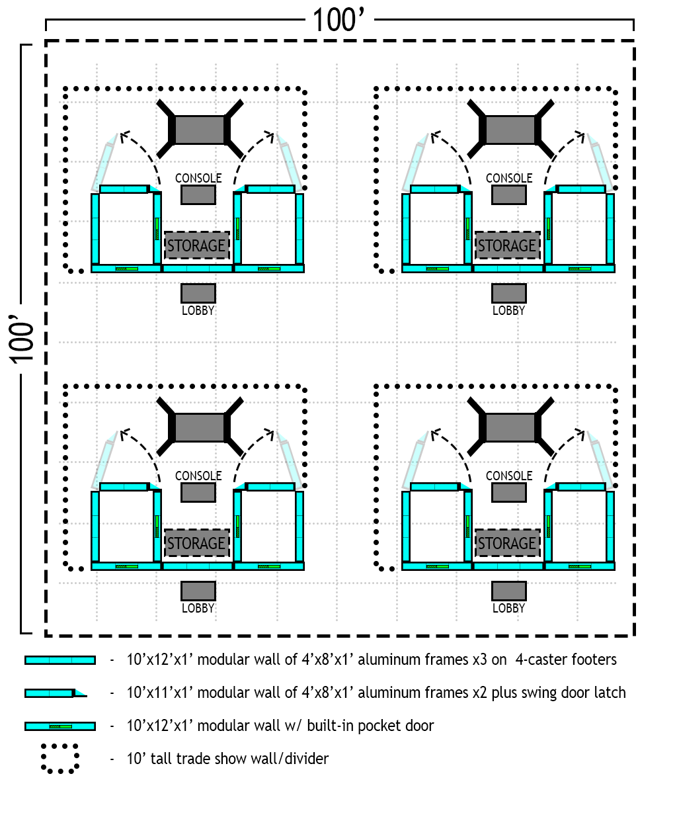
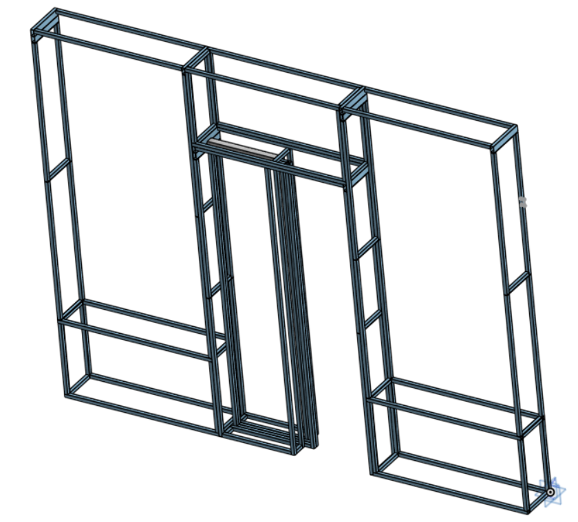
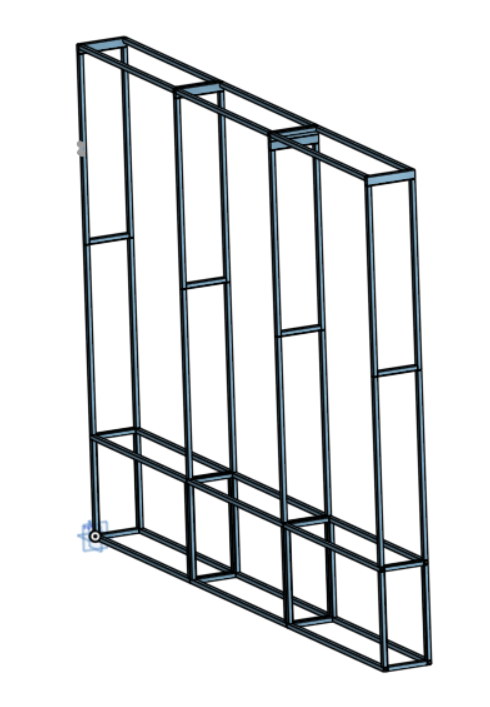
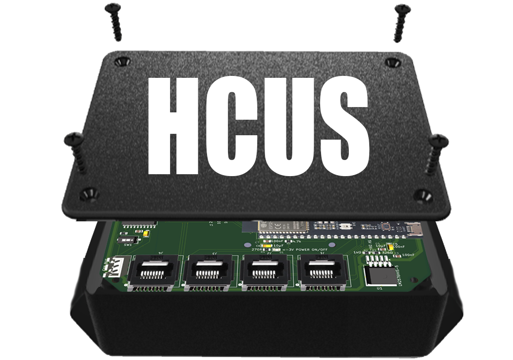
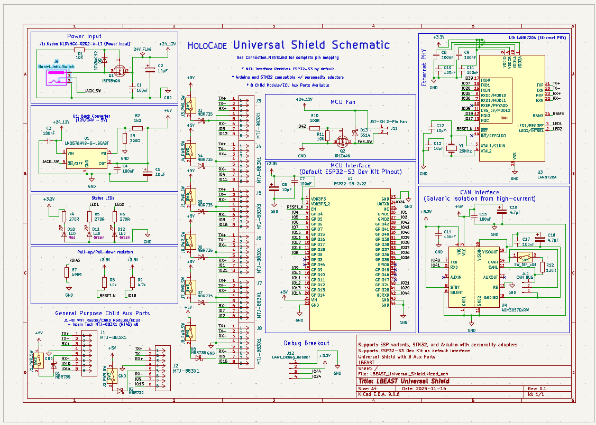
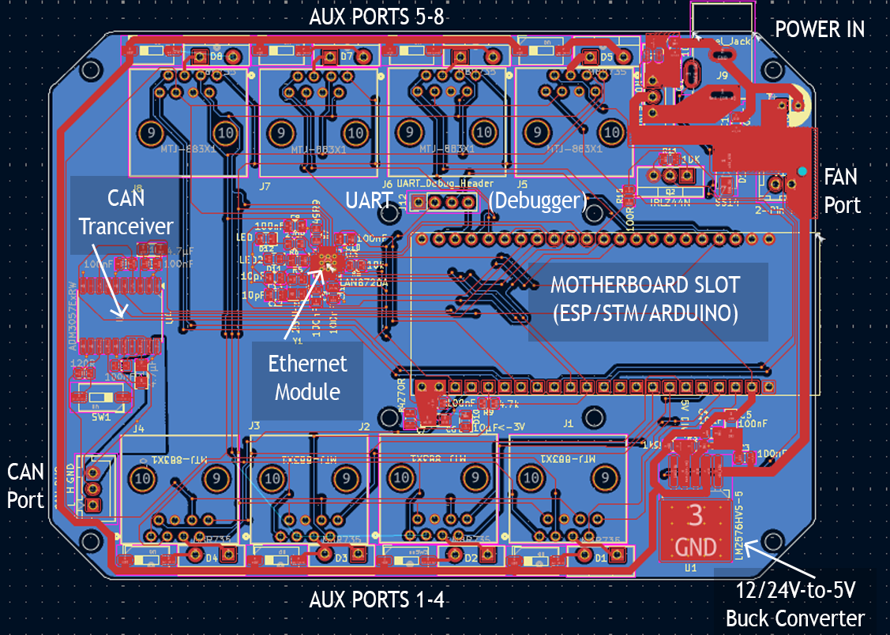
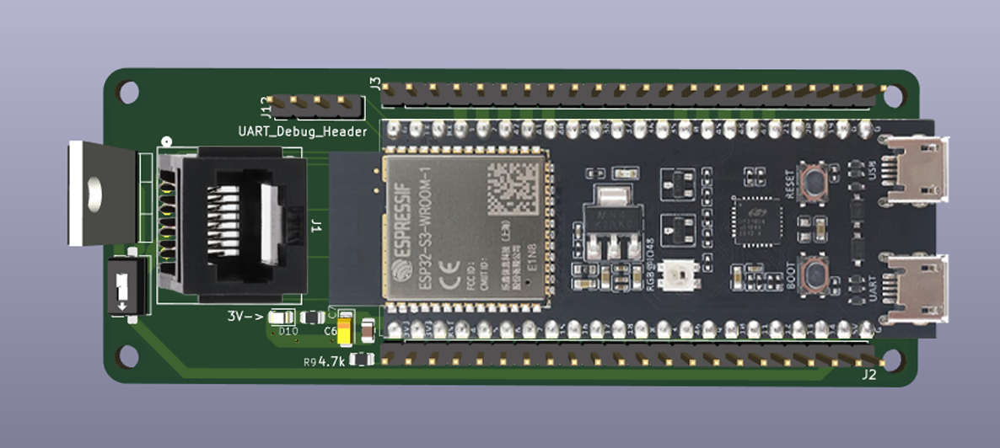

# HoloCade for Unity


**HoloCade SDK** - A comprehensive SDK for developing VR/AR Location-Based Entertainment experiences in Unity with support for AI facial animation, large hydraulic haptics, and embedded systems integration.

<details>
<summary><strong>⚠️Author Disclaimer:</strong></summary>

<blockquote>
This is a brand new plugin as of November 2025. Parts of it are not fully fleshed out. The author built location-based entertainment activations for Fortune 10 brands over the past decade. This is the dream toolchain he wishes we had back then, but it probably still contains unforeseen bugs in its current form. V1.0 is considered Alpha. If you're seeing this message, it's because HoloCade has yet to deploy on a single professional project. Please use this code at your own risk. Also, this plugin provides code that may or may not run on systems your local and state officials may classify as  "amusement rides" or "theme park rides" which may fall under ASTM standards or other local regulations. HoloCade's author disclaims any liability for safety of guests or patrons or regulatory readiness. Please review the local regulations in your area prior to executing this code in any public venue. You are responsible for compliance in your state.
</blockquote>

</details><br>

[](https://github.com/scifiuiguy/holocade_unity/releases)
[](https://unity.com)
[](https://opensource.org/licenses/MIT)
[](https://microsoft.com/windows)

> **🔗 Unreal Version:** Also available at [github.com/scifiuiguy/holocade_unreal](https://github.com/scifiuiguy/holocade_unreal)

---

## 📖 Overview

HoloCade is a comprehensive SDK for developing VR and AR Location-Based Entertainment (LBE) experiences. This repository **is** the **Unity 6 LTS** HoloCade package (`package.json` at the root), intended for use inside Unity projects via Package Manager or by embedding under `Packages/com.ajcampbell.holocade/`.

The HoloCade SDK democratizes LBE development by providing:
- **Experience Genre Templates** - Drag-and-drop complete LBE solutions
- **Low-Level APIs** - Technical modules for custom integration between game engine and various physical systems
- **AI-Driven Facial Animation** for immersive theater live actors (automated w/ NVIDIA ACE)
- **Wireless Trigger Controls** - Embedded buttons in costume/clothing for narrative state machine control through WiFi/Bluetooth
- **Large-Scale Hydraulic Haptics** for lift/motion platforms
- **Embedded Systems Integration** for costume-/prop-/wall-/furniture-mounted interfaces
- **Embedded Sensors** temperature, motion, face, and body tracking sensors to trigger escape room actions
- **Co-located XR Multiplayer LAN Experiences** with Unity NetCode for GameObjects
- **HMD and Hand Tracking** via OpenXR (Unity's native XR system)
- **6DOF Tracking** with SteamVR trackers and future extensibility


<details>
<summary><strong>⚠️OpenXR Note:</strong></summary>

<blockquote>
HoloCade uses **OpenXR exclusively** for all HMD and hand tracking access through Unity's native XR system (`XRHandSubsystem`, `InputDevices`). If OpenXR is not desired for your LBE deployment for any reason, but you still want to use an HoloCade experience genre template to get started, there may be some customization necessary in `HoloCadeHandGestureRecognizer` and in some of the Experience classes. Anywhere OpenXR is referenced, you may need to create an alternative version of that class with your SDK of choice replacing OpenXR usage.

</blockquote>

</details><br>

---

## 💭 Philosophy

<details>
<summary><strong>Why HoloCade?</strong></summary>

<blockquote>

Home console VR usage is nascent and difficult despite being steadily on the rise:
* 80 million monthly active users in the U.S. in 2025
* up 60% from 2020
* 10% of Americans started using VR regularly so far this decade

If that growth holds, we might reach 100 million regular VR users by end-of-decade, more than 1/4 of the population. It's not smartphone-era growth, but it's steady.

BUT...

Content budgets are skin-and-bone. 

Building for VR requires specialty talent compared to film/TV/gaming, and every dollar spent goes half as far due to...
* deeper fidelity challenges
* bigger QA hurdles
* evil perf op constraints

VR devs need a leg up. The industry has been in a funding desert since the Pandemic. "VR is all hype" rumors put the dev community on a respirator, and we never got off the ropes.

I get where investors are coming from. We're 10 years into modern VR. They need proof of ROI. We need to deliver in the black. We need better tools. We were building cars without factories.


A better analogy - Movie Theaters:
If a Hollywood studio invested millions on a new film before the streaming era, they'd be sunk if there were no 35mm projector and no movie theaters hungry to roll the next hit.

An even better analogy - the JAMMA Arcade Spec:
In 1985, the arcade industry was in a slump. All the arcade boxes were proprietary. Venues had to buy a new arcade box for every game. Devs had to design a whole arcade box for just THEIR game. Enter the JAMMA Spec. Suddenly venues could leave the same box in place and swap a card, and suddenly it's a new game! Same hardware, fresh regular content. Devs could focus on the game knowing reliable hardware was already on-site.

We need that for the VR industry:
* Devs need to be able to focus on dev, not hardware
* Venues need standard hardware so devs can bring them regular new content.

We have an chicken-egg situation. A standard spec for VR LBE is what we need.

Enter HoloCade. Free, open-source, plug-n-play across multiple genres.


</blockquote>

</details>

<details>
<summary><strong>Who is HoloCade for?</strong></summary>

<blockquote>

HoloCade is for professional teams building commercial Location-Based Entertainment installations. It's a professional-grade toolchain designed for teams of programmers and technical artists.

**Target audiences:**
- **Theme park attraction designers/engineers/production staff** - Building immersive attractions with motion platforms, embedded systems, and live actor integration
- **VR Arcade venue designers/engineers/production staff** - Deploying multiplayer VR experiences with synchronized motion and professional audio/lighting
- **Brands at trade shows** interested in wowing audiences with VR
- **3rd-party VR developers** who want to deploy new content rapidly to theme parks and VR Arcades
- **VR educators** who want to expose students to professional toolchains used in commercial LBE production

The SDK provides:
- ✅ **C# programmers** with robust APIs and extensible architecture
- ✅ **Unity developers** with drag-and-drop components and visual scripting
- ✅ **Content teams** with rapid deployment capabilities
- ✅ **Commercial projects** with free-to-use, MIT-licensed code

</blockquote>

</details>

<details>
<summary><strong>Who is HoloCade not for?</strong></summary>

<blockquote>

Developers with little or no experience with C# may struggle to put HoloCade to its fullest use. It is meant for a scale of production that would be challenging for lone developers. However, it can be a great learning tool for educators to prepare students to work on professional team projects.

**Important notes:**
- HoloCade is **not** a no-code solution. It requires programming knowledge (C# or Unity scripting) to customize experiences beyond the provided templates.
- HoloCade is designed for **team-based production** with multiple developers, technical artists, and production staff.
- HoloCade provides prefabs, but it assumes tech art team members have access to C# programmers on the team to back them up for customization.

</blockquote>

</details>

---

## 🎯 Quick Start

```csharp
using HoloCade.ExperienceTemplates;

// Create a moving platform experience
var platform = gameObject.AddComponent<MovingPlatformExperience>();
platform.InitializeExperience();

// Send normalized motion (hardware-agnostic)
platform.SendPlatformTilt(0.5f, -0.3f, 0f, 1.5f);  // TiltX, TiltY, Vertical, Duration
```

---

## 📚 Table of Contents

<details>
<summary><strong>THIS README</strong></summary>

<blockquote>

- [Prerequisites & Package Dependencies](#-prerequisites--package-dependencies)
- [Three-Tier Architecture](#-three-tier-architecture)
- [Hardware-Agnostic Input System](#-hardware-agnostic-input-system)
- [Features](#-features)
- [Experience Genre Templates](#experience-genre-templates-pre-configured-solutions)
- [Low-Level APIs](#low-level-apis-technical-modules)
- [Installation](#-installation)
- [Examples](#-examples)
- [Dedicated Server & Server Manager](#-dedicated-server--server-manager)
- [Roadmap](#-roadmap)
- [License](#-license)

</blockquote>

</details>

<details>
<summary><strong>OTHER READMEs IN THIS PROJECT</strong></summary>

<blockquote>

**Low-Level APIs:**
- [VRPlayerTransport README](https://github.com/scifiuiguy/holocade_unity/blob/main/Runtime/Core/VRPlayerTransport/README.md) - `Runtime/Core/VRPlayerTransport/README.md`
- [Input README](https://github.com/scifiuiguy/holocade_unity/blob/main/Runtime/Core/Input/README.md) - `Runtime/Core/Input/README.md`
- [VOIP README](https://github.com/scifiuiguy/holocade_unity/blob/main/Runtime/VOIP/README.md) - `Runtime/VOIP/README.md`
- [EmbeddedSystems README](https://github.com/scifiuiguy/holocade_unity/blob/main/Runtime/EmbeddedSystems/README.md) - `Runtime/EmbeddedSystems/README.md`

**Firmware Examples:**
- [FirmwareExamples README](https://github.com/scifiuiguy/holocade_unity/blob/main/FirmwareExamples/README.md) - `FirmwareExamples/README.md`
- [GunshipExperience README](https://github.com/scifiuiguy/holocade_unity/blob/main/FirmwareExamples/GunshipExperience/README.md) - `FirmwareExamples/GunshipExperience/README.md`
- [FlightSimExperience README](https://github.com/scifiuiguy/holocade_unity/blob/main/FirmwareExamples/FlightSimExperience/README.md) - `FirmwareExamples/FlightSimExperience/README.md`
- [EscapeRoom README](https://github.com/scifiuiguy/holocade_unity/blob/main/FirmwareExamples/EscapeRoom/README.md) - `FirmwareExamples/EscapeRoom/README.md`
- [Base Examples README](https://github.com/scifiuiguy/holocade_unity/blob/main/FirmwareExamples/Base/Examples/README.md) - `FirmwareExamples/Base/Examples/README.md`
- [Base Templates README](https://github.com/scifiuiguy/holocade_unity/blob/main/FirmwareExamples/Base/Templates/README.md) - `FirmwareExamples/Base/Templates/README.md`

</blockquote>

</details>

---

## 📦 Prerequisites & Package Dependencies

> **📦 HoloCade is a Unity Package** - See the [Installation](#-installation) section below for detailed setup instructions.

<details>
<summary><strong>Unity Version Requirements</strong></summary>

<blockquote>

- **Unity 6 LTS (Recommended)** or Unity 2022.3 LTS (Minimum)
- **Windows 10/11** (Primary platform)
- **Linux** (Experimental support)

</blockquote>

</details>

<details>
<summary><strong>HoloCade Package Dependencies</strong></summary>

<blockquote>

HoloCade requires several Unity packages. These are **automatically installed** when you install HoloCade via Package Manager or Git URL. If installing manually, install these via **Window > Package Manager**:

#### **Core Dependencies (Required)**

| Package | Version | Purpose | Installation |
|---------|---------|---------|--------------|
| **XR Plugin Management** | 4.4.0+ | VR/AR runtime management | `com.unity.xr.management` |
| **OpenXR Plugin** | 1.9.0+ | Cross-platform VR support (required for HMD and hand tracking) | `com.unity.xr.openxr` |
| **XR Hands** | 1.3.0+ | Hand tracking support (required for gesture recognition) | `com.unity.xr.hands` |
| **Input System** | 1.7.0+ | Modern input handling | `com.unity.inputsystem` |
| **TextMeshPro** | 3.0.6+ | UI text rendering | `com.unity.textmeshpro` |

> **⚠️ OpenXR Requirement:** HoloCade uses OpenXR exclusively for all HMD and hand tracking. Your HMD must support OpenXR (most modern VR headsets do, including Meta Quest, Windows Mixed Reality, and SteamVR-compatible headsets via OpenXR). If your deployment requires a different XR SDK, you will need to customize the HMD/hand tracking components. See the main Overview section for details.

#### **Multiplayer Dependencies (Required for AIFacemask)**

| Package | Version | Purpose | Installation |
|---------|---------|---------|--------------|
| **NetCode for GameObjects** | 1.8.0+ | Multiplayer networking | `com.unity.netcode.gameobjects` |
| **Unity Transport** | 2.2.0+ | Network transport layer | `com.unity.transport` |

#### **Optional Packages (Platform-Specific)**

| Package | Version | Purpose | When Needed |
|---------|---------|---------|-------------|
| **SteamVR Plugin** | 2.7.3+ | SteamVR integration (optional, for 6DOF body/prop tracking with SteamVR trackers) | If using SteamVR trackers for body/prop tracking |
| **Oculus Integration** | Latest | Meta Quest integration (optional, OpenXR handles Quest via OpenXR) | Only if you need Oculus-specific features beyond OpenXR |
| **XR Interaction Toolkit** | 2.5.0+ | VR interaction helpers | For advanced VR interactions |

</blockquote>

</details>

<details>
<summary><strong>Quick Setup (If You Cloned This Repo)</strong></summary>

<blockquote>

This repository **is the HoloCade package** (`package.json` at the repo root): there is no Unity host project here (no `Assets/` / `ProjectSettings/` in this clone).

**To use HoloCade in your own Unity project:**

1. Add it via **Package Manager → Add package from Git URL** (see [Installation](#-installation)), **or**
2. Clone or submodule this repo into `YourProject/Packages/com.ajcampbell.holocade/` (see embed options in [Installation](#-installation)).

Dependencies resolve from HoloCade’s `package.json` when the package is added to a project.

**Project window / tooling:** Optional shell and batch scripts (compile checks, dedicated-server launcher, version bump) live in **`BuildTooling~/`**. Folders whose names end with **`~`** are ignored by Unity’s Asset Database, so those files do not import into the Project window and do not log importer errors. This root **`README.md`** stays at the package root so it remains visible alongside `package.json` and imports as a normal text asset.

For installation options and Git URLs, see the [Installation](#-installation) section below.

</blockquote>

</details>

<details>
<summary><strong>Project Settings Configuration</strong></summary>

<blockquote>

After installing packages, configure:

1. **XR Plugin Management**
   - **Edit > Project Settings > XR Plug-in Management**
   - Enable **OpenXR** for your target platform (required for HMD and hand tracking)
   - Configure **OpenXR Feature Sets** (hand tracking, controllers, etc.)
   - **Note:** HoloCade uses OpenXR exclusively. Ensure hand tracking is enabled in OpenXR settings for gesture recognition to work.

2. **Input System**
   - **Edit > Project Settings > Player > Active Input Handling**
   - Select **"Both"** (supports old and new input systems)

3. **Physics**
   - **Edit > Project Settings > Physics**
   - Verify collision layers for VR interactions

</blockquote>

</details>

<details>
<summary><strong>Verification</strong></summary>

<blockquote>

To verify all dependencies are installed:

1. Open **Window > Package Manager**
2. Switch to **"In Project"** view
3. Confirm all required packages are listed

If you see compilation errors about missing namespaces:
- `Unity.Netcode` → Install NetCode for GameObjects
- `Unity.XR.OpenXR` → Install OpenXR Plugin
- `UnityEngine.InputSystem` → Install Input System

</blockquote>

</details>

<details>
<summary><strong>Common Issues & Troubleshooting</strong></summary>

<blockquote>

#### **"The type or namespace name 'NetworkBehaviour' could not be found"**
**Solution:** Install `com.unity.netcode.gameobjects` via Package Manager.

#### **"The type or namespace name 'InputSystem' could not be found"**
**Solution:** 
1. Install `com.unity.inputsystem`
2. Go to **Edit > Project Settings > Player**
3. Change **Active Input Handling** to **"Both"** or **"Input System Package (New)"**

#### **"Assembly has reference to non-existent assembly 'Unity.XR.OpenXR'"**
**Solution:** Install `com.unity.xr.openxr` and enable OpenXR in **Edit > Project Settings > XR Plug-in Management**.

#### **Package installation fails or gets stuck**
**Solution:**
1. Close Unity Editor
2. Delete `Library/` folder in project root
3. Delete `Packages/packages-lock.json`
4. Reopen Unity Editor (will reimport all packages)

#### **"Could not load file or assembly 'Unity.Netcode.Runtime'"**
**Solution:** 
1. Restart Unity Editor
2. If that fails, reimport NetCode package: **Package Manager > NetCode for GameObjects > Right-click > Reimport**

</blockquote>

</details>

---

## 🏗️ Three-Tier Architecture

HoloCade uses a modular three-tier architecture for code organization and server/client deployment.

### Code and Class Structure

<details>
<summary><strong>Tier 1: Low-Level APIs (Technical Modules)</strong></summary>

<blockquote>

Foundation modules providing core functionality:
- `HoloCadeCore` - VR/XR tracking abstraction, networking
- `HoloCadeAI` - Low-level AI API (LLM, ASR, TTS, container management)
- `LargeHaptics` - Platform/gyroscope control
- `EmbeddedSystems` - Microcontroller integration
- `ProAudio` - Professional audio console control via OSC
- `ProLighting` - DMX lighting control (Art-Net, USB DMX)
- `Retail` - Cashless tap card payment interface for VR tap-to-play
- `VOIP` - Low-latency voice communication with 3D HRTF spatialization
- `RF433MHz` - 433MHz wireless remote/receiver integration with rolling code validation

**Use these when:** Building custom experiences from scratch with full control.

</blockquote>

</details>

<details>
<summary><strong>Tier 2: Experience Genre Templates (Pre-Configured MonoBehaviours)</strong></summary>

<blockquote>

Ready-to-use complete experiences combining multiple APIs:
- `AIFacemaskExperience` - Live actor-driven multiplayer VR with wireless trigger buttons controlling automated AI facemask performances
- `MovingPlatformExperience` - A 4-gang hydraulic platform on which a single VR player stands while hooked to a suspended cable harness to prevent falling
- `GunshipExperience` - 4-player seated platform with 4DOF hydraulic motion driven by a 4-gang actuator platform with a player strapped in at each corner, all fixed to a hydraulic lift that can dangle players a few feet in the air
- `CarSimExperience` - A racing/driving simulator where 1-4 player seats are bolted on top of a 4-gang hydraulic platform
- `FlightSimExperience` - A single player flight sim with HOTAS controls in a 2-axis gyroscopic cockpit built with servo motors for pitch and roll. **⚠️ Requires outside-in tracking with cockpit-mounted trackers for Space Reset feature (see FlightSimExperience/README.md)** 
- `EscapeRoomExperience` - Puzzle-based escape room with embedded door lock/prop latch solenoids, sensors, and pro AV integration for light/sound and live improv actors
- `GoKartExperience` - Electric go-karts, bumper cars, race boats, or bumper boats augmented by passthrough VR or AR headsets enabling overlaid virtual weapons and pickups that affect the performance of the vehicles
- `SuperheroFlightExperience` - A dual-hoist-harness-and-truss system that lifts a player into the air and turns them prone to create the feeling of superhero flight as they punch fists out forward, up, or down

**Use these when:** Rapid deployment of standard LBE genres.


</blockquote>

</details>

<details>
<summary><strong>Tier 3: Your Custom Game Logic</strong></summary>

<blockquote>

Build your specific experience (Tier 3) on top of templates (Tier 2) or APIs (Tier 1).

</blockquote>

</details>

<details>
<summary><strong>When to Use What?</strong></summary>

<blockquote>

| Scenario | Use This | Why |
|----------|----------|-----|
| Building a gunship VR arcade game | `GunshipExperience` | Pre-configured for 4 players, all hardware setup included |
| Building a racing game | `CarSimExperience` | Simplified driving API, optimized motion profiles |
| Building a space combat game | `FlightSimExperience` | HOTAS integration ready, continuous rotation supported |
| Custom 3-player standing platform | Low-Level APIs | Need custom configuration not covered by templates |
| Live actor-driven escape room | `AIFacemaskExperience` | Wireless trigger buttons in costume control narrative state machine, automated AI facemask performances |
| Puzzle-based escape room | `EscapeRoomExperience` | Narrative state machine, door locks, prop sensors, embedded systems |
| Go-kart racing with VR/AR overlay | `GoKartExperience` | Passthrough VR/AR support, virtual weapons, item pickups, projectile combat |
| Superhero flight simulation | `SuperheroFlightExperience` | Dual-winch suspended harness, gesture-based control, free-body flight |
| Unique hardware configuration | Low-Level APIs | Full control over all actuators and systems |

**Rule of thumb:** Start with templates, drop to APIs only when you need customization beyond what templates offer.

</blockquote>

</details>

### LAN Server/Client Configuration

<details>
<summary><strong>Local Command Console</strong></summary>

<blockquote>

```
┌─────────────────────────────────────────────┐
│  Single PC (Command Console + Server)       │
│  ────────────────────────────────────────   │
│  • Command Console UI (monitoring)          │
│  • Server Manager (dedicated server)        │
│  • NVIDIA ACE Pipeline (if AIFacemask)       │
└───────────────────┬─────────────────────────┘
                    │
                    │ UDP Broadcast (port 7778)
                    │
        ┌───────────┴───────────┐
        │                       │
        ▼                       ▼
   ┌─────────┐            ┌─────────┐
   │  HMD 1  │            │  HMD 2  │
   │(Client) │            │(Client) │
   └─────────┘            └─────────┘
   ... (Player 1...N, Live Actor 1...N)
```

**Use when:** Simple setup, single machine, lightweight network traffic.

</blockquote>

</details>

<details>
<summary><strong>Dedicated Server + Separate Local Command Console</strong></summary>

<blockquote>

```
┌─────────────────────────────────────────────┐
│  Server PC (Dedicated Server)               │
│  ────────────────────────────────────────   │
│  • Server Manager (dedicated server)        │
│  • NVIDIA ACE Pipeline (if AIFacemask)      │
└───────────────────┬─────────────────────────┘
                    │
                    │ UDP Broadcast (port 7778)
                    │
        ┌───────────┴───────────┐
        │                       │
        ▼                       ▼
   ┌─────────┐            ┌─────────┐
   │  HMD 1  │            │  HMD 2  │
   │(Client) │            │(Client) │
   └─────────┘            └─────────┘
   ... (Player 1...N, Live Actor 1...N)

┌─────────────────────────────────────────────┐
│  Console PC (Command Console)               │
│  ────────────────────────────────────────   │
│  • Command Console UI (monitoring)           │
│  • Connected via UDP (port 7779)             │
└─────────────────────────────────────────────┘
```

**Use when:** Heavy processing workloads, better performance isolation, HMD battery life optimization.

</blockquote>

</details>

<details>
<summary><strong>Dedicated Server + Remote Command Console</strong></summary>

<blockquote>

```
┌─────────────────────────────────────────────┐
│  Server PC (Dedicated Server)               │
│  ────────────────────────────────────────   │
│  • Server Manager (dedicated server)        │
│  • NVIDIA ACE Pipeline (if AIFacemask)    │
└───────────────────┬─────────────────────────┘
                    │
                    │ UDP Broadcast (port 7778)
                    │
        ┌───────────┴───────────┐
        │                       │
        ▼                       ▼
   ┌─────────┐            ┌─────────┐
   │  HMD 1  │            │  HMD 2  │
   │(Client) │            │(Client) │
   └─────────┘            └─────────┘
   ... (Player 1...N, Live Actor 1...N)

                    │
                    │ Internet Node
                    │
                    ▼
┌─────────────────────────────────────────────┐
│  Remote Console PC (Command Console)       │
│  ────────────────────────────────────────   │
│  • Command Console UI (monitoring)          │
│  • Connected via UDP (port 7779) over       │
│    internet (VPN recommended)               │
└─────────────────────────────────────────────┘
```

**Use when:** Off-site monitoring (debugging/testing only - use VPN and authentication for security).

</blockquote>

</details>

<details>
<summary><strong>When to Use What Configuration?</strong></summary>

<blockquote>

| Scenario | Recommended Configuration | Why |
|----------|---------------------------|-----|
| Basic single-player experience | **Local Command Console** (same PC as server) | Simple setup, no need for separate machines. Command Console launches and manages server locally. |
| Basic multiplayer with RPCs but no heavy data transferring wirelessly | **Local Command Console** (same PC as server) | Network traffic is lightweight (player positions, events). Local Command Console can manage server on same machine efficiently. |
| Lots of heavy graphics processing you want to offload from VR HMD(s) | **Dedicated + Separate Local** or **Dedicated + Remote** | Offload GPU-intensive rendering and AI processing to dedicated server PC. Better performance isolation and HMD battery life. |
| Need to monitor the experience in real-time from off-site? | **Dedicated + Remote** ⚠️ | Remote Command Console can connect over network to monitor server status, player count, experience state, and logs from a separate location. **⚠️ Recommended for debugging/testing only. For general public operation, full internet isolation is recommended for security.** Requires authentication enabled in Command Protocol settings. |

**Configuration Options:**
- **Local Command Console:** Command Console (UI Panel) and Server Manager (dedicated server) run on the same PC. Simple setup, one machine.
- **Dedicated + Separate Local:** Server Manager runs on dedicated PC, Command Console runs on separate local PC (same LAN). Networked via UDP (port 7779). Better for heavy processing workloads.
- **Dedicated + Remote:** Server Manager runs on dedicated PC, Command Console runs on remote PC (over internet). Networked via UDP (port 7779). VPN and authentication recommended.

</blockquote>

</details>

---


## 🏗️ Standard Pop-up Layout

> **Note:** The Standard Pop-up Layout is **recommended but not required**. HoloCade can be deployed in any configuration that meets your needs. This standard format is optimized for rapid pop-up deployments in public venues.

HoloCade is applicable to a large variety of venues, but it is designed in particular to enable rapid deployment of pop-up VR LBE. The SDK pairs well with a standard physical layout which, when used, gives everyone in the ecosystem confidence of rapid deployment and content refresh.



<details>
<summary><strong>Overview</strong></summary>

<blockquote>

HoloCade is designed for **1-to-4 player co-located VR multiplayer experiences** in publicly accessible venues such as:
- Trade shows
- Civic centers
- Shopping malls
- Theme parks
- Corporate events
- Brand activations

#### Open Layout

- Standard minimum roomscale dimensions suitable for AIFacemask narratives and escape rooms
- Minimum 10' × 10' cordoned-off play space
- Virtual guardian setup recommended with 2-foot padding buffer to the cord to prevent player from striking outside viewer
- Consider outer margin buffer with secondary cord for extra safety (12' × 12')
- 20' × 20' recommended for any open layout using large haptics

#### Closed Layout

- 20' × 40' minimum play space to accommodate swinging ingress/egress walls
- Establish guardian with 2-foot padding buffer to walls for safety
- Consider safety cord to prevent players from reaching the Ops console

</blockquote>

</details>

<details>
<summary><strong>Space Recommendations</strong></summary>
<blockquote>

- **Play Area:** 100+ square feet of open play space
- **Ceiling Height:** Sufficient clearance for players swinging long padded props (minimum 10+ feet recommended)
- **Minimum Total Space:** 50% of total space may be allocated for retail, ingress, and egress infrastructure
- **Flexible Boundaries:** Play space can be cordoned off with temporary trade-show walls or dividers around the 50% play area

</blockquote>

</details>

<details>
<summary><strong>Minimum Square Footage</strong></summary>

<blockquote>

**Standard pop-up installation minimum square footage recommendation: ~40' × ~40'**

This includes:
- **Dual ingress/egress stations** (~12' × ~12' each) equipped with up to 4 VR HMDs apiece
- **Dual battery charging stations** ready for hot-swap after each playthrough
- **Charger stalls in staging area** near Ops Tech monitor console/server (~12' × ~12')
- **Play space** with enough room for ingress/egress door swing (~18' × ~40')
- **Lobby/Greeting area** with dual ingress/egress entry/exit (~10' × ~40')

</blockquote>

</details>

<details>
<summary><strong>Author's Framing Recommendations</strong></summary>

<blockquote>

<table>
<tr>
<td width="30%">

The author of HoloCade is a hobbyist TIG welder who has built many aluminum chassis frames. You can use the provided HoloCade OnShape procedural templates to quickly generate framing designs at dimensions you prefer, but HoloCade's author recommends you consider the following:

- **HoloCade's author is not a certified mechanical engineer** (he's a software engineer)
  - Author disclaims any liability in regard to use of any included CAD designs
  - Included designs are only a starting point
- **Minimum 1" square tube**
  - Mild steel - best price
  - Stainless steel - best strength and good corrosion resistance (most premium)
  - 5051 aluminum w/ clear coat - best balance of strength, weldability, corrosion resistance, and price
- **Use stainless steel hardware** for minimum galvanic corrosion
  - HoloCade CAD templates default to rivnut joints configuration for rapid assembly/teardown
  - HoloCade CAD templates contain teardown animation rigs
    - Too many welds = hard to box and ship
    - Too many bolts = time lost during assembly/teardown
    - OnShape teardown animation rigs aim to provide a Goldilocks balance between the two
  - Male/female rivnut pair config with flanged 1/4-20 Imperial or M6x1.0 Metric hex recommended
    - Pairing rivnuts opens option to run a bolt through one frame piece or the other or both
  - Rivnuts yield fastest assembly teardown with only 1 impact gun & 1 Imperial bit/1 Metric bit
  - Rivnuts avoid need for washers, nuts, and other loose parts - 1 bolt per rivnut - nothing more
  - **OPTIONAL:** eliminate loose bolts
    - Cut an access port ortho to each bolt hole (opposite side of display face)
    - Install double-capture nuts inside tube w/ an amount of play equal to drill depth
    - Bolts become semi-permanently attached to the frame - no more loose parts
  - Choose bolt shank length at 1.5X tube width e.g. 2 1" square tubes join flush w/ 1 1.5" flanged hex bolt
  - **NOTE:** rivnut collar mates w/ a .375" or 10mm hole but opposing bolt flange needs a 0.26" or 6.6mm hole
- **Minimum 0.625" wall thickness**
  - Widely available and perfectly reliable @ 10ft high with no heavy loads on top
  - Hire a qualified engineer to confirm loaded designs (marquees, jumbotrons, etc.)
- **Minimum 6" wall depth**
  - 1" tube x2 inner/outer
  - 1" tube x2 inner/outer pocket door guide
  - 2" pocket door
- **Weld type recommendation** in order of high-to-low quality-for-price:
  - Laser
  - TIG
  - MIG
- **Welder should grind all welds clean** to ensure flush-mount at all joints
- **Ground welds are more likely to fail** - torture test random pieces for proper penetration
- **HoloCade OnShape CAD templates + hired welders** = MUCH cheaper than off-the-shelf branded solutions
- **Framing is often outsourced** to live event companies who may prefer proprietary framing designs
- **HoloCade CAD templates offer a leg-up** for any venue looking for a more integrated in-house solution
- **Consult local officials** regarding regulatory compliance when using custom framing

</td>
<td width="70%">



</td>
</tr>
</table>

</blockquote>

</details>

<details>
<summary><strong>Modular Wall System</strong></summary>

<blockquote>

<table>
<tr>
<td width="30%">

The modular wall frame shown here is a procedurally generated CAD model created using OnShape FeatureScript. This model demonstrates the structural steel framing system used in the standard HoloCade pop-up layout, with configurable dimensions for rapid customization. The complete CAD models and FeatureScript source code are available in the [HoloCade OnShape repository](https://github.com/scifiuiguy/HoloCade_OnShape).

The standard installation uses a **modular wall facade system** for rapid setup and teardown:

</td>
<td width="70%">



</td>
</tr>
</table>

#### Wall Components
- **Panel Size:** 4' × 8' lightweight composite panels (e.g. ACM)
- **Frame Height:** 10' total (8' panel + 2' footer)
- **Frame Material:** Steel framing on pairs of swivel caster legs
- **Exterior Surface:** Light-weight composite material with vinyl graphics capability
- **Connections:** QuickConnect interfaces on all sides for rapid assembly
- **Bracket Support:** Rivnuts offset from parallel QuickConnect for 90-degree bracket attachments
- **Optional detachable 2-caster side-mounts:** Consider letting footer sit on ground with rivnuts on inner footer ready to mate with a caster pair for each end to facilitate rapid redeploy of reusable parts to other stations at the same location

#### Footer System
- **Height:** 2' tall swivel caster footers
- **Exterior:** Composite surface flush with walls above and floor on exterior side
- **Interior:** Standard grid pattern enabling 80/20 aluminum furniture attachments and snap-on facia tiling

#### Facade Configuration
- **Standard Height:** 10' tall facade behind lobby desk
- **Quick Assembly:** Modular panels connect rapidly via QuickConnect system
- **Graphics Ready:** Vinyl exterior graphics can be applied to panels

</blockquote>

</details>

<details>
<summary><strong>Ingress/Egress Rooms</strong></summary>

<blockquote>

The standard layout includes **two mirror-image ingress/egress stations**:

#### Dimensions & Layout
- **Room Size:** 12' × 12' each (3 panels wide)
- **Separation:** Two rooms separated by 4' with two parallel panels forming a closet space between them
- **Open-Air Console:** The rear of the two parallel panels may be left out to provide visibility into the play space for the Ops Tech to run the console from the closet space during playthrough.
- **AR Experience Monitoring:** If the experience is AR, the second panel may be one-way glass or a solid wall with camera monitors supporting the Ops Tech at the console.
- **Command Console:** The Ops Tech may drive the experience from a networked console usually running an Admin Panel built with either UI Toolkit in Unity or UMG in Unreal.
  > **Note:** The **"Command Console"** is the UI Panel (admin interface) used by Operations Technicians. It provides the graphical interface for monitoring and controlling the experience. The **"Server Manager"** is the dedicated server backend that handles all network traffic, decision-making, graphics processing offloaded from VR harnesses, and other heavy computational tasks. The Command Console (UI) may run on the same CPU/PC as the Server Manager (dedicated server), or they may be separate but networked in close proximity.
- **Flow:** Front-of-House (FOH) Retail clerk directs up to four players in alternating fashion to the next available ingress station (left or right)

#### Features per Room
- **Swing Wall:** One panel-footer pair may include a built-in hinge to enable the entire rear wall to swing open, revealing the play area after players don VR headsets
- **Harness Storage:** Wall with four hooks to stow VR harnesses between uses
- **Charging Cabinet:** 80/20 aluminum framing cabinet for rapid battery recharge cycling
- **Capacity:** Up to four VR harnesses per room (eight total across both rooms)
- **Chargers:** Four chargers per room (eight total)

</blockquote>

</details>

<details>
<summary><strong>Staffing Requirements</strong></summary>

<blockquote>

**Minimum Staff:** Two employees during operation hours

1. **Front-of-House (FOH) Retail Clerk**
   - Operates lobby desk
   - Point-of-sale station (tablet or computer)
   - Directs players to ingress stations
   - Handles transactions and customer service

2. **Operations Technician (Ops Tech)**
   - Assists with player ingress/egress
   - Manages VR harness distribution and collection
   - Performs battery swaps
   - Monitors experience operations

**Optional Staff:**
- **Immersive Actors:** Join players in the experience to enhance immersion
- Additional support staff as needed for high-traffic venues

</blockquote>

</details>

<details>
<summary><strong>VR Harness & Power Specifications</strong></summary>

<blockquote>

#### Battery System
- **Type:** Hot-swap LiFePO4 6S5P 21700 battery packs
- **Drain Rate:** ~5% per playthrough
- **Swap Protocol:** Ops Tech swaps batteries after each playthrough to ensure harnesses are always near 100% State of Charge (SOC)
- **Total Harnesses:** 8 harnesses (4 per ingress/egress room)

#### Power Requirements
- **Continuous Draw:** 250W-500W per harness
- **Drain-to-Charge Ratio:** 1:4 (always reaching near 100% SOC before reuse)
- **Charging Specifications:**
  - **250W Harnesses:** 5A chargers
  - **500W Harnesses:** 10A chargers

#### Power Management
- All batteries reach near 100% SOC before reuse
- Continuous operation enabled by hot-swap system
- No reserve battery mode needed due to swap protocol

</blockquote>

</details>

<details>
<summary><strong>Lobby & Retail Area</strong></summary>

<blockquote>

- **Lobby Desk:** Point-of-sale station with tablet or computer
- **Facade:** 10' tall modular wall facade behind lobby desk
- **Graphics:** Vinyl exterior graphics on facade panels
- **Flow:** Customers enter lobby → FOH directs to ingress → Ops Tech assists with setup → Play → Egress → Return to lobby

</blockquote>

</details>

<details>
<summary><strong>Rapid Deployment Benefits</strong></summary>

<blockquote>

This standard format enables:
- **Fast Setup:** Modular components assemble quickly via QuickConnect system
- **Easy Teardown:** Disassembles rapidly for venue transitions
- **Consistent Operations:** Standardized layout and procedures across venues
- **Professional Appearance:** Clean, branded facade with custom graphics
- **Operational Efficiency:** Streamlined player flow and battery management

</blockquote>

</details>

<details>
<summary><strong>HoloCade-Ready Venue Configuration</strong></summary>

<blockquote>

To be considered **HoloCade-ready**, a venue would aim to have at least a handful of 40' × 40' stations:

- **100' × 100' play space** subdivided into 4 play stations is perfect for variety
- **One play space each** dedicated to each unique hardware genre:
  - One gunship space
  - One AI narrative space
  - One escape room space
  - One car and flight sim arcade

**The Theater Analogy:**
Just like movie theaters where multiple screens offer variety, VR play spaces can function similarly. Variety creates demand:
- **Customer** arrives knowing a variety of new content choice is always on-site
- **Developer** knows their experience is supported by on-site hardware
- **Venue** knows many developers are in-progress on new content
- **Result:** A healthy, thriving market

</blockquote>

</details>

<details>
<summary><strong>Safety Considerations</strong></summary>

<blockquote>

- **QTY2 Up-to-code Fire Emergency Fire Extinguishers:** One at the Ops Tech Console and another near any hydraulic equipment.
- **Movable stairs:** Any system that causes players to be lifted into the air must have a physical means of egress in an e-stop emergency.
- **Hydraulically-actuated equipment should have multiple manual and auto e-stops** located at console and on device.
- **Theme park safety regulations vary by state** - take steps to abide by the same rules that apply to carnival equipment in your state.
- **The author of HoloCade disclaims any liability resulting in the use of this free software.**

</blockquote>

</details>

<details>
<summary><strong>Recommended HMD Hardware Example</strong></summary>

<blockquote>

For standard HoloCade installations, the following hardware configuration provides optimal performance and reliability:

#### VR Headset
- **Model:** Meta Quest 3 (512GB, standalone VR/MR)
- **Price Range:** $450–$500 per unit (2025 pricing)
- **Features:** Standalone VR/MR capability, OpenXR-compatible, includes controllers
- **Note:** Supports both standalone and PC-connected modes for maximum flexibility

#### Backpack PC (VR Harness Compute Unit)
- **Model:** ASUS ROG Zephyrus G16 GU605 (2025 edition)
- **CPU:** Intel Core Ultra 9
- **GPU:** NVIDIA RTX 5080 (or RTX 5070 Ti for cost optimization)
- **RAM:** 32GB
- **Storage:** 2TB SSD
- **Price Range:** $2,800–$3,200 per unit
- **Form Factor:** Gaming laptop (backpack-compatible)
- **Use Case:** Powers VR headset for high-end rendering, offloads graphics processing from HMD battery

#### Safety Harness
- **Model:** Petzl EasyFit harness (full-body fall arrest, size 1–2)
- **Price Range:** $300–$350 per unit
- **Features:** Newton EasyFit model; padded, quick-donning for adventure/ride use
- **Use Case:** Full-body fall arrest protection for players on motion platforms and elevated play spaces
- **Availability:** REI/Amazon pricing

#### Integration & Assembly
- **System Integration:** The backpack PC, HMD, and EasyFit harness are all connected together as an integrated VR harness system
- **Connection Method:** Custom straps and 3D-printed interfaces secure all components together
- **Assembly:** Backpack PC mounts to harness via 3D-printed brackets; HMD connects to backpack via cable; harness provides structural support and safety attachment points
- **Result:** Single unified system that players don and doff as one unit, streamlining ingress/egress operations
- **Ingress/Egress Support:** Each ingress/egress station contains four carabiner hooks mounted to the wall, allowing the entire integrated rig to be suspended during donning/doffing. This enables players to unstrap and egress rapidly without dropping or damaging equipment, while keeping the rig ready for the next player

**Why This Configuration?**
- **High Performance:** RTX 5080/5070 Ti provides sufficient power for complex VR experiences
- **Battery Efficiency:** Offloading graphics processing extends HMD battery life
- **Flexibility:** Laptop form factor enables backpack mounting or stationary use
- **Future-Proof:** High-end specs support demanding experiences and future content updates

**Alternative Configurations:**
- For lighter experiences: RTX 5070 Ti configuration (~$2,800) provides cost savings
- For maximum performance: RTX 5080 configuration (~$3,200) enables highest-quality rendering
- Bulk purchasing (10+ units) typically provides ~5% discount

</blockquote>

</details>

<details>
<summary><strong>Why should any given arcade venue integrate HoloCade?</strong></summary>

<blockquote>

<details>
<summary><strong>Why Should a Venue Integrate VR at All?</strong></summary>

<blockquote>

It's surprisingly difficult to make VR LBE economically viable for current arcades:

1. **Customer Comfort Concerns:** Not all customers want a heavy HMD on their face, messing up their hair.

2. **Hygiene Challenges:** Gaskets or personal-use eye-pads are a hassle for venues new to VR.

3. **Space Requirements:** A next-level experience takes up valuable square footage. You can fit ~15 arcade boxes in the bare minimum footage of an HoloCade installation even though HoloCade is fairly economical for rapid multiplayer ingress/egress.

4. **Staffing Requirements:** Next-level VR can't operate stand-alone. A minimum of two employees must be on-hand per experience throughout daily operation. With next-level VR (especially w/ machines involving motion simulation), at least one of the employees needs to be decently tech-savvy. Employing full-time technicians hasn't been a thing in mall arcades since the early 90s, back when industry demand was super-hot.

With these constraints, it's hard enough to turn profit at all (though not impossible), let alone draw as much revenue as near-zero-maintenance coin-op machines. But if we want a new Arcade Renaissance, it has to start somewhere.

</blockquote>

</details>

<details>
<summary><strong>Here's Why</strong></summary>

<blockquote>

1) **Customers Don't Know What They're Missing Yet:** Many customers think of "zombie-shoot-em-up" games when they think of VR. That only appeals to a certain demo. They don't know there's an incredible variety of action, puzzle, comedy, adventure, wonder, and narrative gengres too. Like movies, centrain genres will wow ANYONE beyond their wildest dreams when they realize what they've been missing.

2) **Hygiene Challenges Are Easy:** Hygiene is very solvable, especially now that HMD makers are making modular face guard attachments. Every venue is recommended to provide customers their own personal foam snap-in faceguards (integrated into cost of admission) and tell them to keep it handy until end-of-day. No more sweat tranfer concerns. Currently, snap-ins are unique to each manufacturer, but the industry will hopefully standardize soon on a universal face guard design. Venues should pressure HMD makers to make that happen ASAP.

3) **Space Is Just Another Balance Sheet Cell (as long as it's feasibly black not red):** Movie theaters necessarily take up immense space. If you want a 21st-century arcade, next-level VR is the new best-in-show. It's the only way to prove your arcade is the best in the country. VR requires sacrificing coin-op space OR possibly upgrading to a larger lease, but it can be done without loss leaders if done carefully.

4) **Premium Technical Staff are a Feature not a Bug** Yes, you'll need full-time techincians. No, it's not a deal-breaker. In fact, having staff who can service/repair VR machinery can also keep the coin-op boxes in top shape. Customers today are already paying $20-50 per playthrough for modern VR LBE, and that's usually for blank-play-area experiences that have no hydraulic motion sims. Experiences may run 10-30-minutes-a-pop, 4-8 simultaneous players. Add coin-op multiplayer integration, and there's plenty of room for a technician's wage in that revenue stream. It's fairly low-margin compared to other options, but other options embrace the past. This is the future.

Coin-op is an easy revenue stream because it's 1/2 a century old. It's tried-and-true, but it's also dusty, crusty, and dull in the customer's eyes. Coin-op boxes are a great blast from the past if you have the right games. They'll give nostalgic vibes and keep customers at the venue, but they won't **BRING CUSTOMERS TO** the venue. VR will, if next-level VR attractions are installed correctly with enough variety.


</blockquote>

</details>

<details>
<summary><strong>The Variety Challenge</strong></summary>

<blockquote>

Small arcades may only have room for one HoloCade attraction. VR LBE will remain challenging with only one play space. Customers need variety, like a movie theater. Any single-VR-space venue is highly encouraged to invite other VR providers to set up shop right next door in the same mall. It might seem like competition, but with the industry in recession, there is strength in numbers. Circle the wagons to lift all boats.

</blockquote>

</details>

<details>
<summary><strong>The Movie Theater Analogy</strong></summary>

<blockquote>

Just as movie theaters with only one screen will struggle to get customers off the couch, arcade venues with only one VR experience will struggle too. If multiple venues need to come together at a single mall to bring variety, it's worth it. HoloCade's author recommends you dedicate at least 800 square feet (400 each) to two play spaces. 1600 square feet is much more viable, just as a 4-screen theater is much better than a 1- or 2-screen. Small venues may need to work with a single multi-purpose play space, which means if you have hydraulic rigs, you may need to move them throughout the day for experiences that don't need them. If you have at least two spaces, you can dedicate one to semi-stationary hydraulic systems, and the other to an open play area. Then, if you upgrade to four play spaces later, you can do 2-and-2.

</blockquote>

</details>

<details>
<summary><strong>Integrating Coin-Op with VR</strong></summary>

<blockquote>

You can also line the perimeter of any VR play space with classic coin-op boxes. You can hang banners/marquees/live-play-jumbotrons high enough overhead for all peripheral players to view the premium content they're missing in the center. Coin-op is fun, but the layout of the venue should encourage customer eyelines at all times not to miss the most premium content at the venue. It is even feasible and encouraged to design multiplayer experiences that allow coin-op-style joystick boxes to play in the same sessions as the VR players for a greater multiplayer experience that could never be achieved with home VR. The peripheral joystick stations could serve as peripheral support or peripheral challenge to the VR players, giving each player type levels of value for the level of pay.

</blockquote>

</details>

</blockquote>

</details>

---

## ✨ Features

### Experience Genre Templates (Drag-and-Drop Solutions)

Experience Genre Templates are complete, pre-configured MonoBehaviours that you can add to your scene and use immediately. Each combines multiple low-level APIs into a cohesive, tested solution.

<details>
<summary><strong>🎭 AI Facemask Experience</strong></summary>

<blockquote>

<br>

<details>
<summary><strong>How the Live Actor Controls their AI Face</strong></summary>

<blockquote>

<details>
<summary><strong>Head and Body Tracking</strong></summary>

<blockquote>

A live actor wears an HMD e.g. Meta Quest or Steam Frame. Any HMD will work as long as it supports 10-finger hand tracking for full-body control. Body tracking may include Ultimate trackers on feet or automated foot IK. Foot tracking is not built-in yet for HoloCade v1.0.

</blockquote>

</details>

<details>
<summary><strong>Live Actor Narrative Controls</strong></summary>

<blockquote>

The live actor can wear custom PCBs (sample code and design provided) that allow production to sew hidden wireless buttons into the lining of costumes. In the provided default example, a forward button is sewn into a right wrist band and a reverse button is sewn into a left wrist band. Hidden buttons are necessary because the live actor needs to portray to the player that they ARE the AI character. They are driving the hands, feet, and head direction of the AI in real-time while the AI animates only the face. They are essentially wearing an AI like a Halloween mask. They have zoomed-out control over the AI face. They don't control emotions or face shapes or specific words. That's all automated. They control the overarching story via at least two buttons, forward/reverse. It's sort of like skip buttons on an MP3 player.

</blockquote>

</details>

<details>
<summary><strong>The AI Can Improvise Conversation?</strong></summary>

<blockquote>

Yes, in the default implementation of the Facemask template, the AI facemask is a fully-functional AI NPC. It has a narrative script that the live actor can see in HUD and control one-sentence-at-a-time via forward/reverse buttons, but the player can also interrupt the AI face with conversation. The default AI face is designed to receive conversation input by processing the player's audio into text, generating a text reply, converting that text reply into an audio voice you've pre-trained, and rendering animation of a neurally-generated face you've also pre-trained. With this method, you can bring historically figures or beloved fictional characters to life, and they can give players haptic feedback with real, physical handshakes, high-fives, etc. You can imagine a beloved fictional character grabbing your hand and taking you on a journey through your favorite fictional setting. The haptic feedback of a fictional character's hand touching yours is next-level immersion that wasn't possible even a few years ago.

</blockquote>

</details>

</blockquote>

</details>

<br>

**📚 Documentation:**
- [HoloCadeAI API README](https://github.com/scifiuiguy/holocade_unity/blob/main/Runtime/HoloCadeAI/README.md) - Low-level AI API documentation (LLM, ASR, TTS, container management)
- [AIFacemask Experience README](https://github.com/scifiuiguy/holocade_unity/blob/main/Runtime/ExperienceTemplates/AIFacemaskExperience/README.md) - Complete AIFacemask experience documentation

**Class:** `AIFacemaskExperience`

Deploy LAN multiplayer VR experiences where immersive theater live actors drive avatars with **fully automated AI-generated facial expressions**. The AI face is controlled entirely by NVIDIA ACE pipeline - no manual animation, rigging, or blend shape tools required.

**Architecture:** This experience template uses the **`HoloCadeAI` API** (low-level AI services) for LLM, ASR, and TTS functionality. The `HoloCadeAI` API is decoupled and reusable - you can use it to build other AI-powered experiences beyond facemask.

**⚠️ DEDICATED SERVER REQUIRED ⚠️**

This template **enforces** dedicated server mode. You **must** run a separate local PC as a headless dedicated server. This is **not optional** - the experience will fail to initialize if ServerMode is changed to Listen Server.

**Network Architecture:**
```
┌─────────────────────────────────────┐
│   Dedicated Server PC (Headless)    │
│                                     │
│  ┌───────────────────────────────┐  │
│  │  Unity Dedicated Server       │  │ ← Multiplayer networking
│  │  (No HMD, no rendering)       │  │
│  └───────────────────────────────┘  │
│                                     │
│  ┌───────────────────────────────┐  │
│  │  NVIDIA ACE Pipeline           │  │ ← AI Workflow:
│  │  - Speech Recognition         │  │   Audio → NLU → Emotion
│  │  - NLU (Natural Language)     │  │              ↓
│  │  - Emotion Detection          │  │   Facial Animation
│  │  - Facial Animation Gen       │  │   (Textures + Blend Shapes)
│  └───────────────────────────────┘  │              ↓
└─────────────────────────────────────┘   Stream to HMDs
               │
        LAN Network (UDP/TCP)
               │
        ┌──────┴────────┐
        │               │
   VR HMD #1      VR HMD #2      (Live Actors)
   VR HMD #3      VR HMD #4      (Players)
```

**AI Facial Animation (Fully Automated):**
- **NVIDIA ACE Pipeline**: Generates facial textures and blend shapes automatically
- **No Manual Control**: Live actors never manually animate facial expressions
- **No Rigging Required**: NVIDIA ACE handles all facial animation generation
- **Real-Time Application**: AIFaceController receives NVIDIA ACE output and applies to mesh
- **Mask-Like Tracking**: AIFace mesh is tracked on top of live actor's face in HMD
- **Context-Aware**: Facial expressions determined by audio, NLU, emotion, and narrative state machine
- **Automated Performances**: Each narrative state triggers fully automated AI facemask performances

**Live Actor Control (High-Level Flow Only):**
- **Wireless Trigger Buttons**: Embedded in live actor's costume/clothes (ESP32, WiFi-connected)
- **Narrative State Control**: Buttons advance/retreat the narrative state machine (Intro → Act1 → Act2 → Finale)
- **Automated Performance Triggers**: State changes trigger automated AI facemask performances - live actor controls when, not how
- **Experience Direction**: Live actor guides players through story beats by controlling narrative flow

**Why Dedicated Server?**
- **Performance**: Offloads heavy AI processing from VR HMDs
- **Parallelization**: Supports multiple live actors simultaneously
- **Reliability**: Isolated AI workflow prevents HMD performance degradation
- **Scalability**: Easy to add more live actors or players

**Automatic Server Discovery:**

HoloCade includes a **zero-configuration UDP broadcast system** for automatic server discovery:
- **Server**: Broadcasts presence every 2 seconds on port `7778`
- **Clients**: Automatically discover and connect to available servers
- **No Manual IP Entry**: Perfect for LBE installations where tech setup should be invisible
- **Multi-Experience Support**: Discover multiple concurrent experiences on the same LAN
- **Server Metadata**: Includes experience type, player count, version, current state

When a client HMD boots up, it automatically finds the dedicated server and connects - zero configuration required!

**Complete System Flow:**

The AI Facemask system supports two workflows: **pre-baked scripts** (narrative-driven) and **real-time improv** (player interaction-driven).

**Pre-Baked Script Flow (Narrative-Driven):**
```
Live Actor presses wireless trigger button (embedded in costume)
    ↓
Narrative State Machine advances/retreats (Intro → Act1 → Act2 → Finale)
    ↓
ACE Script Manager triggers pre-baked script for new state
    ↓
NVIDIA ACE Server streams pre-baked facial animation (from cached TTS + Audio2Face)
    ↓
AIFaceController receives facial animation data (blend shapes + textures)
    ↓
Facial animation displayed on live actor's HMD-mounted mesh
```

**Real-Time Improv Flow (Player Interaction-Driven):**
```
Player speaks into HMD microphone
    ↓
VOIPManager captures audio → Sends to Mumble server
    ↓
Dedicated Server receives audio via Mumble
    ↓
ACE ASR Manager (visitor pattern) receives audio → Converts speech to text (NVIDIA Riva ASR)
    ↓
ACE Improv Manager receives text → Local LLM (with LoRA) generates improvised response
    ↓
Local TTS (NVIDIA Riva) converts text → audio
    ↓
Local Audio2Face (NVIDIA NIM) converts audio → facial animation
    ↓
Facial animation streamed to AIFaceController
    ↓
Facial animation displayed on live actor's HMD-mounted mesh
```

**Component Architecture:**
```
┌─────────────────────────────────────────────────────────────────┐
│  PLAYER HMD (Client)                                            │
│  ────────────────────────────────────────────────────────────   │
│  1. Player speaks into HMD microphone                           │
│  2. VOIPManager captures audio                                  │
│  3. Audio sent to Mumble server (Opus encoded)                  │
└───────────────────────┬─────────────────────────────────────────┘
                        │
                        ▼
┌─────────────────────────────────────────────────────────────────┐
│  MUMBLE SERVER (LAN)                                            │
│  ────────────────────────────────────────────────────────────   │
│  Routes audio to dedicated server                               │
└───────────────────────┬─────────────────────────────────────────┘
                        │
                        ▼
┌─────────────────────────────────────────────────────────────────┐
│  DEDICATED SERVER PC (Unity Server)                             │
│  ────────────────────────────────────────────────────────────   │
│                                                                 │
│  ┌──────────────────────────────────────────────────────────┐   │
│  │  ACE ASR Manager (VOIP-to-AIFacemask Visitor Pattern)    │   │
│  │  - Receives audio from Mumble                            │   │
│  │  - Buffers audio (voice activity detection)              │   │
│  │  - Converts speech → text (NVIDIA Riva ASR)              │   │
│  │  - Triggers Improv Manager with text                     │   │
│  └───────────────────────┬──────────────────────────────────┘   │
│                          │                                      │
│                          ▼                                      │
│  ┌──────────────────────────────────────────────────────────┐   │
│  │  ACE Improv Manager                                      │   │
│  │  - Receives text from ASR Manager                        │   │
│  │  - Local LLM (Ollama/vLLM/NIM + LoRA) → Improvised text  │   │
│  │  - Local TTS (NVIDIA Riva) → Audio file                  │   │
│  │  - Local Audio2Face (NVIDIA NIM) → Facial animation      │   │
│  └───────────────────────┬──────────────────────────────────┘   │
│                          │                                      │
│                          ▼                                      │
│  ┌──────────────────────────────────────────────────────────┐   │
│  │  ACE Script Manager                                      │   │
│  │  - Manages pre-baked scripts                             │   │
│  │  - Triggers scripts on narrative state changes           │   │
│  │  - Pre-bakes scripts (TTS + Audio2Face) on ACE server    │   │
│  └──────────────────────────────────────────────────────────┘   │
└───────────────────────┬─────────────────────────────────────────┘
                        │
                        │ Facial Animation Data (Blend Shapes + Textures)
                        │
                        ▼
┌─────────────────────────────────────────────────────────────────┐
│  LIVE ACTOR HMD (Client)                                        │
│  ────────────────────────────────────────────────────────────   │
│  ┌──────────────────────────────────────────────────────────┐   │
│  │  AIFaceController                                        │   │
│  │  - Receives facial animation data from server            │   │
│  │  - Applies blend shapes/textures to mesh                 │   │
│  │  - Real-time facial animation display                    │   │
│  └──────────────────────────────────────────────────────────┘   │
└─────────────────────────────────────────────────────────────────┘
```

**Integration with HoloCadeAI Module:**
The AIFacemask Experience uses the **HoloCadeAI** module for all low-level AI capabilities, but the two are **decoupled**:
- **HoloCadeAI Module**: Provides generic, reusable AI APIs (LLM, ASR, TTS, container management)
- **AIFacemask Experience**: Uses HoloCadeAI but adds experience-specific features:
  - Narrative state machine integration
  - Face controller integration
  - Experience-specific script structures
  - Experience-specific delegates and events

**AIFacemask Components (extend HoloCadeAI base classes):**
- `AIFacemaskScriptManager` extends `AIScriptManager` (HoloCadeAI)
- `AIFacemaskImprovManager` extends `AIImprovManager` (HoloCadeAI)
- `AIFacemaskASRManager` extends `AIASRManager` (HoloCadeAI)

This architecture allows:
- **Reusability**: HoloCadeAI can be used by other experiences without AIFacemask dependencies
- **Extensibility**: Future experiences can use HoloCadeAI for custom AI workflows
- **Maintainability**: AI capabilities are centralized in HoloCadeAI, experience-specific logic in AIFacemask

**Architecture:**
- **AI Face**: Fully autonomous, driven by NVIDIA ACE pipeline (Audio → NLU → Emotion → Facial Animation)
- **Live Actor Role**: High-level experience director via wireless trigger buttons, NOT facial puppeteer
- **Wireless Controls**: Embedded trigger buttons in live actor's costume/clothes (4 buttons total)
- **Narrative State Machine**: Live actor advances/retreats through story beats (Intro → Tutorial → Act1 → Act2 → Finale → Credits)
- **Automated Performances**: AI facemask performances are fully automated - live actor controls flow, not expressions
- **Server Mode**: **ENFORCED** to Dedicated Server (attempting to change will fail initialization)

**Note:** All AI capabilities are provided by the **HoloCadeAI** module. AIFacemask components extend HoloCadeAI base classes to add narrative state machine integration and experience-specific features.

**Live Actor Control System:**
- **Wireless Trigger Buttons**: Embedded in live actor's costume/clothes (ESP32-based, WiFi-connected)
- **High-Level Flow Control**: Buttons advance/retreat the narrative state machine, which triggers automated AI facemask performances
- **No Facial Control**: Live actor never manually controls facial expressions - NVIDIA ACE handles all facial animation
- **Experience Direction**: Live actor guides players through story beats by advancing/retreating narrative states

**Includes:**
- Pre-configured `AIFaceController` (receives NVIDIA ACE output, applies to mesh)
- Pre-configured `SerialDeviceController` (wireless trigger buttons embedded in costume)
- Pre-configured `ExperienceStateMachine` (narrative story progression)
- Pre-configured `AIFacemaskScriptManager` (pre-baked script collections, extends `HoloCadeAI.AIScriptManager`)
- Pre-configured `AIFacemaskImprovManager` (real-time improvised responses, extends `HoloCadeAI.AIImprovManager`)
- Pre-configured `AIFacemaskASRManager` (speech-to-text for player voice, extends `HoloCadeAI.AIASRManager`)
- Pre-configured `AIFacemaskLiveActorHUDComponent` (VR HUD overlay for live actors) - TODO: Implement Unity equivalent
- Uses `HoloCadeAI` API for all AI services (LLM, ASR, TTS, container management)
- LAN multiplayer support (configurable live actor/player counts)
- Passthrough mode for live actors to help players

**Button Layout (Embedded in Costume):**
- **Left Wrist/Clothing**: Button 0 (Advance narrative), Button 1 (Retreat narrative)
- **Right Wrist/Clothing**: Button 2 (Advance narrative), Button 3 (Retreat narrative)

**Quick Start:**
```csharp
// In your scene
var experience = gameObject.AddComponent<AIFacemaskExperience>();
experience.numberOfLiveActors = 1;
experience.numberOfPlayers = 4;
experience.liveActorMesh = myCharacterMesh;

// ServerMode is already set to DedicatedServer by default
// DO NOT CHANGE IT - initialization will fail if you do

experience.InitializeExperience();  // Will validate server mode

// Live actor controls high-level flow via wireless trigger buttons embedded in costume
// Buttons advance/retreat narrative state machine, which triggers automated AI facemask performances
// Facial expressions are fully automated by NVIDIA ACE - no manual control needed

// React to experience state changes (triggered by live actor's buttons)
string currentState = experience.GetCurrentExperienceState();

// Programmatically trigger state changes (usually handled by wireless buttons automatically)
experience.AdvanceExperience();  // Advance narrative state
experience.RetreatExperience();  // Retreat narrative state
```

**❌ What Happens If You Try to Use Listen Server:**
```
========================================
⚠️  SERVER MODE CONFIGURATION ERROR ⚠️
========================================
This experience REQUIRES ServerMode to be set to 'DedicatedServer'
Current ServerMode is set to 'ListenServer'

Please change ServerMode in the Inspector to 'DedicatedServer'
========================================
```

**Handle State Changes:**
Override `OnNarrativeStateChanged` to trigger game events when live actor advances/retreats narrative state via wireless trigger buttons:
```csharp
protected override void OnNarrativeStateChanged(string oldState, string newState, int newStateIndex)
{
    // State changes are triggered by live actor's wireless trigger buttons
    // Each state change triggers automated AI facemask performances
    if (newState == "Act1")
    {
        // Spawn enemies, trigger cutscene, etc.
        // NVIDIA ACE will automatically generate facial expressions for this state
    }
}
```

</blockquote>

</details>

<details>
<summary><strong>🎢 Moving Platform Experience</strong></summary>

<blockquote>

**Class:** `MovingPlatformExperience`

Single-player standing VR experience on an unstable hydraulic platform with safety harness. Provides pitch, roll, and Y/Z translation for immersive motion.

**Includes:**
- Pre-configured 4DOF hydraulic platform (4 actuators + scissor lift)
- 10° pitch and roll capability
- Vertical translation for rumble/earthquake effects
- Emergency stop and return-to-neutral functions
- Blueprint-friendly motion commands

**Quick Start:**
```csharp
var platform = gameObject.AddComponent<MovingPlatformExperience>();
platform.maxPitch = 10.0f;
platform.maxRoll = 10.0f;
platform.InitializeExperience();

// Send normalized tilt (RECOMMENDED - hardware-agnostic)
// -1.0 to +1.0 automatically scales to hardware capabilities
platform.SendPlatformTilt(0.3f, -0.5f, 0.0f, 2.0f);  // TiltX (right), TiltY (backward), Vertical, Duration

// Advanced: Use absolute angles if you need precise control
platform.SendPlatformMotion(5.0f, -3.0f, 20.0f, 2.0f);  // pitch, roll, vertical, duration
```

</blockquote>

</details>

<details>
<summary><strong>🚁 Gunship Experience</strong></summary>

<blockquote>

**Class:** `GunshipExperience`

Four-player VR experience where each player is strapped to the corner of a hydraulic platform capable of 4DOF motion (pitch/roll/forward/reverse/lift-up/liftdown). Perfect for multiplayer gunship, helicopter, spaceship, or multi-crew vehicle simulations.

**Includes:**
- Pre-configured 4DOF hydraulic platform (6 actuators + scissor lift)
- 4 pre-defined seat positions
- LAN multiplayer support (4 players)
- Synchronized motion for all passengers
- Emergency stop and safety functions

**Quick Start:**
```csharp
var gunship = gameObject.AddComponent<GunshipExperience>();
gunship.InitializeExperience();

// Send normalized motion (RECOMMENDED - hardware-agnostic)
// Values from -1.0 to +1.0 automatically scale to hardware capabilities
gunship.SendGunshipTilt(0.5f, 0.8f, 0.2f, 0.1f, 1.5f);  // TiltX (roll), TiltY (pitch), ForwardOffset, VerticalOffset, Duration

// Advanced: Use absolute angles if you need precise control
gunship.SendGunshipMotion(8.0f, 5.0f, 10.0f, 15.0f, 1.5f);  // pitch, roll, forwardOffset (cm), verticalOffset (cm), duration
```

</blockquote>

</details>

<details>
<summary><strong>🏎️ Car Sim Experience</strong></summary>

<blockquote>

**Class:** `CarSimExperience`

Single-player seated racing/driving simulator on a hydraulic platform. Perfect for arcade racing games and driving experiences.

**Includes:**
- Pre-configured 4DOF hydraulic platform optimized for driving
- Motion profiles for cornering, acceleration, and bumps
- Compatible with racing wheels and pedals (via Unity Input System)
- Simplified API for driving simulation

**Quick Start:**
```csharp
var carSim = gameObject.AddComponent<CarSimExperience>();
carSim.InitializeExperience();

// Use normalized driving API (RECOMMENDED - hardware-agnostic)
carSim.SimulateCornerNormalized(-0.8f, 0.5f);      // Left turn (normalized -1 to +1)
carSim.SimulateAccelerationNormalized(0.5f, 0.5f); // Accelerate (normalized -1 to +1)
carSim.SimulateBump(0.8f, 0.2f);                   // Road bump (intensity 0-1)

// Advanced: Use absolute angles if you need precise control
carSim.SimulateCorner(-8.0f, 0.5f);         // Left turn (degrees)
carSim.SimulateAcceleration(5.0f, 0.5f);    // Accelerate (degrees)
```

</blockquote>

</details>

<details>
<summary><strong>✈️ Flight Sim Experience</strong></summary>

<blockquote>

**Class:** `FlightSimExperience`

Single-player flight simulator using a two-axis gyroscope for continuous rotation beyond 360 degrees. Perfect for realistic flight arcade games and space combat.

**Includes:**
- Pre-configured 2DOF gyroscope system (continuous pitch/roll)
- **HOTAS controller integration:**
  - Logitech G X56 support
  - Thrustmaster T.Flight support
  - Joystick, throttle, and pedal controls
  - Configurable sensitivity and axis inversion
- Continuous rotation (720°, 1080°, unlimited)
- Unity Input System integration

**Quick Start:**
```csharp
var flightSim = gameObject.AddComponent<FlightSimExperience>();
flightSim.hotasType = HOTASType.LogitechX56;
flightSim.enableJoystick = true;
flightSim.enableThrottle = true;
flightSim.InitializeExperience();

// Read HOTAS input in Update
Vector2 joystick = flightSim.GetJoystickInput();  // X=roll, Y=pitch
float throttle = flightSim.GetThrottleInput();

// Send continuous rotation command (can exceed 360°)
flightSim.SendContinuousRotation(720.0f, 360.0f, 4.0f);  // Two barrel rolls!
```

</blockquote>

</details>

<details>
<summary><strong>🚪 Escape Room Experience</strong></summary>

<blockquote>

**Class:** `EscapeRoomExperience`

Puzzle-based escape room experience with narrative state machine, embedded door locks, and prop sensors. Perfect for interactive puzzle experiences with physical hardware integration.

**Includes:**
- Pre-configured narrative state machine (puzzle progression)
- Embedded door lock control (unlock/lock doors via microcontroller)
- Prop sensor integration (read sensor values from embedded devices)
- Automatic door unlocking based on puzzle state
- Door state callbacks (confirm when doors actually unlock)

**Quick Start:**
```csharp
var escapeRoom = gameObject.AddComponent<EscapeRoomExperience>();
escapeRoom.InitializeExperience();

// Unlock a specific door (by index)
escapeRoom.UnlockDoor(0);  // Unlock door 0

// Lock a door
escapeRoom.LockDoor(0);

// Check if door is unlocked
bool isUnlocked = escapeRoom.IsDoorUnlocked(0);

// Trigger a prop action (e.g., activate a sensor)
escapeRoom.TriggerPropAction(0, 1.0f);  // Prop 0, value 1.0

// Read prop sensor value
float sensorValue = escapeRoom.ReadPropSensor(0);

// Get current puzzle state
string currentState = escapeRoom.GetCurrentPuzzleState();
```

**Handle State Changes:**
Override `OnNarrativeStateChanged` in your derived class:
```csharp
protected override void OnNarrativeStateChanged(string oldState, string newState, int newStateIndex)
{
    if (newState == "Puzzle1_Complete")
    {
        // Unlock next door, play sound, etc.
    }
}
```

</blockquote>

</details>

<details>
<summary><strong>🏎️ Go-Kart Experience</strong></summary>

<blockquote>

**Class:** `GoKartExperience`

Electric go-karts, bumper cars, race boats, or bumper boats augmented by passthrough VR or AR headsets enabling overlaid virtual weapons and pickups that affect the performance of the vehicles.

**Includes:**
- Pre-configured passthrough VR/AR support for real-world vehicle driving
- Virtual weapon/item pickup system with projectile combat
- Barrier collision system for projectile interactions
- Throttle control (boost/reduction based on game events)
- Shield system (hold item behind kart to block projectiles)
- Procedural spline-based track generation
- Multiple track support (switchable during debugging)
- ECU integration for physical vehicle control

**Quick Start:**
```csharp
var goKart = gameObject.AddComponent<GoKartExperience>();
goKart.ECUIPAddress = "192.168.1.100";
goKart.ECUPort = 8888;
goKart.InitializeExperience();

// Apply throttle boost/reduction based on game event
goKart.ApplyThrottleEffect(1.5f, 5.0f);  // 50% boost for 5 seconds

// Switch to a different track (for debugging)
goKart.SwitchTrack(1);  // Switch to track index 1
```

**Use Cases:**
- Electric go-kart racing with VR weapon overlay
- Bumper car arenas with virtual power-ups
- Race boat experiences with AR overlays
- Bumper boat attractions with virtual combat

</blockquote>

</details>

<details>
<summary><strong>🦸 Superhero Flight Experience</strong></summary>

<blockquote>

**Class:** `SuperheroFlightExperience`

Pre-configured dual-winch suspended harness system for free-body flight (flying like Superman). Uses gesture-based control (10-finger/arm gestures) - no HOTAS, no button events, no 6DOF body tracking.

**Features:**
- Dual-winch system (front shoulder-hook, rear pelvis-hook)
- Five flight modes: Standing, Hovering, Flight-Up, Flight-Forward, Flight-Down
- Gesture-based control (fist detection, HMD-to-hands vector analysis)
- Virtual altitude system (raycast for landable surfaces)
- 433MHz wireless height calibration clicker
- Server-side parameter exposure (airHeight, proneHeight, speeds, angles)
- Safety interlocks (calibration mode only, movement limits, timeout)

**Note:** Distinct from FlightSimExperience (2DOF gyroscope HOTAS cockpit for jet/spaceship simulation).

**Quick Start:**
```csharp
var superheroFlight = gameObject.AddComponent<SuperheroFlightExperience>();
superheroFlight.ECUIPAddress = "192.168.1.100";
superheroFlight.ECUPort = 8888;
superheroFlight.InitializeExperience();

// Get current gesture state
SuperheroFlightGestureState gestureState = superheroFlight.FlightHandsController.GetGestureState();

// Get current flight mode
SuperheroFlightGameState flightMode = superheroFlight.GetCurrentGameState();

// Acknowledge standing ground height (after calibration)
superheroFlight.AcknowledgeStandingGroundHeight();
```

**Gesture Control:**
- **Both fists closed** = Flight motion enabled
- **Single hand release** = Hover/stop
- **Arms pointing up** = Flight-Up mode
- **Arms pointing forward** = Flight-Forward mode (prone position)
- **Arms pointing down** = Flight-Down mode

**Height Calibration:**
- Use 433MHz wireless clicker for height adjustment during calibration mode
- Buttons mapped to "HeightUp" and "HeightDown" functions
- Calibration mode automatically disabled after 5 minutes of inactivity

</blockquote>

</details>

---

## 🔧 Low-Level APIs (Technical Modules)

When you need full control or custom hardware configurations, use the low-level API modules:

<details>
<summary><strong>Core Module (`HoloCade.Core`)</strong></summary>

<blockquote>

### Core Module (`HoloCade.Core`)

**Classes:**
- `HoloCadeTrackingSystem` - VR/XR tracking using Unity's native OpenXR system (HMD and controller tracking)
- `HoloCadeHandGestureRecognizer` - Hand gesture recognition component using OpenXR hand tracking
- `HoloCadeNetworkManager` - LAN multiplayer with Unity NetCode for GameObjects
- `HoloCadeExperienceBase` - Base class for custom experiences

> **⚠️ OpenXR Requirement:** HoloCade uses OpenXR exclusively for HMD and hand tracking. If you need to use a different XR SDK (SteamVR native, Meta SDK, etc.), you will need to customize `HoloCadeHandGestureRecognizer` and experience classes that use HMD/hand tracking. See the main Overview section for details.

**Example:**
```csharp
using HoloCade.Core;

var tracking = gameObject.AddComponent<HoloCadeTrackingSystem>();
tracking.InitializeTracking();

Vector3 hmdPos = tracking.GetHMDPosition();
Quaternion hmdRot = tracking.GetHMDRotation();
bool triggerPressed = tracking.IsTriggerPressed(XRNode.RightHand);
```

</blockquote>

</details>

<details>
<summary><strong>🎛️ LargeHaptics API</strong></summary>

<blockquote>

**Module:** `HoloCade.LargeHaptics`

Manual control of individual hydraulic actuators, gyroscopes, and scissor lift translation.

<details>
<summary><strong>🎮 Hardware-Agnostic Input System - Normalized Tilt Control (-1 to +1)</strong></summary>

<blockquote>

HoloCade uses a **joystick-style normalized input system** for all 4DOF hydraulic platforms. This means you write your game code once, and it works on any hardware configuration:

**Why Normalized Inputs?**
- ✅ **Hardware Independence:** Same game code works on platforms with 5° tilt or 15° tilt
- ✅ **Venue Flexibility:** Operators can upgrade/downgrade hardware without code changes
- ✅ **Intuitive API:** Think like a joystick: -1.0 (full left/back), 0.0 (center), +1.0 (full right/forward)
- ✅ **Automatic Scaling:** SDK maps your inputs to actual hardware capabilities

**Example:**
```csharp
// Your game sends: "tilt 50% right, 80% forward"
platform.SendPlatformTilt(0.5f, 0.8f, 0.0f, 1.0f);

// On 5° max platform: Translates to Roll=2.5°, Pitch=4.0°
// On 15° max platform: Translates to Roll=7.5°, Pitch=12.0°
// Same code, automatically scaled!
```

**Axis Mapping:**
- **TiltX:** Left/Right roll (-1.0 = full left, +1.0 = full right)
- **TiltY:** Forward/Backward pitch (-1.0 = full backward, +1.0 = full forward)
- **ForwardOffset:** Scissor lift forward/reverse (-1.0 = full reverse, +1.0 = full forward, 0.0 = neutral)
- **VerticalOffset:** Scissor lift up/down (-1.0 = full down, +1.0 = full up, 0.0 = neutral)

**Advanced Users:** If you need precise control and know your hardware specs, angle-based APIs are available in the `Advanced` category.

</blockquote>

</details>

**4DOF Platform Example:**
```csharp
using HoloCade.LargeHaptics;

var controller = gameObject.AddComponent<PlatformController4DOF>();

HapticPlatformConfig config = new HapticPlatformConfig
{
    platformType = PlatformType.MovingPlatform_SinglePlayer,
    maxPitchDegrees = 10f,
    maxRollDegrees = 10f,
    maxTranslationY = 100f,  // Scissor lift forward/reverse
    maxTranslationZ = 100f   // Scissor lift up/down
};

controller.InitializePlatform(config);

// Send normalized motion (recommended)
controller.SendNormalizedMotion(0.5f, -0.3f, 0.2f, 1.5f);  // TiltX, TiltY, VerticalOffset, Duration

// Or send absolute motion command (advanced)
PlatformMotionCommand cmd = new PlatformMotionCommand
{
    pitch = 5f,
    roll = -3f,
    translationY = 20f,  // Scissor lift forward/reverse (cm)
    translationZ = 15f,  // Scissor lift up/down (cm)
    duration = 1.5f
};
controller.SendMotionCommand(cmd);
```

**2DOF Flight Sim with HOTAS Example:**
```csharp
var flightSimController = gameObject.AddComponent<GyroscopeController2DOF>();

// Configure gyroscope settings
flightSimController.SetMaxRotationSpeed(90.0f);  // degrees per second
flightSimController.SetJoystickSensitivity(1.5f);
flightSimController.SetEnableHOTAS(true);

// Initialize connection to ECU
flightSimController.Initialize();

// Read HOTAS input
Vector2 joystickInput = flightSimController.GetHOTASJoystickInput();  // X = roll, Y = pitch
float throttleInput = flightSimController.GetHOTASThrottleInput();
float pedalInput = flightSimController.GetHOTASPedalInput();

// Send gyroscope state (automatically sent in Update() based on HOTAS input)
// Or send custom gyro state:
GyroState gyroState = new GyroState
{
    pitch = 720.0f,  // Two full rotations
    roll = 360.0f    // One full roll
};
flightSimController.SendGyroStruct(gyroState, 102);
```

</blockquote>

</details>

<details>
<summary><strong>🤖 HoloCadeAI API</strong></summary>

<blockquote>

**Module:** `HoloCade.HoloCadeAI`

Low-level AI API for all generative AI capabilities in HoloCade. This module provides LLM providers, ASR providers, TTS providers, Audio2Face integration, container management, and HTTP/gRPC clients for AI service communication.

**Important:** This is a **decoupled, reusable API** that can be used by any experience template. The `AIFacemaskExperience` uses this API, but you can build other experiences that leverage the same AI capabilities.

**LLM Provider Example:**
```csharp
using HoloCade.HoloCadeAI;

var llmManager = gameObject.AddComponent<LLMProviderManager>();
llmManager.InitializeProvider("http://localhost:8000", LLMProviderType.OpenAICompatible, "llama-3.2-3b-instruct");

var request = new LLMRequest
{
    playerInput = "Hello!",
    systemPrompt = "You are a helpful assistant.",
    modelName = "llama-3.2-3b-instruct",
    temperature = 0.7f,
    maxTokens = 150
};

llmManager.RequestResponse(request, (response) =>
{
    Debug.Log($"Response: {response.responseText}");
});
```

**ASR Provider Example:**
```csharp
using HoloCade.HoloCadeAI;

var asrManager = gameObject.AddComponent<AIASRManager>();
asrManager.InitializeASRManager();

// ASR Manager implements IVOIPAudioVisitor
// Register with VOIPManager to receive audio automatically
voipManager.RegisterAudioVisitor(asrManager);
```

**Container Management Example:**
```csharp
using HoloCade.HoloCadeAI;

var containerManager = gameObject.AddComponent<ContainerManagerDockerCLI>();
var config = new ContainerConfig
{
    imageName = "nvcr.io/nim/llama-3.2-3b-instruct:latest",
    containerName = "holocade-llm-llama",
    hostPort = 8000,
    containerPort = 8000,
    requireGPU = true
};

containerManager.StartContainer(config);
```

**Supported Providers:**
- **LLM**: Ollama, OpenAI-compatible (NVIDIA NIM, vLLM, OpenAI API, Claude API)
- **ASR**: NVIDIA Riva, Parakeet, Canary, Whisper (via NIM)
- **TTS**: NVIDIA Riva (via gRPC)
- **Container Management**: Docker CLI wrapper for managing AI service containers

**Hot-Swapping:** All providers support hot-swapping at runtime by changing endpoint URLs - perfect for NVIDIA NIM containerized models.

</blockquote>

</details>

<details>
<summary><strong>🎭 AI Face Controller (AIFacemask Module)</strong></summary>

<blockquote>

**Module:** `HoloCade.AIFacemask`

Receive and apply NVIDIA ACE facial animation output to a live actor's HMD-mounted mesh.

**Important:** This is a receiver/display system - facial animation is fully automated by NVIDIA ACE. No manual control, keyframe animation, or rigging required.

```csharp
using HoloCade.AIFacemask;

var faceController = gameObject.AddComponent<AIFaceController>();

AIFaceConfig config = new AIFaceConfig
{
    targetMesh = liveActorMesh,  // Mesh attached to live actor's HMD/head
    nvidiaACEEndpointURL = "http://localhost:8080/ace",  // NVIDIA ACE endpoint
    updateRate = 30.0f  // Receive updates at 30 Hz
};

faceController.InitializeAIFace(config);

// NVIDIA ACE will automatically stream facial animation data
// Component receives and applies it via ReceiveFacialAnimationData()
```

**Note:** This component is part of the `AIFacemask` module, which is used by `AIFacemaskExperience`. The `HoloCadeAI` API provides the underlying AI services (LLM, ASR, TTS) that generate the content for facial animation.

</blockquote>

</details>

<details>
<summary><strong>🔌 Embedded Systems Module (`HoloCade.EmbeddedSystems`)</strong></summary>

<blockquote>

### Embedded Systems Module (`HoloCade.EmbeddedSystems`)

**Classes:**
- `SerialDeviceController` - Communicate with Arduino, ESP32, STM32, Raspberry Pi, Jetson Nano
- `MicrocontrollerType` - Device type enumeration
- `ButtonState` - Button state tracking

**Example:**
```csharp
using HoloCade.EmbeddedSystems;
using System.IO.Ports;

var device = gameObject.AddComponent<SerialDeviceController>();
device.ConnectToDevice();

// Read buttons
if (device.IsButtonPressed(0))
{
    Debug.Log("Button 0 is pressed");
}

if (device.GetButtonDown(1))
{
    Debug.Log("Button 1 was just pressed");
}

// Send haptics
device.SendHapticPulse(255, 500);  // intensity, duration(ms)

// Control LEDs
device.SetLEDColor(0, 255, 0, 0);  // Red LED

// Send custom commands
device.SendCustomCommand("PLAY:SOUND:1");
```

</blockquote>

</details>

<details>
<summary><strong>🎚️ Pro Audio Module (`HoloCade.ProAudio`)</strong></summary>

<blockquote>

### Pro Audio Module (`HoloCade.ProAudio`)

**Classes:**
- `ProAudioController` - Hardware-agnostic professional audio console control via OSC
- `HoloCadeOSCClient` - Lightweight OSC client for sending commands
- `HoloCadeOSCServer` - Lightweight OSC server for receiving updates (bidirectional sync)
- `ProAudioConsole` - Supported console types (Behringer, Yamaha, Allen & Heath, Other, Custom)
- `ProAudioConfig` - Configuration (console type, IP, ports, channel offset, custom patterns)

**Basic Example:**
```csharp
using HoloCade.ProAudio;

var audioController = gameObject.AddComponent<ProAudioController>();

// Configure for Behringer X32
audioController.Config.ConsoleType = ProAudioConsole.BehringerX32;
audioController.Config.BoardIPAddress = "192.168.1.100";
audioController.Config.OSCPort = 10023;  // X32 default OSC port
audioController.Config.EnableReceive = true;  // Enable bidirectional sync
audioController.Config.ReceivePort = 8000;

// Initialize connection
audioController.InitializeConsole(audioController.Config);

// Control channel fader (0.0 = -inf, 1.0 = 0dB)
audioController.SetChannelFader(1, 0.75f);  // Virtual channel 1 to 75%

// Mute/unmute channel
audioController.SetChannelMute(2, true);   // Mute virtual channel 2
audioController.SetChannelMute(2, false);  // Unmute virtual channel 2

// Set bus send (e.g., reverb send)
audioController.SetChannelBusSend(1, 1, 0.5f);  // Virtual channel 1 → Bus 1 at 50%

// Control master fader
audioController.SetMasterFader(0.9f);  // Master to 90%
```

**Virtual-to-Physical Channel Mapping (For UI Toolkit Widgets):**
```csharp
// Register virtual channel 1 to map to physical hardware channel 5
bool success = audioController.RegisterChannelForSync(
    virtualChannel: 1,      // UI Toolkit widget channel number
    physicalChannel: 5     // Physical hardware channel number
);

// Now SetChannelFader(1, level) will send OSC to physical channel 5

// Unregister when removing channel from UI
audioController.UnregisterChannelForSync(1);

// Get max channels for current console type
int maxChannels = audioController.GetMaxChannelsForConsole();  // 32 for X32, 64 for Other, etc.
```

**Bidirectional Sync with Actions (For UI Toolkit Window):**
```csharp
// Subscribe to physical board updates
audioController.OnChannelFaderChanged += (virtualChannel, level) =>
{
    Debug.Log($"Physical board changed channel {virtualChannel} to {level}");
    // Update UI Toolkit slider for this channel
};

audioController.OnChannelMuteChanged += (virtualChannel, mute) =>
{
    Debug.Log($"Physical board muted channel {virtualChannel}: {mute}");
    // Update UI Toolkit toggle for this channel
};

audioController.OnMasterFaderChanged += (level) =>
{
    Debug.Log($"Physical board changed master to {level}");
    // Update UI Toolkit master slider
};
```

**Supported Consoles:**
- ✅ Behringer X32, M32, Wing
- ✅ Yamaha QL, CL, TF, DM7
- ✅ Allen & Heath SQ, dLive
- ✅ Soundcraft Si
- ✅ PreSonus StudioLive
- ✅ Other (generic 64-channel support)
- ✅ Custom (user-defined OSC path patterns with XX/YY placeholders)

**Features:**
- ✅ **Virtual-to-Physical Mapping** - Map UI channels to any hardware channel
- ✅ **Bidirectional Sync** - Physical board changes update UI, UI changes update board
- ✅ **Channel Validation** - Validates channel numbers against console-specific limits
- ✅ **Channel Offset** - Support for 0-based vs 1-based channel indexing
- ✅ **Custom OSC Patterns** - Define custom OSC paths for unsupported hardware
- ✅ **No Max for Live** - Direct OSC to console (no intermediate software)
- ✅ **Cross-Manufacturer** - Same API works with all supported boards
- ✅ **Lightweight** - Custom OSC implementation (no Asset Store dependencies)
- ✅ **UDP-Based** - Consistent with HoloCade architecture (uses existing UDP infrastructure)

**Next Steps:** See `ProAudioNextSteps.md` for UI Toolkit template implementation guide.

</blockquote>

</details>

<details>
<summary><strong>💡 Pro Lighting Module (`HoloCade.ProLighting`)</strong></summary>

<blockquote>

### Pro Lighting Module (`HoloCade.ProLighting`)

**Classes:**
- `ProLightingController` - DMX lighting control via Art-Net or USB DMX
- `ProLightingConfig` - Configuration (transport type, IP, port, universe)
- `DMXFixture` - Virtual fixture definition
- `ArtNetNode` - Discovered Art-Net node metadata

**Example:**
```csharp
using HoloCade.ProLighting;

var lightingController = gameObject.AddComponent<ProLightingController>();

// Configure for Art-Net
lightingController.Config.TransportType = DMXTransportType.ArtNet;
lightingController.Config.ArtNetIPAddress = "192.168.1.200";
lightingController.Config.ArtNetPort = 6454;  // Art-Net default port
lightingController.Config.ArtNetUniverse = 0;

lightingController.InitializeLighting(lightingController.Config);

// Register a fixture
DMXFixture fixture = new DMXFixture
{
    fixtureType = DMXFixtureType.RGBW,
    dmxAddress = 1,
    universe = 0
};
int fixtureId = lightingController.RegisterFixture(fixture);

// Control fixture intensity (0.0 to 1.0)
lightingController.SetFixtureIntensity(fixtureId, 0.75f);

// Set RGBW color
lightingController.SetFixtureColorRGBW(fixtureId, 1.0f, 0.5f, 0.0f, 0.0f);  // Orange

// Start a fade
lightingController.StartFixtureFade(fixtureId, 0.0f, 1.0f, 2.0f);  // Fade from 0 to 1 over 2 seconds
```

**Supported Transports:**
- ✅ Art-Net (UDP) - Full support with auto-discovery
- ✅ USB DMX - Stubbed (coming soon)

**Features:**
- ✅ **Fixture Registry** - Virtual fixture management by ID
- ✅ **Fade Engine** - Time-based intensity fades
- ✅ **RDM Discovery** - Automatic fixture discovery (stubbed)
- ✅ **Art-Net Discovery** - Auto-detect Art-Net nodes on network
- ✅ **Multiple Fixture Types** - Dimmable, RGB, RGBW, Moving Head, Custom

</blockquote>

</details>

<details>
<summary><strong>💳 Retail API</strong></summary>

<blockquote>

**Module:** `HoloCade.Retail`

Cashless tap card payment interface for VR tap-to-play capability. Supports multiple payment providers and provides in-process HTTP webhook server for receiving payment confirmations.

**Use Case:** Setting up self-assist VR play stations with tap-card or tap-wristband token payment provider kiosks? HoloCade provides integration with five different tap-card providers.

**Supported Providers:**
- ✅ Embed
- ✅ Nayax
- ✅ Intercard
- ✅ Core Cashless
- ✅ Cantaloupe

**Example:**
```csharp
using HoloCade.Retail;

var paymentManager = gameObject.AddComponent<ArcadePaymentManager>();

// Configure payment provider
paymentManager.config.provider = PaymentProvider.Embed;
paymentManager.config.apiKey = "your-api-key";
paymentManager.config.baseUrl = "https://api.embed.com";
paymentManager.config.cardId = "player-card-id";

// Check card balance (async coroutine)
StartCoroutine(paymentManager.CheckBalance(paymentManager.config.cardId, (balance) =>
{
    Debug.Log($"Card balance: ${balance:F2}");
}));

// Allocate tokens for gameplay (async coroutine)
StartCoroutine(paymentManager.AllocateTokens("station-1", 10.0f, (success) =>
{
    if (success)
    {
        Debug.Log("Tokens allocated successfully");
    }
}));
```

**Webhook Server:**
The payment manager automatically starts an in-process HTTP webhook server on port 8080 (configurable) to receive payment confirmations from the payment provider. When a player taps their card, the provider sends a POST request to the webhook endpoint, which triggers `OnPaymentConfirmed()` automatically and can be wired to start a VR session.

**Features:**
- ✅ **In-Process Webhook Server** - Runs in the same executable as the VR HMD using `HttpListener` (no separate server process)
- ✅ **Multi-Provider Support** - Provider-specific API endpoints and webhook paths
- ✅ **Async Coroutine API** - Balance checking and token allocation with callback support
- ✅ **Automatic Payment Processing** - Webhook triggers payment confirmation callback on successful payment
- ✅ **Unity-Friendly** - Easy integration via MonoBehaviour component

</blockquote>

</details>

<details>
<summary><strong>🎤 VOIP API</strong></summary>

<blockquote>

**Module:** `HoloCade.VOIP`

Low-latency voice communication with 3D HRTF spatialization using Mumble protocol and Steam Audio.

**Basic Example:**
```csharp
using HoloCade.VOIP;

var voipManager = gameObject.AddComponent<VOIPManager>();
voipManager.serverIP = "192.168.1.100";
voipManager.serverPort = 64738;  // Mumble default port
voipManager.autoConnect = true;
voipManager.playerName = "Player_1";

// Connect to Mumble server
voipManager.Connect();

// Mute/unmute microphone
voipManager.SetMicrophoneMuted(false);

// Set output volume (0.0 to 1.0)
voipManager.SetOutputVolume(0.8f);

// Listen to connection events
voipManager.OnConnectionStateChanged.AddListener((state) =>
{
    Debug.Log($"VOIP connection state: {state}");
});
```

**Custom Audio Processing (Visitor Pattern):**

If your experience genre template needs to process player voice (speech recognition, voice commands, audio analysis, etc.), use the **visitor interface pattern** to subscribe to audio events without coupling your module to VOIP:

```csharp
// 1. Create a component that implements IVOIPAudioVisitor
public class MyAudioProcessor : MonoBehaviour, IVOIPAudioVisitor
{
    public void OnPlayerAudioReceived(int playerId, float[] audioData, int sampleRate, Vector3 position)
    {
        // Process audio for your custom use case
        // AudioData is PCM (decoded from Opus), SampleRate is typically 48000
        ProcessVoiceCommand(audioData, sampleRate);
    }
    
    private void ProcessVoiceCommand(float[] audioData, int sampleRate)
    {
        // Your custom audio processing logic
    }
}

// 2. In your experience's InitializeExperienceImpl(), register as visitor:
protected override bool InitializeExperienceImpl()
{
    // ... other initialization ...
    
    if (VOIPManager voipManager = GetComponent<VOIPManager>())
    {
        if (MyAudioProcessor audioProcessor = GetComponent<MyAudioProcessor>())
        {
            voipManager.RegisterAudioVisitor(audioProcessor);
        }
    }
}
```

**Why Use the Visitor Pattern?**

- ✅ **Decoupled Architecture** - VOIP module doesn't know about your experience
- ✅ **Multiple Visitors** - Multiple components can subscribe to the same audio stream
- ✅ **Clean Separation** - Your experience code stays in your experience module
- ✅ **Reusable Pattern** - Same approach works for any experience genre template

**Real-World Example:**

`AIFacemaskExperience` uses this pattern for speech recognition:
- `AIFacemaskASRManager` (extends `HoloCadeAI.AIASRManager`) implements `IVOIPAudioVisitor`
- Receives player audio → Converts to text → Triggers AI improv responses
- All AIFacemask code stays in the AIFacemask module, VOIP module remains decoupled
- `HoloCadeAI` API provides the underlying ASR provider system (hot-swappable backends)

**Features:**
- ✅ **Mumble Protocol** - Low-latency VOIP (< 50ms on LAN)
- ✅ **Steam Audio** - 3D HRTF spatialization for positional audio
- ✅ **Per-User Audio Sources** - Automatic spatialization for each remote player
- ✅ **HMD-Agnostic** - Works with any HMD's microphone and headphones
- ✅ **Unity-Friendly** - Easy integration via MonoBehaviour component
- ✅ **Visitor Pattern** - Subscribe to audio events without module coupling

**Prerequisites:**
- Murmur server running on LAN
- Steam Audio plugin (git submodule)
- MumbleLink plugin (git submodule)

</blockquote>

</details>

<details>
<summary><strong>📡 RF433MHz API</strong></summary>

<blockquote>

**Module:** `HoloCade.RF433MHz`

Hardware-agnostic 433MHz wireless remote/receiver integration. Provides abstraction layer for different USB receiver modules (RTL-SDR, CC1101, RFM69, Generic) with rolling code validation and replay attack prevention.

**Features:**
- **Multiple Receiver Types:** RTL-SDR, CC1101, RFM69, RFM95, Generic USB receivers
- **Rolling Code Validation:** Prevents replay attacks with rolling code protocols
- **Replay Attack Prevention:** Rejects duplicate codes within time window
- **AES Encryption:** Optional encryption support for custom solutions
- **Button Learning Mode:** Pair new remotes by pressing buttons during learning mode
- **Button Function Mapping:** Map button codes to function names (e.g., "HeightUp", "HeightDown")
- **Persistence:** Save/load button mappings to JSON file
- **Auto-Save:** Automatically save mappings when buttons are learned or mappings change

**Basic Example:**
```csharp
using HoloCade.RF433MHz;

var rfReceiver = gameObject.AddComponent<RF433MHzReceiver>();

// Configure receiver
RF433MHzReceiverConfig config = new RF433MHzReceiverConfig
{
    ReceiverType = RF433MHzReceiverType.Generic,
    USBDevicePath = "COM3",  // Windows COM port, or /dev/ttyUSB0 on Linux
    EnableRollingCodeValidation = true,
    EnableReplayAttackPrevention = true,
    UpdateRate = 20.0f  // 20 Hz
};

// Initialize receiver
rfReceiver.InitializeReceiver(config);

// Subscribe to button events
rfReceiver.OnButtonPressed.AddListener((buttonCode) =>
{
    Debug.Log($"Button {buttonCode} pressed");
});

rfReceiver.OnButtonFunctionTriggered.AddListener((buttonCode, functionName, pressed) =>
{
    Debug.Log($"Function '{functionName}' triggered by button {buttonCode}");
});
```

**Button Learning & Mapping:**
```csharp
// Enable learning mode (30 second timeout)
rfReceiver.EnableLearningMode(30.0f);

// Press buttons on remote - they will be automatically learned
// OnCodeLearned event fires when new button is learned

// Map learned button to function
rfReceiver.AssignButtonFunction(buttonCode: 1, functionName: "HeightUp");
rfReceiver.AssignButtonFunction(buttonCode: 2, functionName: "HeightDown");

// Now OnButtonFunctionTriggered will fire when these buttons are pressed
```

**Persistence:**
```csharp
// Save button mappings to JSON file
rfReceiver.SaveButtonMappings();  // Saves to default path: Application.persistentDataPath/Config/HoloCade/RF433MHz_Buttons.json

// Load button mappings on startup (automatically called in Start())
rfReceiver.LoadButtonMappings();

// Custom file path
rfReceiver.SaveButtonMappings("/path/to/custom/file.json");
```

**Security Features:**
- **Rolling Code Validation:** Validates rolling codes to prevent replay attacks
- **Replay Attack Prevention:** Rejects duplicate codes within configurable time window
- **AES Encryption:** Optional 128-bit or 256-bit AES encryption for encrypted remotes
- **Network Isolation:** Recommended for security (see Network Configuration documentation)

**Supported Receiver Types:**
- ✅ **RTL-SDR:** Software-defined radio USB dongle
- ✅ **CC1101:** Dedicated 433MHz transceiver module with USB interface
- ✅ **RFM69/RFM95:** LoRa/RF modules with USB interface (433MHz capable)
- ✅ **Generic:** Off-the-shelf USB dongles available on Amazon/eBay

**Use Cases:**
- Height calibration clicker for SuperheroFlightExperience
- Wireless remote control for embedded systems
- Custom button interfaces for LBE installations
- Safety interlock controls (emergency stop, calibration mode)

</blockquote>

</details>

---

## 📦 Installation

HoloCade is distributed as a Unity Package, making it easy to integrate into your projects. Choose the installation method that best fits your workflow.

### **Installation Methods**

> **✅ Simple Installation:** The HoloCade repository root **is** the package folder. You can clone directly into your project's `Packages/` directory - no need to extract subfolders or copy files manually.

<details>
<summary><strong>Option 1: Git Clone (Recommended - Simple One-Command Install)</strong></summary>

<blockquote>

The HoloCade repository root **is** the package folder. Simply clone directly into your project's `Packages/` directory:

```bash
# From your Unity project root
cd Packages
git clone https://github.com/scifiuiguy/holocade_unity.git com.ajcampbell.holocade
```

**Windows PowerShell:**
```powershell
# From your Unity project root
cd Packages
git clone https://github.com/scifiuiguy/holocade_unity.git com.ajcampbell.holocade
```

That's it! The package is ready to use.

**Next steps:**
1. Open Unity Editor
2. Unity will automatically detect and import the package
3. Verify in **Window > Package Manager > "In Project"**

**To update the package later:**
```bash
cd Packages/com.ajcampbell.holocade
git pull
```

</blockquote>

</details>

<details>
<summary><strong>Option 2: Git Submodule (Recommended for Git-based Projects)</strong></summary>

<blockquote>

If your project uses Git, add HoloCade as a submodule:

```bash
# From your Unity project root
cd Packages
git submodule add https://github.com/scifiuiguy/holocade_unity.git com.ajcampbell.holocade
```

**Windows PowerShell:**
```powershell
# From your Unity project root
cd Packages
git submodule add https://github.com/scifiuiguy/holocade_unity.git com.ajcampbell.holocade
```

Then:
1. Open Unity Editor
2. Unity will automatically detect and import the package
3. Verify in **Window > Package Manager > "In Project"**

**To update the package later:**
```bash
cd Packages/com.ajcampbell.holocade
git submodule update --remote
```

**To clone a project that uses HoloCade as a submodule:**
```bash
git clone --recursive https://github.com/yourusername/yourproject.git
```

</blockquote>

</details>

<details>
<summary><strong>Option 3: Git URL Installation (Package Manager)</strong></summary>

<blockquote>

Install HoloCade directly from a Git repository via Unity Package Manager:

1. **Open Unity Editor**
2. **Window > Package Manager**
3. Click **"+"** button (top-left)
4. Select **"Add package from git URL..."**
5. Enter the Git URL:
   ```
   https://github.com/scifiuiguy/holocade_unity.git
   ```
6. Click **"Add"**
7. Unity will download and install the package

> **📌 Note:** Current release: **v0.1.3**. The Git URL above pulls the **latest `main`** unless you add a **revision**: use `#main` for the branch tip, or `#v0.1.3` to pin this (or another) tag. HoloCade uses **Semantic Versioning** (SemVer): MAJOR.MINOR.PATCH (e.g., 0.1.3 = patch/minor line, 1.0.0 = major/breaking changes).

**For a specific branch:**
```
https://github.com/scifiuiguy/holocade_unity.git#main
```

**For a specific version tag:**
```
https://github.com/scifiuiguy/holocade_unity.git#v0.1.3
```

**Using SSH:**
```
git@github.com:scifiuiguy/holocade_unity.git
```

</blockquote>

</details>

<details>
<summary><strong>Option 4: Download ZIP (Manual Installation)</strong></summary>

<blockquote>

1. **Download** the repository as a ZIP from GitHub
2. **Extract** the ZIP to a temporary location
3. **Copy the entire extracted folder** to your project's `Packages/` directory and rename it to `com.ajcampbell.holocade`:
   ```
   YourProject/
   └── Packages/
       └── com.ajcampbell.holocade/          ← Copy entire extracted folder here
           ├── package.json
           ├── Runtime/
           ├── Editor/
           └── ...
   ```
4. **Open Unity Editor**
5. Unity will automatically detect and import the package
6. Verify in **Window > Package Manager > "In Project"**

</blockquote>

</details>

<details>
<summary><strong>Verifying Installation</strong></summary>

<blockquote>

### **Verifying Installation**

After installation, verify HoloCade is properly installed:

1. **Window > Package Manager**
2. Switch to **"In Project"** tab
3. Look for **"HoloCade SDK"** (v0.1.3)
4. **Create a test script** to verify namespaces:
   ```csharp
   using HoloCade.Core;
   using HoloCade.ExperienceTemplates;
   
   // This should compile without errors
   public class HoloCadeTest : MonoBehaviour
   {
       void Start()
       {
           Debug.Log("HoloCade package loaded successfully!");
       }
   }
   ```

</blockquote>

</details>

<details>
<summary><strong>Package Dependencies</strong></summary>

<blockquote>

### **Package Dependencies**

HoloCade requires several Unity packages. These will be **automatically installed** when you install HoloCade via Git URL or Package Manager. If installing manually, ensure these are installed:

| Package | Version | Purpose |
|---------|---------|---------|
| `com.unity.inputsystem` | 1.14.2+ | Modern input handling |
| `com.unity.netcode.gameobjects` | 2.6.0+ | Multiplayer networking |
| `com.unity.xr.management` | 4.4.0+ | VR/AR runtime management |
| `com.unity.xr.openxr` | 1.13.1+ | Cross-platform VR support |
| `com.unity.modules.uielements` | 1.0.0 | UI Toolkit for Command Console |

**To install dependencies manually:**
1. **Window > Package Manager**
2. Click **"+"** → **"Add package by name..."**
3. Enter package name (e.g., `com.unity.inputsystem`)
4. Click **"Add"**

</blockquote>

</details>

<details>
<summary><strong>Troubleshooting Installation</strong></summary>

<blockquote>

### **Troubleshooting Installation**

#### **Package doesn't appear in Package Manager**
- **Solution:** Close and reopen Unity Editor
- **Solution:** Check that `package.json` exists at the root of the cloned HoloCade folder (e.g. `Packages/com.ajcampbell.holocade/package.json` in your project)
- **Solution:** Verify `Packages/manifest.json` includes the package (if using Git URL)

#### **"Could not resolve package" (Git URL installation)**
- **Solution:** Verify the Git repository URL is correct and publicly accessible
- **Solution:** Check your internet connection
- **Solution:** Try using HTTPS instead of SSH or vice versa

#### **"Assembly 'HoloCade.Runtime' could not be found"**
- **Solution:** Ensure `Runtime/HoloCade.Runtime.asmdef` exists in the package
- **Solution:** Close and reopen Unity Editor to force reimport
- **Solution:** Check for compilation errors in the Console

#### **Dependencies not installing automatically**
- **Solution:** Install dependencies manually (see table above)
- **Solution:** Check `package.json` in the HoloCade package for the `dependencies` section

</blockquote>

</details>

---

## 💻 Examples

<details>
<summary><strong>Example 1: Simple Moving Platform</strong></summary>

<blockquote>

### Example 1: Simple Moving Platform

```csharp
using UnityEngine;
using HoloCade.ExperienceTemplates;

public class SimplePlatformDemo : MonoBehaviour
{
    private MovingPlatformExperience platform;

    void Start()
    {
        platform = gameObject.AddComponent<MovingPlatformExperience>();
        platform.InitializeExperience();
    }

    void Update()
    {
        // Simulate ocean waves
        float time = Time.time;
        float tiltX = Mathf.Sin(time * 0.5f) * 0.3f;
        float tiltY = Mathf.Cos(time * 0.7f) * 0.2f;
        
        platform.SendPlatformTilt(tiltX, tiltY, 0f, 0.1f);
    }
}
```

</blockquote>

</details>

<details>
<summary><strong>Example 2: Car Racing with Input</strong></summary>

<blockquote>

### Example 2: Car Racing with Input

```csharp
using UnityEngine;
using HoloCade.ExperienceTemplates;

public class RacingGameController : MonoBehaviour
{
    private CarSimExperience carSim;

    void Start()
    {
        carSim = gameObject.AddComponent<CarSimExperience>();
        carSim.InitializeExperience();
    }

    void Update()
    {
        // Get steering and throttle from Input System
        float steering = Input.GetAxis("Horizontal");  // -1 to +1
        float throttle = Input.GetAxis("Vertical");    // -1 to +1

        // Send to platform
        carSim.SimulateCornerNormalized(steering, 0.2f);
        carSim.SimulateAccelerationNormalized(throttle, 0.2f);

        // Simulate road bumps randomly
        if (Random.value < 0.01f)
            carSim.SimulateBump(0.5f, 0.2f);
    }
}
```

</blockquote>

</details>

<details>
<summary><strong>Example 3: Multiplayer Gunship</strong></summary>

<blockquote>

### Example 3: Multiplayer Gunship

```csharp
using UnityEngine;
using HoloCade.ExperienceTemplates;

public class GunshipGameController : MonoBehaviour
{
    private GunshipExperience gunship;

    // Simulate flight turbulence
    private float turbulence => Mathf.PerlinNoise(Time.time * 0.5f, 0f) * 0.2f - 0.1f;
    
    // Random tilt for damage shake
    private float randomTilt => Random.Range(-0.3f, 0.3f);

    void Start()
    {
        gunship = gameObject.AddComponent<GunshipExperience>();
        gunship.InitializeExperience();
        gunship.StartAsHost();
    }

    void Update() => gunship.SendGunshipTilt(turbulence, 0f, 0f, 0.1f);
    public void OnHit() => gunship.SendGunshipTilt(randomTilt, randomTilt, 0f, 0.1f);
}
```

</blockquote>

</details>

---

## 🏛️ Architecture

<details>
<summary><strong>Module Structure</strong></summary>

<blockquote>

## 📦 Module Structure

```
HoloCade/
├── HoloCade.Core          # Core systems, VR/XR tracking abstraction, networking
├── HoloCade.HoloCadeAI      # Low-level AI API (LLM, ASR, TTS, container management)
├── HoloCade.LargeHaptics  # Hydraulic platform & gyroscope control API
├── HoloCade.EmbeddedSystems # Microcontroller integration API
├── HoloCade.ProAudio      # Professional audio console control via OSC
├── HoloCade.ProLighting   # DMX lighting control (Art-Net, USB DMX)
├── HoloCade.Retail        # Cashless tap card payment interface for VR tap-to-play
├── HoloCade.VOIP          # Low-latency voice communication with 3D HRTF
└── HoloCade.ExperienceTemplates # Pre-configured experience genre templates
    ├── AIFacemaskExperience
    ├── MovingPlatformExperience
    ├── GunshipExperience
    ├── CarSimExperience
    ├── FlightSimExperience
    ├── EscapeRoomExperience
    ├── GoKartExperience
    └── SuperheroFlightExperience
```

</blockquote>

</details>

<details>
<summary><strong>Networking</strong></summary>

<blockquote>

## 🌐 Networking

HoloCade v0.1.0 focuses on **local LAN multiplayer** using Unity NetCode for GameObjects:

- **Listen Server** (one player acts as host) or **Dedicated Server** (headless PC for monitoring)
- No web-hosting or online matchmaking in v0.1.0
- Future versions may add cloud deployment

</blockquote>

</details>

<details>
<summary><strong>Hardware Integration</strong></summary>

<blockquote>

## ⚙️ Hardware Integration

All hardware communication is **abstracted** through interfaces:

- **HMD and Hand Tracking** → OpenXR (Unity's native XR system) - **Note:** OpenXR is used exclusively. If you need a different XR SDK, customization of `HoloCadeHandGestureRecognizer` and experience classes will be required.
- **Tracking Interface** → SteamVR Trackers (future: UWB, optical, ultrasonic)
- **Platform Controller** → UDP/TCP to hydraulic controller
- **Embedded Devices** → Serial, WiFi, Bluetooth, Ethernet

This allows you to:
1. Develop with simulated hardware
2. Integrate real hardware without changing game code
3. Swap hardware systems in configuration

> **⚠️ OpenXR Requirement:** HoloCade uses OpenXR exclusively for HMD and hand tracking. If your deployment requires a different XR SDK (SteamVR native, Meta SDK, etc.), you will need to create alternative versions of classes that use OpenXR APIs. See the main Overview section for details.

</blockquote>

</details>

<details>
<summary><strong>Use Cases</strong></summary>

<blockquote>

## 💡 Use Cases

HoloCade is designed for **commercial LBE installations** including:

- 🎬 **Movie/TV Promotional Activations** (Comic-Con, CES, Sundance, Tribeca)
- 🎮 **VR Arcades** with motion platforms
- 🎪 **Theme Park Attractions** with custom haptics
- 🎭 **Immersive Theater** with live actor-driven avatars
- 🏢 **Corporate Events** and brand experiences
- 🚀 **Research Labs** and academic projects

</blockquote>

</details>

<details>
<summary><strong>Dedicated Server & Server Manager</strong></summary>

<blockquote>

## 🖥️ Dedicated Server & Server Manager

> **Terminology Note:** 
> - **"Command Console"** (operations terminology) = The UI Panel (admin interface) used by Operations Technicians to monitor and control the experience
> - **"Server Manager"** (developer terminology) = The dedicated server backend that handles network traffic, decision-making, graphics processing offloaded from VR harnesses, and other computational tasks
>
> These are **separate components** that **may** run on the same CPU/PC, or may be networked on separate machines in close proximity.

The AIFacemask experience (and optionally other multiplayer experiences) uses a **dedicated server architecture** to offload AI processing and enable robust multi-player experiences.

### **Architecture Overview**

```
┌─────────────────────────────────────────────────┐
│  HoloCade Server Manager PC (Dedicated Server)    │
│  ─────────────────────────────────────────────  │
│  • Handles all network traffic                  │
│  • Decision-making & game state logic           │
│  • Graphics processing offloaded from VR        │
│  • AI workflow (Speech → NLU → Emotion →        │
│    Audio2Face)                                  │
│  • Streams facial animation to HMDs             │
└─────────────────────────────────────────────────┘
                    │
                    ├─ UDP Broadcast ──→ LAN (auto-discovery)
                    │
        ┌───────────┴───────────┐
        │                       │
        ▼                       ▼
   ┌─────────┐            ┌─────────┐
   │  HMD 1  │            │  HMD 2  │
   │ (Client)│            │ (Client)│
   └─────────┘            └─────────┘

┌─────────────────────────────────────────────────┐
│  Command Console PC (Optional - May be same)    │
│  ─────────────────────────────────────────────  │
│  • Server Manager GUI (UI Toolkit)              │
│  • Admin Panel for Ops Tech monitoring          │
│  • Experience control interface                 │
└─────────────────────────────────────────────────┘
         │ (May share same CPU/PC as Server Manager)
         │ OR networked separately
```

### **Building the Dedicated Server**

1. **Open Unity Hub** and load the HoloCade_Unity project
2. **File > Build Settings**
3. **Select "Dedicated Server" platform** (added in Unity 2021.2+)
4. **Click "Build"** and save to `Builds/Server/`

### **Option 1: Command-Line Launch (Quick)**

Use the provided launch scripts:

**Windows** (from the HoloCade package folder, e.g. under `Packages/com.ajcampbell.holocade/`):
```batch
BuildTooling~\LaunchDedicatedServer.bat -experience AIFacemask -port 7777 -maxplayers 4
```

**Linux:**
```bash
./BuildTooling~/LaunchDedicatedServer.sh -experience AIFacemask -port 7777 -maxplayers 4
```

### **Option 2: Server Manager GUI (Recommended)**

The **Command Console** (the admin UI Panel) is a UI Toolkit-based application for managing dedicated servers with a graphical interface. This provides the operations interface to monitor and control the **Server Manager** (dedicated server backend) which handles network traffic, decision-making, and graphics processing.

#### **Setting Up the Server Manager**

1. **Create a new scene** called `ServerManager`
2. **Create an empty GameObject** named `ServerManager`
3. **Add components:**
   - `ServerManagerController`
   - `ServerManagerUI`
   - `UIDocument` (assign the ServerManager UXML file)
4. **Configure UIDocument:**
   - Create a UXML file with the UI layout (see example below)
   - Assign to UIDocument component
5. **Play** the scene

#### **Server Manager Interface**

The Unity version mirrors the Unreal UMG interface:

```
┌────────────────────────────────────────┐
│  HoloCade Server Manager                 │
├────────────────────────────────────────┤
│  Configuration:                        │
│  Experience: [AIFacemask     ▼]        │
│  Server Name: [HoloCade Server]          │
│  Max Players: [4]                      │
│  Port: [7777]                          │
│  Scene: [HoloCadeScene]                  │
│                                        │
│  [Start Server]  [Stop Server]         │
├────────────────────────────────────────┤
│  Status:                               │
│  ● Running                             │
│  Players: 2/4                          │
│  State: Act1                           │
│  Uptime: 00:15:32                      │
│  PID: 12345                            │
├────────────────────────────────────────┤
│  Omniverse Audio2Face:                 │
│  Status: ○ Not Connected               │
│  Streams: 0 active                     │
│  [Configure Omniverse]                 │
├────────────────────────────────────────┤
│  Server Logs:                          │
│  [12:30:15] Server started...          │
│  [12:30:22] State changed to: Lobby    │
└────────────────────────────────────────┘
```

#### **Key Features**

- **Start/Stop Servers** - Launch and manage dedicated server processes
- **Real-Time Monitoring** - Player count, experience state, uptime
- **Omniverse Integration** - Configure Audio2Face streaming (coming soon)
- **Live Logs** - View server output in real-time
- **Multi-Experience Support** - Switch between different experience types
- **Process Management** - Automatic detection of crashed servers

### **Automatic Server Discovery**

Clients automatically discover and connect to dedicated servers on the LAN using UDP broadcast:

- **Server** broadcasts presence every 2 seconds on port `7778`
- **Clients** listen for broadcasts and auto-connect
- **No manual IP entry required** for venue deployments

See the Unreal documentation for details on the server beacon protocol.

### **Omniverse Audio2Face Integration**

The dedicated server PC should also run NVIDIA Omniverse with Audio2Face for real-time facial animation:

1. **Install** [NVIDIA Omniverse](https://www.nvidia.com/en-us/omniverse/)
2. **Install** Audio2Face from Omniverse Launcher
3. **Configure** Audio2Face to stream to your HMDs
4. **Connect** via the Server Manager Omniverse panel

> **Note:** Omniverse integration is in development. Current implementation provides the architecture and UI hooks.

### **Remote Monitoring & Off-Site Access**

The Command Console supports remote connection to Server Managers over the network, enabling off-site monitoring and control.

#### **Local Network (LAN)**

- ✅ **Auto-Discovery:** Server Beacon automatically discovers servers on the local network (UDP broadcast on port 7778)
- ✅ **Command Protocol:** Direct UDP connection on port 7779 for remote control
- ✅ **Real-Time Status:** Status updates via Server Beacon broadcasts

#### **Internet/Off-Site Access**

The Command Protocol (UDP port 7779) **can work over the internet** with proper network configuration:

**What Works:**
- ✅ Command Protocol connects directly via UDP (not broadcast)
- ✅ Can send Start/Stop commands to remote servers
- ✅ Can request status via `RequestStatus` command
- ✅ Manual IP entry supported for known server addresses

**What Doesn't Work:**
- ❌ **Auto-Discovery:** Server Beacon (UDP broadcast) is LAN-only - routers don't forward broadcasts
- ❌ **Real-Time Status:** Server Beacon status updates won't work over internet
- ⚠️ **Workaround:** Use `RequestStatus` command for periodic status polling

**Security Considerations:**
- ⚠️ **Authentication:** Enable authentication for off-site connections (shared secret in Command Console settings)
- ⚠️ **Firewall:** Must open UDP port 7779 inbound on server firewall
- ⚠️ **Production:** For public operation, use VPN or full internet isolation
- ⚠️ **Debugging Only:** Off-site monitoring recommended for debugging/testing only

**Recommended Setup for Off-Site:**
1. **VPN Connection:** Connect via VPN between Command Console and Server Manager
2. **Manual IP Entry:** Enter server IP address manually (no auto-discovery over internet)
3. **Enable Authentication:** Configure shared secret in both Command Console and Server Manager
4. **Status Polling:** Use `RequestStatus` command for periodic status updates
5. **For Production:** Use full internet isolation - off-site monitoring is for debugging only

**Network Requirements:**
- Server must have public IP or port-forwarded private IP
- Firewall must allow UDP port 7779 inbound
- NAT traversal may require port forwarding or UPnP configuration

</blockquote>

</details>

---

## ⚙️ Network Configuration

HoloCade requires reliable network communication between game engine servers, ECUs (embedded control units), VR clients, and console interfaces. This section details network setup options and recommended configurations.

> **⚠️ Network Isolation & Safety:** Each HoloCade deployment operates as its own isolated network—a micro-intranet completely offline from any other systems on-site. This isolation is a critical safety requirement: HoloCade networks must not connect to corporate networks, guest WiFi, or any other infrastructure. The OpsTech personnel operating the HoloCade console serve as the system administrators (SysAdmins) for this isolated micro-intranet, responsible for network configuration, device management, and troubleshooting. While most network management tasks can be automated through HoloCade's router API integration (when using professional routers with REST API support), the OpsTech team must understand and maintain this isolated network environment.

> **💡 Multi-Show Venues:** For venues running multiple HoloCade installations simultaneously,  centralized analytics or monitoring may be desired/required. In such cases, consider using **air-gap switches** or **data diodes** (hardware-enforced one-way data transfer devices) to transfer session data from isolated show networks to centralized management systems without creating network connections. Commercial products include Owl Cyber Defense Data Diode, Waterfall Security Solutions, and Fox-IT Data Diode. This maintains network isolation while enabling venue-wide analytics and reporting.

<details>
<summary><strong>Overview</strong></summary>

<blockquote>

### Overview

**Network Architecture:**
- **Local Network (LAN)**: All HoloCade devices operate on the same local network
- **Static DHCP (Recommended)**: Devices use DHCP but receive reserved IP addresses
- **Centralized Management**: Console interface for IP and port assignment
- **Security Rotation**: Optional scheduled IP address rotation for security

**Key Concepts:**
- **DHCP Reservations**: Router assigns same IP to device based on MAC address (static DHCP mode)
- **UDP Port Assignment**: Each device type uses specific UDP ports (configurable)
- **Connection Verification**: System verifies all device connections at session start
- **NAT Punchthrough**: Optional fallback for remote connections through firewalls

</blockquote>

</details>

<details>
<summary><strong>Consumer Router Setup (Manual Configuration)</strong></summary>

<blockquote>

### Consumer Router Setup (Manual Configuration)

**Recommended for:** Small deployments, home labs, budget-conscious setups

**Router Requirements:**
- Router with DHCP reservation capability (most modern routers support this)
- Web-based admin interface (standard on consumer routers)
- No API access required (manual configuration)

**Setup Walkthrough:**

1. **Identify Device MAC Addresses**
   - Each ECU (Gunship ECU, Gun ECUs) has a unique MAC address
   - Document MAC addresses for all HoloCade devices
   - Methods to obtain MAC:
     - Serial monitor output during device boot
     - Router's connected devices list
     - Device firmware can report MAC address

2. **Configure DHCP Reservations in Router**
   - Access router admin panel (typically `192.168.1.1` or `192.168.0.1`)
   - Navigate to DHCP settings → DHCP Reservations (or "Static DHCP")
   - For each HoloCade device:
     - Enter MAC address
     - Assign desired static IP address
     - Ensure IPs are outside DHCP dynamic range (e.g., if DHCP pool is 192.168.1.100-200, use 192.168.1.10-99)
   - Save configuration

3. **Configure HoloCade Console IP Settings**
   - Open HoloCade Command Console
   - Navigate to Network Configuration
   - Manually enter IP address and UDP port for each device:
     - Gunship ECU: IP address, port 8888
     - Gun ECU Station 0: IP address, port 8888
     - Gun ECU Station 1: IP address, port 8889
     - Gun ECU Station 2: IP address, port 8890
     - Gun ECU Station 3: IP address, port 8891
     - Game Engine Server: IP address, port 8888
   - Save configuration

4. **Verify Connections**
   - Console will verify all device connections at session start
   - If any device fails to connect, check:
     - IP address matches router reservation
     - Device is powered on and connected to network
     - Firewall allows UDP traffic on assigned ports

5. **IP Rotation (Manual)**
   - To rotate IPs for security:
     - Access router admin panel
     - Update DHCP reservations with new IP addresses
     - Update HoloCade Console IP settings to match
     - Restart devices to acquire new IPs
   - **Note:** Manual process - must be done outside operating hours

**Limitations:**
- ❌ No automated bulk IP rotation
- ❌ Manual entry required in console for each device
- ❌ IP changes require manual router + console updates
- ✅ Works with any consumer router
- ✅ No special router features required

</blockquote>

</details>

<details>
<summary><strong>Professional Router Setup (API Integration)</strong></summary>

<blockquote>

### Professional Router Setup (API Integration)

**Recommended for:** Production deployments, enterprise installations, advanced users

**Router Requirements:**
- Enterprise-grade router with API access (SNMP, REST, or vendor-specific API)
- Examples: Ubiquiti UniFi, Cisco, pfSense, MikroTik RouterOS
- Router API credentials for programmatic access

**Setup Walkthrough:**

1. **Configure Router API Access**
   - Enable API access in router admin panel
   - Generate API credentials (API key, username/password, or certificate)
   - Document API endpoint URL and authentication method
   - Test API connectivity from game engine server

2. **Initial DHCP Reservation Setup**
   - Option A: Use router web UI (same as consumer setup)
   - Option B: Use router API to create reservations programmatically
   - Configure all HoloCade device MAC addresses with reserved IPs
   - Ensure IPs are outside DHCP dynamic range

3. **Configure HoloCade Console**
   - Open HoloCade Command Console
   - Navigate to Network Configuration → Router Integration
   - Enter router API credentials:
     - Router IP address
     - API endpoint URL
     - Authentication credentials
   - Test router API connection
   - Console will automatically discover and populate device IPs from router

4. **Automatic Device Discovery**
   - Console queries router API for all DHCP reservations
   - Filters for HoloCade devices (by MAC address prefix or device naming)
   - Automatically populates IP addresses and ports
   - No manual entry required

5. **Connection Verification**
   - Console verifies all device connections at session start
   - Confirms IP addresses match router reservations
   - Automatic reconnection via NAT punchthrough if needed

6. **Scheduled IP Rotation (Automated)**
   - Configure rotation schedule in console (morning/evening, before/after hours)
   - Console triggers router API to update all DHCP reservations simultaneously
   - Console automatically updates its own IP configuration
   - Devices acquire new IPs on next DHCP renewal
   - **Note:** Rotation only occurs during scheduled windows (prevents mid-session changes)

**Advantages:**
- ✅ Automated bulk IP rotation
- ✅ Automatic device discovery
- ✅ No manual IP entry required
- ✅ Coordinated network-wide IP refresh
- ✅ Scheduled security rotation

**Router API Integration:**
- Console module calls router API to:
  - Query current DHCP reservations
  - Bulk update reservations for IP rotation
  - Verify device connectivity
- Supports multiple router vendors (UniFi, Cisco, pfSense, etc.)
- Fallback to manual mode if API unavailable

</blockquote>

</details>

<details>
<summary><strong>UDP Port Configuration</strong></summary>

<blockquote>

### UDP Port Configuration

**Default Port Assignments:**
- **Game Engine Server**: 8888 (receives from Gunship ECU, sends to Gunship ECU)
- **Gunship ECU**: 8888 (receives from Game Engine), 8892 (receives from Gun ECUs)
- **Gun ECU Station 0**: 8888 (receives from Gunship ECU)
- **Gun ECU Station 1**: 8889 (receives from Gunship ECU)
- **Gun ECU Station 2**: 8890 (receives from Gunship ECU)
- **Gun ECU Station 3**: 8891 (receives from Gunship ECU)
- **Command Console**: 7778 (Server Beacon), 7779 (Command Protocol)

**Port Conflicts:**
- Console interface allows reassignment if ports conflict with other services
- All ports configurable per device
- Port changes require device restart to take effect

</blockquote>

</details>

<details>
<summary><strong>NAT Punchthrough (Optional)</strong></summary>

<blockquote>

### NAT Punchthrough (Optional)

**When to Use:**
- Remote device connections (devices behind different NATs)
- Firewall traversal for off-site monitoring
- Backup connection method if DHCP reservations fail

**How It Works:**
- Custom NAT punchthrough implementation for HoloCade UDP protocol
- Establishes connection through firewalls/NAT devices
- Automatic fallback if primary connection fails
- Not required for local network deployments (DHCP reservations preferred)

**Configuration:**
- Enable in console Network Configuration
- Configure punchthrough server (if using relay server)
- Devices automatically attempt punchthrough if direct connection fails

</blockquote>

</details>

<details>
<summary><strong>Best Practices</strong></summary>

<blockquote>

### Best Practices

1. **Use DHCP Reservations (Static DHCP)**
   - Centralized management via router
   - Devices always get same IP
   - Easier than device-side static IP configuration

2. **Keep IPs Outside DHCP Dynamic Range**
   - Prevents conflicts between reserved and dynamic IPs
   - Example: DHCP pool 192.168.1.100-200, use 192.168.1.10-99 for reservations

3. **Document All Manual IP Assignments** (Consumer Router Deployments)
   - Maintain spreadsheet or documentation of all device IPs
   - Include MAC addresses for reference
   - Update when IPs rotate
   - **Note:** Professional router deployments with API integration automatically maintain this documentation

4. **Verify Connections at Session Start**
   - Console automatically verifies all device connections
   - Prevents gameplay with missing devices
   - Automatic recovery via NAT punchthrough if needed

5. **Schedule IP Rotation Outside Operating Hours**
   - Configure rotation for morning (before open) or evening (after close)
   - Prevents mid-session network disruptions
   - Router DHCP lease times can enforce timing

6. **Use Professional Router for Production**
   - API integration enables automated management
   - Bulk operations save time
   - Better suited for multi-device deployments

</blockquote>

</details>

---

## 🔧 Embedded System Nuts & Bolts



HCUS (the HoloCade Universal Shield) is the suggested motherboard for all small, hidden wireless systems in an HoloCade project. It can host ESP32, STM32, or Arduino as its core driver. It supports CAN for driving high-current devices (hydraulics, big servo motors, etc.), and Ethernet (with optional power).



Full hardware design details, KiCAD files, and pin maps live in the dedicated [Universal Shield README](https://github.com/scifiuiguy/HoloCade_PCBs/blob/main/HoloCade_Universal_Shield/README.md). Refer to that doc whenever you need schematic/PCB specifics or manufacturing notes.



<details>
<summary><strong>How HCUS handles Power-over-Ethernet (PoE):</strong></summary>

<blockquote>

HCUS has togglable power output capability on every one of its 8 ports individually. 5 volts goes out on pin 4 of the connected CAT5 cable when the port switch is on (DIP switch beside the port). There are a handful of power situations you might run into:

1. **HCUS Aux Port J1 connects a module that has a simple sensor and no brain**
   - The module doesn't have its own power supply
   - It needs to draw power from HCUS
   - Aux Port 1 should have its PoE switched on

2. **HCUS Aux Port J1 connects to a microcontroller (ESP32, STM32, Arduino, etc.)**
   - The microcontroller can optionally receive power from HCUS or its own supply
   - If it has its own supply (battery, USB wall wart, etc.) HCUS should toggle PoE off
   - If it does not have a supply, HCUS should toggle PoE on

3. **HCUS Aux Port J1 connects to a Raspberry Pi, Jetson, or Intel NUC**
   - SBCs typically require their own power supply and draw too much current for PoE on HCUS
   - Toggle PoE off for these devices to minimize RF interference

4. **HCUS Aux Port J1 connects to another HCUS**
   - If one HCUS powers the other, keep the total powered devices across both under eight
   - If more than eight devices are plugged in and using PoE, each HCUS should have a dedicated power supply

Since HCUS has no control over whether a given device conforms to PoE at 5 volts on pin 4, any connected device should toggle PoE off by default and supply its own power unless you have verified its compatibility. HCUS confirms only ESP, STM, and Arduino as PoE-compatible out-of-the-box via the Child Shield. Note that HCUS generally cannot be powered by its child ports unless they are also an HCUS or a Child Shield. There may be exceptions if the device is known to output power on pin 4.

If you choose to deploy a custom microcontroller in your network alongside HCUS, you can start with and modify any PCB template in HoloCade to deploy a PoE-compatible device that also includes your custom functionality.

</blockquote>
</details>

<details>
<summary><strong>Child ECUs A.K.A. Smart Modules</strong></summary>

<blockquote>



If you need a non-smart peripheral to expand its functions beyond a simple sensor or interface, you can design any embedded PCB and connect it to the motherboard wirelessly or over ethernet. HoloCade module templates can get you started. They have ethernet already mapped for data, power, parent PWM, and parent ADC. Your smart signals will automatically map to the parent according to the CAT-5 Pin Layout.

</blockquote>

</details>

<details>
<summary><strong>CAT-5 Pin Layout</strong></summary>

<blockquote>

Pin 1: Ethernet RX+  
Pin 2: Ethernet RX-  
Pin 3: Ethernet TX+  
Pin 4: GND  
Pin 5: +3V3 (if you need the motherboard to power your device)  
Pin 6: Ethernet TX-  
Pin 7: ADC from the Motherboard  
Pin 8: PWM from the Motherboard

**Final Pin 7 / Pin 8 Mapping (ESP32-S3 on HCUS)**  
| Aux Port | Pin 7 (ADC) | Pin 8 (PWM) |
|----------|-------------|-------------|
| J1 | GPIO10 (Pin 16) | GPIO14 (Pin 20) |
| J2 | GPIO9 (Pin 15) | GPIO13 (Pin 19) |
| J3 | GPIO5 (Pin 5) | GPIO12 (Pin 18) |
| J4 | GPIO4 (Pin 4) | GPIO11 (Pin 17) |
| J5 | GPIO8 (Pin 12) | GPIO16 (Pin 9) |
| J6 | GPIO1 (Pin 26) | GPIO21 (Pin 40) |
| J7 | GPIO7 (Pin 7) | GPIO2 (Pin 27) |
| J8 | GPIO6 (Pin 6) | GPIO15 (Pin 8) |

</blockquote>

</details>

### 🤖 Embedded System Philosophy:

<details>
<summary><strong>Microcontrollers vs. PLCs</strong></summary>

<blockquote>

It is the HoloCade author's opinion that microcontrollers are generally a fine alternative to PLCs in most cases for XR LBE. It may be that an extremely permanent attraction (a roller coaster or other large-scale ride) may benefit from PLCs ahead of microcontrollers as PLCs typically come with certified 100%-uptime guaranteed by reliable and well-regulated corporate entities. However, HoloCade does not integrate PLCs since each PLC provider typically operates in its own closed-hardware ecosystem. That said, any team that requires PLC design can still integrate with HoloCade templates. They'll just need to code their own embedded system interface rather than using HoloCade's provided Embedded Systems API.

</blockquote>

</details>

<details>
<summary><strong>Open-Source Hardware</strong></summary>

<blockquote>

The open-source community has been ascendant for decades in software, but is on the cusp of becoming a powerhouse in hardware as well. HoloCade aims to be an early player in the ecosystem that proves 21st-century professional hardware systems do not need to remain closed-source. HoloCade encourages interoperability for both software and hardware. It targets deployment for everyone who can't afford half-a-billion-dollar budgets for gigantic installations backed by enterprise-level PLC providers. HoloCade can even be useful for large-scale theme park teams who find themselves under deep budget constraints. Opting for microcontrollers over PLCs is a large cost-savings factor in many cases, though regulatory red tape may eclipse cost savings for the largest rides. Production staff should work with engineering staff to weigh pros and cons.

</blockquote>

</details>

<details>
<summary><strong>Brand Lock-In</strong></summary>

<blockquote>

Locking into a given PLC provider's brand generally means adopting all the associated hardware and wiring infrastructure that comes part-and-parcel. PLC choice ossifies infrastructure from Day-1, making updates to a given attraction in the fast-paced landscape of XR LBE quite difficult. HoloCade targets rapid pop-up capability for experiences in new and changing spaces. PLCs discourage modularity and flexibility. They're perfect for factories where the same, simple ops must occur uninterrupted 24-7 for decades. Microcontrollers, on the other hand (ESP32, STM32, Pi, Jetson, etc.) can be extremely reliable (though not quite as much-so as PLCs) as long as embedded systems are well-designed with care to protect against EMF and heat, and they offer excellent flexibility to deploy similar hardware for both prototyping and production.

</blockquote>

</details>

<details>
<summary><strong>Short-Term LBE Deliveries</strong></summary>

<blockquote>

For trade show experiences running for a few days at most, prototype PCB shields tend to satisfy all requirements as long as glue or heat-safe tape is applied to show-approved socket connectors that might shake loose under vibration. When using Kapton tape, multiple full wraps are ideal. For longer production runs (semi-permanent installations showing the same experience for weeks or months), HoloCade provides example firmware PCBs in both socket-mount and through-hole mount form. For long-term production, HoloCade's author recommends developers produce several redundant copies of show-ready through-hole mounted versions of final boards. Off-the-shelf microcontroller modules can be reliably soldered to shields with confidence the system will last for years if well-tested for heat dissipation and interference protection.

</blockquote>

</details>

<details>
<summary><strong>Upgrading From Socket-Mount</strong></summary>

<blockquote>

Given enough time and vibration, socket-mount shields are likely to shake loose even when glued. Full wraps of Kapton tape are more reliable, but still not considered "safe" for long runs. Solder-mounted equivalents give a small-batch run of custom PCBs a much longer shelf life, arguably similar to final PCB design, just slightly bulkier. As soon as a firmware build is locked for show, a handful of copies should be solder-mounted.

</blockquote>

</details>

<details>
<summary><strong>Maintenance</strong></summary>

<blockquote>

Even with long-term shows, HoloCade expects developers and venues will need to coordinate regularly for occasional OTA firmware flashing, board replacements, etc. Some developers may desire to upgrade from shields to fully custom PCBs simply because that is the gold standard practice in PCB product design. Firmware engineering staff may want to upgrade simply because it seems more professional. HoloCade's author cautions against this, though it may seem counterintuitive.

<ol>
<li>PCB product manufacturers typically encourage firmware engineers to miniaturize all designs as much as possible due to the smartphone era proving immense cost savings at mass-production scale, but this does not apply to XR LBE.
    <ol type="a">
    <li>LBE venues generally have an abundances of space in which to stow an embedded PCB that is a little bit more bulky than it could be with millions more spent on R&D.</li>
    <li>XR LBE will generally always be extremely small-batch (dozens or hundreds of PCB copies, rarely 1000s). Without mass-unit scale, the cost savings from shrinking circuit boards is non-existent while potentially costing a production team hundreds of hours of unnecessary extra R&D.</li>
    </ol>
</li>
<li>Regular maintenance, upgrade-flashing, and emergency replacements become complex and costly if developers upgrade from shields to fully custom PCBs.</li>
</ol>

</blockquote>

</details>

<details>
<summary><strong>Upgrading From Soldered Shields?</strong></summary>

<blockquote>

In most cases, fully custom PCBs may be unnecessary for just about any XR LBE installation. In fact, conforming to default HoloCade shield design could mean venues with multiple play-spaces can keep white-label HoloCade shields and module copies on-hand as ultimate venue-wide backup-for-all-the-backups. Shield interop guarantees unlimited hot-swap capability. If all developer-provided backups run out, the venue can always flash more because they'll have spare HoloCade shields on-hand. Supporting common HoloCade default shields as delivery targets means greater flexibility for on-site Operations Technicians, which yields higher likelihood of customers never needing to wait for technical difficulties. Ops Techs don't necessarily need to know how to solder either. Since the HoloCade specs are open-source, service providers can pre-solder targeted ready-to-flash microcontroller modules to default shields and stock venues up as needed. On top of that, old hardware from last year's experience may be pulled from a closet and reused as backup for a new experience if both are built on the same shields. It's very similar to arcade venues that locked into the practice of stocking spare JAMMA-spec parts to interop with almost any arcade cabinet.

</blockquote>

</details>

<details>
<summary><strong>Why a Universal Shield for almost all LBE installations?</strong></summary>

<blockquote>

In the 80s, the JAMMA spec allowed new games to hot-swap into existing arcade boxes as PCB cards that could be easily pulled and placed. The HoloCade Universal Shield aims to accomplish the same goal, but for a much larger variety of hardware. A given experience might have hydraulics, haptics, various power sources, and/or need to connect multiple MCUs in a network. Also, a development team may prefer this or that MCU dev kit as their go-to default platform. It would be marvelous for a single shield to support MOST use cases of any-MCU-to-any-collection-of-hardware. HoloCade Universal Shield recommends ESP32-S3 by default since it has the most robust onboard wireless capabilities, but dev teams may have unique requirements for which they prefer a different MCU. In such cases, they need only an adapter to fit to the ESP32's slot on the Universal Shield. Obviously, there may be moments of necessary customization (e.g. a custom STM-based PCB that self-contains an adpater to the shield), but if you can use the exact same board to power most LBE stations at a venue that has several stations, then just like 80s arcades... the venue's job installing a new experience at a given station becomes drastically simplified, not to mention the dev team is far less likely to need to design any custom PCBs from scratch. Interoperability is the future!

</blockquote>

</details>

<details>
<summary><strong>Extra Protection Against Elements</strong></summary>

<blockquote>

For any experience running one year or longer, HoloCade's author recommends considering conformal coating or potting for several copies of show board back-ups with exposed hot-swap connectors. With half a dozen hot-swap copies of well-designed module/shield combos, an Ops Tech can count on nearly uninterrupted show control. They may not achieve 100% up-time as is promised with PLCs, but PLCs also rarely achieve ACTUAL 100% up-time. They simply come with contingencies provided by brands. With microcontrollers, you could save a lot of budget, but the contingencies are roll-your-own or roll-the-dice. HoloCade's author encourages developers and venues not to roll the dice: use backups on backups when deploying small-batch microcontroller PCB shields and modules.

</blockquote>

</details>

---

## 🗺️ Roadmap

<details>
<summary><strong>v0.1.0 (Complete)</strong></summary>

<blockquote>

### ✅ Completed (v0.1.0)
- ✅ Core VR tracking abstraction
- ✅ HMD and hand tracking via OpenXR (Unity's native XR system)
- ✅ Hand gesture recognition (`HoloCadeHandGestureRecognizer`)
- ✅ 4DOF hydraulic platform support (4 & 6 actuators)
- ✅ 2DOF gyroscope support
- ✅ **Dedicated Server** architecture
- ✅ **Server Manager GUI** (UI Toolkit-based)
- ✅ **Automatic Server Discovery** (UDP broadcast)
- ✅ Normalized input system (-1 to +1)
- ✅ HOTAS integration framework
- ✅ AI facial animation control
- ✅ Embedded systems (Arduino, ESP32, STM32)
- ✅ LAN multiplayer (Unity NetCode)
- ✅ Experience Genre Templates (AIFacemask, MovingPlatform, Gunship, CarSim, FlightSim, EscapeRoom, SuperheroFlight)
- ✅ **NVIDIA ACE Integration Architecture** (data structures, visitor pattern, component architecture)
- ✅ **433MHz RF Trigger API** - Hardware-agnostic 433MHz wireless remote/receiver integration with rolling code validation, button learning, and function mapping
- ✅ **VR Player Transport (Server ↔ VR Clients)** - Bidirectional communication between game server and VR players for replicating OpenXR HMD and hand tracking data across LAN multiplayer experiences. Integrates with Unity NetCode for GameObjects for state synchronization. Enables gesture recognition for remote players in 6DOF multiplayer experiences.

</blockquote>

</details>

<details>
<summary><strong>v0.1.1 (Complete)</strong></summary>

<blockquote>

### ✅ Completed (v0.1.1)
- ✅ **24V Large Solenoid Kicker with Dual-Handle Thumb Triggers** - 24V large solenoid kicker with dual-handle thumb triggers connected to an embedded system to simulate a large gun/rocket/laser/plasma mini-gun/rifle/launcher mounted to the hydraulic rig in the GunshipExperience
- ✅ **Implementing HOTAS integration** - Full Unity Input System HOTAS profiles and complete HOTAS controller support (completed for FlightSimExperience; other experiences can migrate from FlightSimExperience if needed)
- ✅ **Cashless Tap Card Payment Interface** - Implement cashless tap card payment interface for VR tap-to-play capability. Enables players to tap NFC/RFID cards or devices to initiate gameplay sessions without cash transactions.
- ✅ **Go-Kart Experience** - Electric go-karts, bumper cars, race boats, or bumper boats augmented by passthrough VR or AR headsets enabling overlaid virtual weapons and pickups that affect the performance of the vehicles
- ✅ **Superhero Flight Experience** - A dual-hoist-harness-and-truss system that lifts a player into the air and turns them prone to create the feeling of superhero flight as they punch fists out forward, up, or down
- ✅ **10-Finger OpenXR Gesture Recognition Mapping** - An alpha system for calculating angle and distances relationships between various hand and head nodes to trigger desired events e.g. transition from closed-fist-to-open-palm
- ✅ **433MHz RF Communication** - In addition to embedded comms across WiFi and Bluetooth, HoloCade now has the ability to integrate inexpensive keychain-style RF button clickers and any other devices using old-school 433MHz comms with replay encryption protection

</blockquote>

</details>

<details>
<summary><strong>v0.1.2 (Complete)</strong></summary>

<blockquote>

### ✅ Completed (v0.1.2)
- ✅ **VR Player Transport (Server ↔ VR Clients)** - Bidirectional communication between game server and VR players for replicating OpenXR HMD and hand tracking data across LAN multiplayer experiences. Integrates with Unity NetCode for GameObjects for state synchronization. Enables gesture recognition for remote players in 6DOF multiplayer experiences.
- ✅ **Guns Subsystem (Per-Station Solenoid Kicker)** - Per-station embedded controllers with dual thumb buttons, 24V solenoid kicker for haptic recoil, SteamVR Ultimate tracker on gun nose. Station ECUs sync over UDP to primary Gunship ECU, which relays aggregated per-station state to game engine. Engine-side APIs include real-time tracker node per gun transform, event/delegate surface for fire presses, fire rate gating, safety lockouts, and per-station ID mapping.
- ✅ **Virtual Scissor Lift Platform Representation** - SteamVR Ultimate tracker on platform chassis with engine-side transform fusion (commanded pose vs tracker pose). Performance optimization module with responsiveness measurement and rolling KPIs. Unity GameObject locator for easy attachment of chopper/gunship/spaceship meshes. Grounded/In-Flight state management with safety interlocks.
- ✅ **HoloCadeAI Module Architecture** - Complete low-level AI API module with decoupled architecture. Includes LLM providers (Ollama, OpenAI-compatible), ASR providers (NVIDIA Riva, Parakeet, Canary, Whisper), container management, HTTP/gRPC clients, and base manager classes (AIScriptManager, AIImprovManager, AIASRManager). Fully extensible provider system with hot-swapping support. AIFacemaskExperience refactored to use HoloCadeAI base classes.
- ✅ **Finishing AIFacemask functionality** - Complete all NOOP implementations for NVIDIA ACE service integration:
  - **AIFaceController**: Receive facial animation data from NVIDIA ACE endpoint (HTTP/WebSocket client), apply blend shape weights to SkinnedMeshRenderer morph targets, apply facial texture to mesh material
  - **AIFacemaskScriptManager** (uses HoloCadeAI `AIScriptManager`): Request script playback from NVIDIA ACE server (HTTP POST), request script pre-baking (TTS → Audio, Audio → Facial data), async pre-baking support (background processing)
  - **AIFacemaskASRManager** (uses HoloCadeAI `AIASRManager`): Request ASR transcription from local ASR service (gRPC/HTTP to NVIDIA Riva/Parakeet/Canary), trigger improv after transcription (wire to AIFacemaskImprovManager)
  - **AIFacemaskImprovManager** (uses HoloCadeAI `AIImprovManager`): Request LLM response from local LLM (HTTP to Ollama/vLLM/NVIDIA NIM via HoloCadeAI), request TTS conversion from local TTS (gRPC to NVIDIA Riva TTS), request Audio2Face conversion from local Audio2Face (HTTP/gRPC to NVIDIA NIM), auto-trigger Audio2Face after TTS completes (callback chain), monitor async response generation status (track LLM/TTS/Audio2Face operations)
  - **AIFacemaskExperience**: Configure NVIDIA ACE endpoint URL (load from project settings/config), register ASR Manager as visitor with VOIPManager (wire visitor pattern), configure NVIDIA ACE server base URL (load from project settings/config)
  - **VOIPManager**: Decode Opus to PCM for visitors (decode Mumble Opus before passing to visitors), integrate with player replication system (get remote player positions)
  - **Server Beacon**: Get server port from project settings (load port configuration), track actual player count (query Unity networking)
  - **Optimization**: Optimize blend shape application (batch updates, interpolation, caching), texture streaming optimization (efficient texture updates, compression)
  - **Live Actor HUD Overlay**: Create stereo VR HUD overlay for live actors showing upcoming AI dialogue line, forward/backward arrow buttons with visual feedback on wrist button presses, and current narrative state (name + index). Uses Unity UI Canvas attached to live actor's camera for stereo rendering. Procedurally generated in C# (AIFacemaskLiveActorHUD widget class + AIFacemaskLiveActorHUDComponent MonoBehaviour component). Client-only, visible only to live actor HMD clients.

</blockquote>

</details>

### ✅ Current (v0.1.3) Pre-Alpha

<details>
<summary><strong>v0.1.3 (In-Progress)</strong></summary>

<blockquote>

### 🎯 Planned (v0.1.3 - In-Progress)

#### Gunship Experience — Alpha Readiness

> **📋 Hardware Specifications:** See **[FirmwareExamples/GunshipExperience/Gunship_Hardware_Specs.md](FirmwareExamples/GunshipExperience/Gunship_Hardware_Specs.md)** for complete hardware specifications including solenoid selection, PWM driver modules, thermal management, redundancy, and communication architecture.

- [x] **ESP32 Shield Design (Hardware)**
  - **Example Shield Designs**: Design example shields/breakout boards for ESP32 plus needed modules for both ECU types:
    - **GunshipExperience_ECU**: ESP32 + Ethernet PHY (LAN8720A) + actuator control interfaces + scissor lift control interfaces
    - **Gun_ECU**: ESP32 + Ethernet PHY (LAN8720A) + dual thumb button inputs + N× solenoid PWM driver interfaces + NTC thermistor ADC inputs
  - **Source Files**: Include PCB design source files in KiCAD format (`.kicad_pcb`, `.kicad_sch`) for maximum extensibility
    - **Note**: EasyEDA projects can be exported to KiCAD format for cross-tool compatibility
    - **Alternative**: Include source files in EasyEDA format if preferred, but provide KiCAD export
  - **Documentation**: Include schematics (PDF), PCB layouts (PDF), BOM (CSV/Excel), and assembly instructions
  - **Purpose**: Provide reference designs for developers building custom hardware or adapting existing ESP32 boards
  - **File Structure**: Organize in `Hardware/Shields/` directory with subdirectories for each shield type
- [ ] **Additional ECU Firmware Implementation** - Complete firmware for remaining experience ECUs:
  - **WristButton_ECU**: Wireless trigger button controller for AIFacemaskExperience (embedded in live actor costumes, battery-powered, WiFi/Bluetooth communication)
  - **MovingPlatform_ECU**: Motion platform controller for MovingPlatformExperience (similar to GunshipExperience_ECU, uses same 4-gang actuator system, single-player standing platform)
  - **CarSim_ECU**: Motion platform controller for CarSimExperience (similar to GunshipExperience_ECU, uses same 4-gang actuator system, optimized for driving simulation motion profiles)

</blockquote>

</details>

<details>
<summary><strong>v1.0 (Alpha)</strong></summary>

<blockquote>

### 🎯 Planned Alpha (v1.0)
- [ ] **Adding Weight & Height Safety Check Embedded Firmware** - Safety firmware for motion platforms to prevent operation if weight/height limits are exceeded
- [ ] **Network Configuration Module** - Build a network configuration system with console interface for OpsTech to manage IP addresses and UDP ports:
  - **IP & Port Configuration Console**: Centralized console interface for assigning static IP addresses and UDP ports to all HoloCade devices (ECUs, game engine servers, VR clients, console). Manual entry interface for consumer router deployments (requires keying-in IP addresses from router admin panel). Automatic device discovery for professional router deployments (via router API integration).
  - **Connection Verification**: At session start, verify connection to all devices and confirm IP addresses match expected values. If any device connection fails, automatically attempt reconnection via NAT punchthrough or re-authentication. Ensures all devices are reachable before gameplay begins.
  - **NAT Punchthrough Support**: Custom NAT punchthrough implementation for embedded systems (since Unity's NGO NAT punchthrough doesn't cover our custom UDP protocol). Enables remote device connections through firewalls/NAT when needed, with automatic reconnection if devices are reassigned. Primary deployment uses static DHCP (reservations) for local network stability.

- [ ] **Router API Integration Module (Optional, Advanced)** - Professional router integration for automated network management:
  - **Router API Connectivity**: Support for enterprise router APIs (Ubiquiti UniFi, Cisco, pfSense, MikroTik RouterOS, etc.) to programmatically query and manage DHCP reservations. Automatic device discovery by querying router for all HoloCade device reservations.
  - **Network-Wide IP Refresh**: Queue network-wide IP address rotation via router API - updates all DHCP reservations simultaneously, then triggers network-wide NAT punchthrough to re-establish all connections. Optional module for advanced users with professional routers. Consumer router users must manually update IPs in router admin panel and console (see Network Configuration documentation).
  - **Scheduled Rotation**: Configure IP rotation schedules (morning/evening, before/after hours) that trigger router API bulk updates. Prevents IP changes during work hours or mid-session. Router DHCP lease times and reservation rules handle timing enforcement.

- [ ] **Pro Audio Mixer Templates** - UI Toolkit windows for Pro Audio mixer interface templates:
  - **Mixer Window Template**: Pre-built UI Toolkit window template for professional audio console control (Behringer X32, Yamaha, Allen & Heath, etc.)
  - **Channel Strip Widgets**: Reusable channel strip components (fader, mute, bus sends, EQ controls)
  - **Master Section Widget**: Master fader and output controls
  - **Virtual-to-Physical Mapping UI**: Visual interface for mapping UI channels to physical hardware channels
  - **Bidirectional Sync Display**: Real-time updates when physical board changes are made
  - **Console-Specific Templates**: Pre-configured layouts for supported console types (X32, M32, Wing, QL, CL, SQ, dLive, etc.)

- [ ] **ProLighting Templates** - UI Toolkit windows for ProLighting DMX control interface templates:
  - **Lighting Console Window Template**: Pre-built UI Toolkit window template for DMX lighting control (Art-Net, USB DMX)
  - **Fixture Control Widgets**: Reusable fixture control components (intensity, color, fade controls)
  - **Fixture Registry UI**: Visual interface for managing fixture registry and virtual fixtures
  - **Fade Engine Controls**: Time-based fade controls and preview
  - **Art-Net Discovery UI**: Interface for discovering and configuring Art-Net nodes
  - **Fixture Type Templates**: Pre-configured layouts for fixture types (Dimmable, RGB, RGBW, Moving Head, Custom)

- [ ] **Experience Template Monitoring Windows** - UI Toolkit windows for default monitoring interface for each experience template:
  - **AIFacemaskExperience Monitoring Window**: Real-time monitoring for AI facemask experience (narrative state, player count, AI pipeline status)
  - **GunshipExperience Monitoring Window**: Real-time monitoring for gunship experience (platform state, gun station status, player positions)
  - **MovingPlatformExperience Monitoring Window**: Real-time monitoring for moving platform (platform tilt, vertical position, safety status)
  - **FlightSimExperience Monitoring Window**: Real-time monitoring for flight sim (gyroscope state, HOTAS input, continuous rotation status)
  - **CarSimExperience Monitoring Window**: Real-time monitoring for car sim (platform motion, driving state, throttle/steering)
  - **EscapeRoomExperience Monitoring Window**: Real-time monitoring for escape room (puzzle state, door locks, sensor readings)
  - **GoKartExperience Monitoring Window**: Real-time monitoring for go-kart experience (vehicle state, throttle effects, track position)
  - **SuperheroFlightExperience Monitoring Window**: Real-time monitoring for superhero flight (winch state, flight mode, gesture recognition)
  - **Common Monitoring Features**: Player count, experience state, connection status, error logging, performance metrics

- [ ] **Main Console Interface Window** - UI Toolkit window for the main console interface that houses all monitoring and control widgets:
  - **Main Console Window Template**: Pre-built UI Toolkit window template serving as the primary operations console interface
  - **Tabbed Interface**: Tab system for organizing different console sections (ProAudio, ProLighting, Experience Monitors, Network Config, etc.)
  - **Widget Container System**: Framework for embedding and managing child widgets (ProAudio mixer, ProLighting console, experience monitoring windows)
  - **Layout Management**: Resizable panels, dockable windows, and customizable layouts for different operator preferences
  - **Navigation System**: Menu system for switching between console sections and accessing different monitoring interfaces
  - **Status Bar**: Global status bar showing system-wide information (server status, network status, active experiences)
  - **Toolbar**: Quick access toolbar for common operations (start/stop experiences, emergency stop, system reset)
  - **Multi-Experience Support**: Ability to monitor and control multiple experiences simultaneously from single console interface

</blockquote>

</details>

<details>
<summary><strong>v2.0 (Future)</strong></summary>

<blockquote>

### 🎯 Planned (v2.0)
- [ ] Apple Vision Pro support
- [ ] **Holographic Render Target Support** - Support for holographic display technologies including swept-plane, swept-volume, Pepper's Ghost, lenticular, and other volumetric display methods. Enables rendering to specialized holographic hardware for immersive product visualization and LBE installations.
- [ ] **ESP32 DMX Child ECU** - Battery-powered ESP32 Child ECU that receives Art-Net/sACN lighting data wirelessly and outputs standard DMX to fixtures. Designed for scenarios where fixtures must be suspended in air without cables. See `FirmwareExamples/Research/WirelessLighting.md` for design specification.
- [x] **Universal Shield UART Debug Breakout** - ✅ **COMPLETE (v0.1.3)** - 4-pin header (GND, 3.3V, U0TXD, U0RXD) for serial debug interface, firmware programming, and UART-based module interfacing. Now available on Universal Shield. See the [Universal Shield PCB README](https://github.com/scifiuiguy/HoloCade_PCBs/blob/main/HoloCade_Universal_Shield/README.md) for pinout details.
- [x] **Universal Shield DIP Switch Power Toggling** - ✅ **COMPLETE (v0.1.3)** - DIP switches (one per aux port) to manually enable/disable 5V power output on each aux port, plus Schottky diodes (MBR745) for backfeed protection. Prevents parallel power supply issues when connecting HCUS-to-HCUS and enables flexible power management. Now available on Universal Shield. See the [Universal Shield PCB README](https://github.com/scifiuiguy/HoloCade_PCBs/blob/main/HoloCade_Universal_Shield/README.md) for implementation details.
- [ ] **Universal Shield Personality Adapters** - Design and manufacture adapter PCBs to enable Universal Shield support for ESP32-WROOM-32, Arduino Uno/Mega, and STM32 (Black Pill, Nucleo, etc.) MCU platforms. Adapters handle pin mapping, power regulation (Arduino), and level shifting (Arduino) to provide platform flexibility and cost optimization. See the [Universal Shield PCB README](https://github.com/scifiuiguy/HoloCade_PCBs/blob/main/HoloCade_Universal_Shield/README.md) for design specifications.
- [ ] **Universal Shield Variants (Via vs. Header Mounting)** - Create three mounting variants of the Universal Shield: 1) Current via-mounted design (ESP32-S3 soldered directly), 2) 22-pin male headers variant (removable module), 3) 22-pin female headers variant (stackable configuration). Each variant maintains identical functionality but supports different installation requirements (permanent, removable, or stackable). See the [Universal Shield PCB README](https://github.com/scifiuiguy/HoloCade_PCBs/blob/main/HoloCade_Universal_Shield/README.md) for variant specifications.
- [ ] **Universal Shield 4A Fuse for Aux Power Bus** - Add overcurrent protection (4A fuse) to the 5V aux power bus on Universal Shield. Fuse protects all 8 aux ports from excessive current draw, short circuits, and overcurrent conditions. Fuse rating matches maximum design capacity (4A total across 8 ports). Consider resettable fuse (polyfuse) for easier field maintenance. See the [Universal Shield PCB README](https://github.com/scifiuiguy/HoloCade_PCBs/blob/main/HoloCade_Universal_Shield/README.md) for implementation details.
- [ ] **HoloCade Child Shield (LBCS)** - Create a simplified, cost-optimized variant of the Universal Shield (HCUS) with only 1 aux port instead of 8. Maintains full parent ECU functionality (ESP32-S3, Ethernet, CAN, ADC/PWM) but with reduced connector count, smaller PCB footprint, and lower BOM cost. Ideal for single child ECU installations, cost-sensitive projects, and compact installations. See the [Universal Shield PCB README](https://github.com/scifiuiguy/HoloCade_PCBs/blob/main/HoloCade_Universal_Shield/README.md) for design specifications.
- [ ] **Child Shield TP4056 Battery Integration** - Integrate TP4056 USB-C lithium battery charging module directly onto the Child Shield PCB with exposed battery connection pads (B+/B-). Enables portable, battery-powered operation for wearable props, handheld gadgets, and remote sensor clusters. Includes power path management (USB-C charging + battery power), boost converter for 5V output (ESP32 dev board compatibility), battery protection circuitry, and charging status LEDs. See the [Child Shield PCB README](https://github.com/scifiuiguy/HoloCade_PCBs/blob/main/HoloCade_Child_Shield/README.md) for implementation details.
- [ ] **OnShape Standard Layout Procedural Generator** - Complete the OnShape-based procedural generator for the standard layout so mechanical CAD variants can be produced programmatically. Enables rapid iteration on enclosure and chassis geometry directly within OnShape for future releases.
- [ ] **Pico-Click C3 Integration** - Integrate the open-source Pico-Click C3 project (ESP32-C3 based) as the default platform for hidden embedded wireless buttons in clothing and props. Replaces current ESP8266-based implementation with improved performance (160 MHz RISC-V), dual connectivity (WiFi + Bluetooth 5.0), lower power consumption (5 µA deep sleep), and enhanced memory (400 KB SRAM). See `FirmwareExamples/README.md` for current ESP8266 examples that will be migrated.
- [ ] **GunshipExperience HOTAS Pilot Support** - Add optional 5th player (pilot) support to GunshipExperience with HOTAS controller integration. Enables pilot-controlled flight while 4 gunners operate weapons, expanding gameplay possibilities for multi-crew vehicle experiences.
- [ ] **Multiplayer FPS Laser Tag/Gun Battle Experience** - Networked arena FPS template with wireless PoE blasters, impact-solenoid haptics, and scoreboard synchronization for team-based laser combat.
- [ ] **Holographic Multiplayer Tabletop Platformer Party Game Experience** - Mixed-reality platformer where players control miniature avatars projected onto a holographic table, leveraging RenderTexture arrays for volumetric board games.
- [ ] **Dodge Ball Experience with Fiducial-Tracked Foam Balls** - Physical dodge ball template that uses OpenCV fiducial tracking on foam-lined balls to translate throws into XR-powered power-ups, slow-motion replays, and safety-aware scoring.
- [ ] **Multiplayer Disc War Experience** - Frisbee-style disc combat template where discs bounce and bank off arena walls like 3D air hockey, with attack/defense modes for player elimination or goal scoring.
- [ ] Advanced inverse kinematics for custom actuator configs
- [ ] Visual scripting (Bolt/Visual Scripting) support
- [ ] Cloud multiplayer (Photon/Mirror)
- [ ] Prefab packages (ready-to-use scene templates)
- [ ] **RenderTexture Arrays and Matrices** - Support for RenderTexture arrays and matrices with hardware-agnostic output to video spheres, 360 video, stereoscopic 3D billboards, stereoscopic 360 video, LED walls, projectors (front projection, rear projection, variable-depth projection), and drone swarm renderers. Enables synchronized multi-display installations for immersive LBE experiences.
- [ ] **Multi-Render-Target API for Marketing Display Screens/Projectors** - Add a multi-render-target API for marketing display screens/projectors showing live 1st- and 3rd-person gameplay from views preset by the developer. Enables venues to display live gameplay feeds on external displays for marketing and spectator engagement.
- [ ] **OTA Firmware Updates** - Implement and test OTA (Over-The-Air) firmware flashing for ESP32-based reference design, APT package management for Raspberry Pi and Jetson Nano, and ESP32-as-wireless-adapter for STM32 OTA based on the rounakdatta open-source project. **Note:** The rounakdatta project will be included as a git submodule when implementing OTA functionality.
- [ ] **3D-Printable 1/8th-Scale Platform Model** - Design a 3D-printable 1/8th-scale model of the scissor lift and tilt platform with complete ECU prototype integration capability for use in off-site network debugging. Enables developers to test network configurations, firmware updates, and communication protocols without requiring access to full-scale hardware. Includes mounting points for ESP32 ECUs, mock actuators, and all necessary interfaces for full system validation.

</blockquote>

</details>

---

## 💬 Support

- **Issues:** [github.com/scifiuiguy/holocade_unity/issues](https://github.com/scifiuiguy/holocade_unity/issues)
- **Discussions:** [github.com/scifiuiguy/holocade_unity/discussions](https://github.com/scifiuiguy/holocade_unity/discussions)
- **Unreal Version:** [github.com/scifiuiguy/holocade_unreal](https://github.com/scifiuiguy/holocade_unreal)

The HoloCade Author may be available for dev contracts and consultations: [https://ajcampbell.info](https://ajcampbell.info)

---

## 📄 License

This project is licensed under the **MIT License** - see the [LICENSE](LICENSE) file for details.

**TL;DR:** Free to use, modify, and distribute for personal or commercial projects. Attribution appreciated but not required.

---

## 🤝 Contributing

HoloCade is open-source under the MIT License. Got ideas for how to make HoloCade better? Contributions are welcome!

<details>
<summary><strong>Development Workflow</strong></summary>

<blockquote>

### Development Workflow

This repository **is the HoloCade UPM package only** (see `package.json` at the root). It does **not** include a host Unity project—there is no `Assets/` or `ProjectSettings/` here to “open as a project.” To work on the SDK you use **an existing Unity project** (or a small throwaway test project) and load HoloCade into it.

1. **Prepare a Unity project** — Unity 6 LTS (recommended) or 2022.3 LTS, with a profile that matches HoloCade’s needs (see [Prerequisites & Package Dependencies](#-prerequisites--package-dependencies)).

2. **Add HoloCade into that project** using one of these patterns:
   - **Git URL (Package Manager):** **Window → Package Manager → + → Add package from git URL** — e.g. `https://github.com/your-username/holocade_unity.git#main` (your fork) or the upstream URL from [Installation](#-installation).
   - **Local package (best for fast iteration):** Fork and clone your fork somewhere on disk, then point your project’s `Packages/manifest.json` at the clone with a **local path**, for example:
     ```json
     "com.ajcampbell.holocade": "file:../../path/to/holocade_unity"
     ```
     (Adjust the relative path so it resolves to the repo root that contains `package.json`.) Unity will reimport when you change files in that folder.

3. **Branch and implement** — In your clone, create a feature branch (`git checkout -b feature/AmazingFeature`), make edits, and verify in the Unity Editor (Console, play mode, your test scene) against the project from step 1.

4. **Commit and push** — `git add`, `git commit`, `git push origin feature/AmazingFeature`.

5. **Open a Pull Request** from your fork toward the upstream repository (`scifiuiguy/holocade_unity`).

> **Tip:** Keep a dedicated test project for HoloCade work so you can regress multiplayer, XR, and build targets without mixing experiments into a production game repo.

</blockquote>

</details>

<details>
<summary><strong>Code Standards</strong></summary>

<blockquote>

### Code Standards

- Follow [Microsoft C# Coding Conventions](https://docs.microsoft.com/en-us/dotnet/csharp/fundamentals/coding-style/coding-conventions)
- Add XML documentation comments to public APIs
- Write Unity-friendly code with proper MonoBehaviour lifecycle awareness
- Test with both C# and Unity Inspector workflows

</blockquote>

</details>

---

## 👤 Credits

Created by **AJ Campbell**.

---

*HoloCade: Making location-based entertainment development accessible to everyone.*

