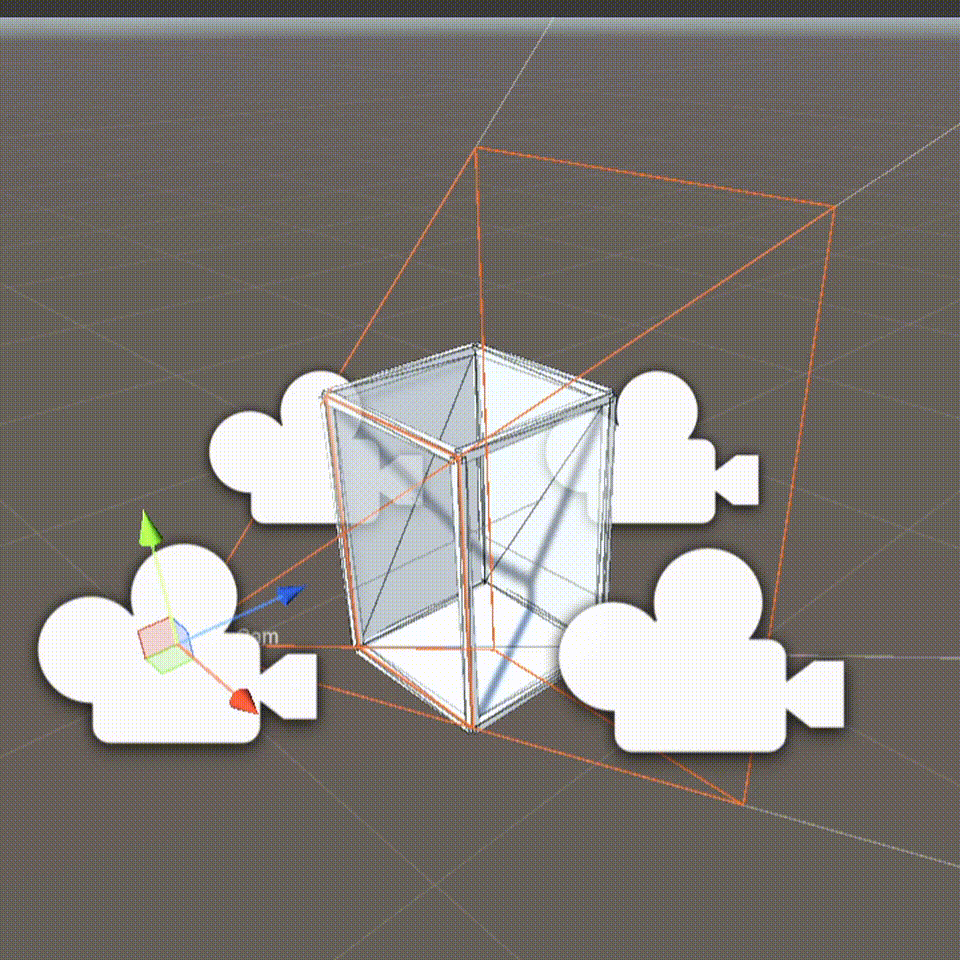

# HoloCade Cube Module (Unity)

This document describes the current Unity-side Cube module implementation and the required rendering model for production-ready Cube behavior.

---

## Purpose

The Cube module provides a reusable HoloCade SDK runtime for four-sided, inward-facing, perspective-correct rendering with virtual passthrough.

The target effect is a shared virtual volume that appears fixed inside the physical cabinet frame, with each player seeing:

- perspective-correct 3D content from their side
- three opposing passthrough portals
- stable clipping at the side boundary plane

Developers can deploy Cube in either a 4-player or 2-player configuration:

- **4-player mode:** North, South, East, and West displays/cameras/input stations are active.
- **2-player mode:** North and South remain active as P1/P2, while East/West displays, cameras, and joystick interfaces can be omitted.

In 2-player mode, the rest of the Cube rendering/tracking stack should continue to operate for P1/P2 without requiring title-level logic changes.

---

## Getting Started (Drop-In Cube Base)

Use the prebuilt Cube assets under `Runtime/Cube/CubeAssets/` as the starting point for new projects:

- Prefab: `Runtime/Cube/CubeAssets/[CubeBase].prefab`
- Runtime config: `Runtime/Cube/CubeAssets/CubeRuntimeConfig.asset`
- Monitor catalog: `Runtime/Cube/CubeAssets/CubeMonitorCatalog.asset`
- Example specs:
  - `Runtime/Cube/CubeAssets/Toshiba43Spec.asset`
  - `Runtime/Cube/CubeAssets/Insignia43Spec.asset`

### Quick Setup

1. Drag `Runtime/Cube/CubeAssets/[CubeBase].prefab` into your scene.
2. Select the root object with `CubeRigController`.
3. Ensure `runtimeConfig` is assigned (`CubeRuntimeConfig.asset` or your own).
4. Assign `monitorCatalog` and choose `Monitor Model` from the dropdown.
5. Click `Rebuild Rig Now` (or keep live update enabled).

This generates the side roots, side cameras, portal quads, floor, and frame primitives.

### Changing Monitor Size / Model

- Create or edit `CubeMonitorSpec` assets (dimensions are authored in inches; meters are derived read-only in inspector).
- Add specs to `CubeMonitorCatalog`.
- Select a different `Monitor Model` in `CubeRigController`.
- The Cube boundary geometry updates procedurally from the selected monitor dimensions.

Portrait mapping behavior:
- monitor width -> vertical axis (`Y`)
- monitor height -> horizontal axes (`X`/`Z`)

### Camera Placement and Frustum Debug (Edit Mode)

- Side cameras are created per quadrant (`North_Camera`, `South_Camera`, `East_Camera`, `West_Camera`).
- For eye-position debugging, move the side camera child (not the side root boundary anchor).
- In `CubeRigController`, enable scene debug options:
  - `drawPortalFramesInScene`
  - `drawCameraCentersInScene`
  - `drawCameraFrustumsInScene`

Selection behavior:
- select Cube root -> show all colored frustums
- select a side camera/side hierarchy -> show that side only

The colored frustums visualize the camera's active projection matrix (off-axis + mandatory oblique clipping), so you can verify boundary alignment while editing.

### Render Target Notes

- Portal surfaces are generated by the rig; they are the visible "inner boundary" frames.
- If you use `CubeStereoGpuReprojectionPass`, assign the 4 optional serialized portal color render targets (N/S/E/W) for stable authoring/debug output.
- Depth targets remain internal runtime buffers in the reprojection pipeline.

---

## Current Implementation (As of This Commit)

The following runtime files currently exist under `Runtime/Cube/`:

- `CubeSide.cs`
  - Defines side identities (`North`, `South`, `East`, `West`) and side-vector helpers.

- `CubeRuntimeConfig.cs`
  - ScriptableObject for cube dimensions, camera settings, tracking bounds, portal/frame/floor material hooks, and parallax tuning.

- `CubeFaceTrackingProviderBase.cs`
  - Abstract provider contract for side-based tracked eye center input.
  - Intended integration point for MediaPipe adapters.

- `CubePassthroughSources.cs`
  - ScriptableObject containing per-side physical camera feed textures.

- `CubeSideCameraController.cs`
  - Side camera procedural motion from tracked eye input.
  - Supports smoothing and out-of-bounds rejection via configured tracking volume.
  - Applies per-frame off-axis projection (asymmetric frustum).
  - Applies oblique near clip plane fixed to side boundary (mandatory).

- `CubeRigController.cs`
  - Procedurally builds:
    - four side roots/cameras
    - four boundary portal quads
    - floor primitive
    - frame edge primitives
  - Applies passthrough source textures to side portals.
  - Exposes side camera and portal renderer accessors for downstream reprojection systems.

- `CubeStereoFrame.cs`
  - Stereo frame contracts for reprojection input:
    - left/right color textures
    - left/right depth textures (meters)
    - optional confidence textures
    - per-view intrinsics and camera-to-world transforms

- `CubeStereoFrameProviderBase.cs`
  - Abstract runtime provider for side-specific stereo frames.

- `CubeDepthReprojectionMath.cs`
  - Utility math for unprojection/projective reprojection.

- `CubeStereoCpuReprojectionPass.cs`
  - CPU reference pipeline for depth reprojection and compositing.
  - Included as correctness baseline and debugging fallback.

- `CubeStereoReprojection.compute`
  - Compute shader kernels for GPU reprojection:
    - target/depth clear
    - source pixel reprojection with depth arbitration

- `CubeStereoGpuReprojectionPass.cs`
  - GPU-first passthrough compositing path using compute dispatch.
  - Reprojects left/right stereo inputs into side portal render targets.
  - Uses confidence thresholding and depth competition per target pixel.

### Important Current Limitation

Projection correctness and GPU reprojection scaffolding are implemented, but production hardening is still pending:

- hole fill and seam optimization in GPU reprojection output
- temporal reprojection stabilization and confidence-driven blend refinement
- full calibration tooling + diagnostics workflow for field deployments
- MediaPipe provider implementation (current tracking provider is abstract contract only)

---

## Required Rendering Model (Production Behavior)

For each side camera, the production pipeline must apply both:

1. **Off-axis projection (asymmetric frustum)**
2. **Oblique near clip plane fixed to that side's cube boundary plane**

### Why both are required

- Off-axis projection keeps image registration correct when eye position shifts laterally.
- Oblique near clipping prevents the near plane from scooping into the virtual volume and clipping gameplay content incorrectly.

Without oblique clipping, off-center eye positions can produce incorrect near clipping of snakes/pickups/content near the boundary window.

---

## Side Geometry Contract

Each side of the cube defines a fixed boundary rectangle in world space.

Per side camera:

- camera faces inward toward the cube volume
- boundary rectangle remains spatially fixed to cabinet geometry
- near clipping must align to this boundary plane (portal/window semantics)
- frustum asymmetry updates each frame from tracked eye position

---

## Tracking and Bounds Contract

Face tracking input is side-specific and provided through `CubeFaceTrackingProviderBase`.

Each side camera must:

- consume tracked eye-center world position for its side
- convert to local space of side anchor/window frame
- reject tracking input outside configured bounds
- retain prior stable state when tracking is out-of-bounds or unavailable

Out-of-bounds behavior should avoid large jumps and preserve visual stability.

---

## Virtual Passthrough Contract

There are four portal surfaces, one per side boundary.

Each portal displays the corresponding physical camera feed for that side.

From any given side camera view:

- the portal on the same side is naturally backface-culled
- the opposite three portals remain visible
- this yields the "see-through aquarium" illusion between players

Passthrough sources are currently represented by side textures in `CubePassthroughSources`.

---

## Floor and Frame Contract

Cube module must render:

- a virtual floor plane
- frame/pillar geometry matching cabinet visual language

Materials/shaders should allow look-dev alignment with physical cabinet surfaces to improve continuity between real and virtual structure.

Current scaffold uses primitive geometry with material hooks from `CubeRuntimeConfig`.

---

## MediaPipe Integration Requirements

MediaPipe integration should be implemented as a concrete provider derived from `CubeFaceTrackingProviderBase`.

Expected responsibilities:

- receive and preprocess face landmarks per side
- estimate eye center world position per player side
- expose stable side-mapped output via `TryGetEyeCenterWorldPosition(...)`
- apply confidence filtering, temporal smoothing, and dropout handling

---

## Immediate Next Steps

1. Add debug visualization toggles for:
   - side boundary rectangles
   - tracking bounds volume
   - eye pose and projection rays
2. Add validation scene that demonstrates side-by-side:
   - symmetric camera mode (for comparison)
   - off-axis + oblique production mode
3. Add automated sanity checks for invalid geometry config (zero-size windows, inverted normals, bad clip distances).
4. Add GPU post-process passes for hole filling, depth-edge cleanup, and temporal smoothing.
5. Implement concrete MediaPipe side tracking provider derived from `CubeFaceTrackingProviderBase`.
6. Add calibration/verification tooling for stereo intrinsics/extrinsics and per-side feed alignment.

---

## Scope Notes

- Cabinet module remains responsible for control/payment IO and UDP transport.
- Cube module is responsible for rendering and visual-spatial behavior of the four-sided display volume.
- Title-level gameplay (e.g. HoloSnake) should depend on Cube/Cabinet APIs and avoid duplicating shared Cube rendering logic.
